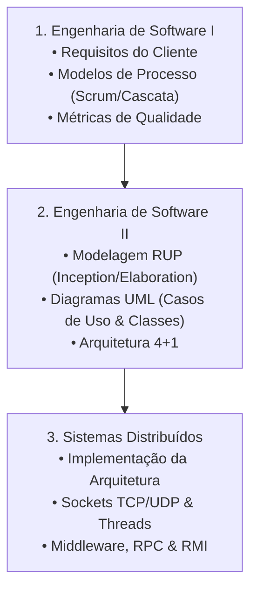

# 🏷️ Guia de Estudo Simultâneo: Tag A (Arquitetura, Software & Distribuídos)

> [!important] 🎯 Objetivo da Tag A
> Estudar e conectar **simultaneamente** a tríade de engenharia de sistemas:
> 1. **Engenharia de Software I:** Levantamento de requisitos funcionais/não-funcionais, ciclos de vida (Cascata vs Ágil) e métricas de qualidade.
> 2. **Engenharia de Software II:** Metodologia RUP (4 Fases), modelagem UML (Casos de Uso `<<include>>`/`<<extend>>`, Diagramas de Classes, Sequência) e Arquitetura 4+1.
> 3. **Sistemas Distribuídos e Programação em Paralelo:** Comunicação de rede (Sockets TCP/UDP), concorrência (Threads/Deadlocks), Middleware, RPC e RMI.

---

## 🔗 Matriz de Conexão Cognitiva (Como Estudar em Conjunto)

---

## 📚 Links Rápidos de Estudo da Tag A
- **Engenharia de Software I:**
  - 📖 [[Primeiro Semestre/Engenharia de Software I/01 - Guia de Estudo Teórico|01 - Guia Teórico ES I]]
  - 🛠️ [[Primeiro Semestre/Engenharia de Software I/02 - Exercícios e Práticas|02 - Práticas & Casos ES I]]
- **Engenharia de Software II:**
  - 📖 [[Segundo Semestre/Engenharia de Software II/01 - Guia de Estudo Teórico|01 - Guia Teórico ES II]]
  - 🛠️ [[Segundo Semestre/Engenharia de Software II/02 - Exercícios e Práticas|02 - Práticas & Casos ES II]]
- **Sistemas Distribuídos:**
  - 📖 [[Primeiro Semestre/Sistemas Distribuídos e Programação em Paralelo/01 - Guia de Estudo Teórico|01 - Guia Teórico SD]]
  - 🛠️ [[Primeiro Semestre/Sistemas Distribuídos e Programação em Paralelo/02 - Exercícios e Práticas|02 - Práticas & Sockets SD]]
