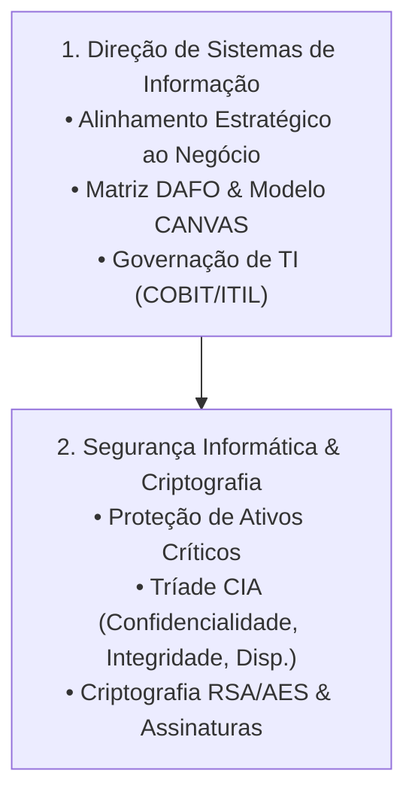

# 🏷️ Guia de Estudo Simultâneo: Tag B (Segurança & Governação Estratégica)

> [!important] 🎯 Objetivo da Tag B
> Estudar e conectar **simultaneamente** o primeiro dia de exames (01/09/2026):
> 1. **Segurança Informática e Criptografia (Manhã):** Tríade CIA, Criptografia Simétrica (AES) vs Assimétrica (RSA), Hashes SHA-256, Assinaturas Digitais e Firewalls.
> 2. **Direção de Sistemas de Informação - DSI (Tarde):** Governação de TI, Alinhamento Estratégico ao Negócio, Matriz DAFO/SWOT, Forças de Porter, Matriz BCG e Modelo CANVAS.

---

## 🔗 Matriz de Conexão Cognitiva (Como Estudar em Conjunto)

---

## 📚 Links Rápidos de Estudo da Tag B
- **Segurança Informática e Criptografia:**
  - 📖 [[Primeiro Semestre/Segurança Informática e Criptografia/01 - Guia de Estudo Teórico|01 - Guia Teórico Segurança]]
  - 🛠️ [[Primeiro Semestre/Segurança Informática e Criptografia/02 - Exercícios e Práticas|02 - Práticas & Casos Segurança]]
- **Direção de Sistemas de Informação:**
  - 📖 [[Segundo Semestre/Direção de Sistemas de Informação/01 - Guia de Estudo Teórico|01 - Guia Teórico DSI]]
  - 🛠️ [[Segundo Semestre/Direção de Sistemas de Informação/02 - Exercícios e Práticas|02 - Práticas & Casos DSI]]
