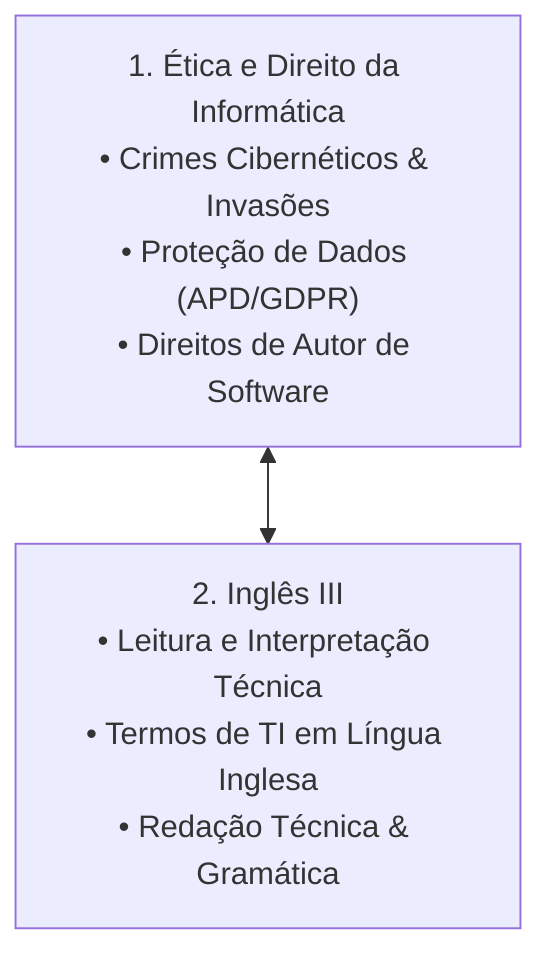

# 🏷️ Guia de Estudo Simultâneo: Tag C (Ética, Legislação & Comunicação)

> [!important] 🎯 Objetivo da Tag C
> Estudar e conectar **simultaneamente** as dimensões jurídicas, éticas e de comunicação técnica internacional:
> 1. **Ética e Direito da Informática:** Legislação angolana e internacional sobre crimes cibernéticos, Lei de Proteção de Dados (APD/GDPR), Propriedade Intelectual de software e Código Deontológico da Engenharia.
> 2. **Inglês III:** Compreensão de leitura técnica em TI (*Culture*, *Culture Shock*), voz passiva técnica, artigos e vocabulário especializado em sistemas.

---

## 🔗 Matriz de Conexão Cognitiva (Como Estudar em Conjunto)

---

## 📚 Links Rápidos de Estudo da Tag C
- **Ética e Direito da Informática:**
  - 📖 [[Segundo Semestre/Ética e Direito da Informática/01 - Guia de Estudo Teórico|01 - Guia Teórico Ética e Direito]]
  - 🛠️ [[Segundo Semestre/Ética e Direito da Informática/02 - Exercícios e Práticas|02 - Práticas & Casos Jurídicos]]
- **Inglês III:**
  - 📖 [[Primeiro Semestre/Inglês III/01 - Guia de Estudo Teórico|01 - Guia Teórico Inglês III]]
  - 🛠️ [[Primeiro Semestre/Inglês III/02 - Exercícios e Práticas|02 - Práticas & Textos Inglês III]]
