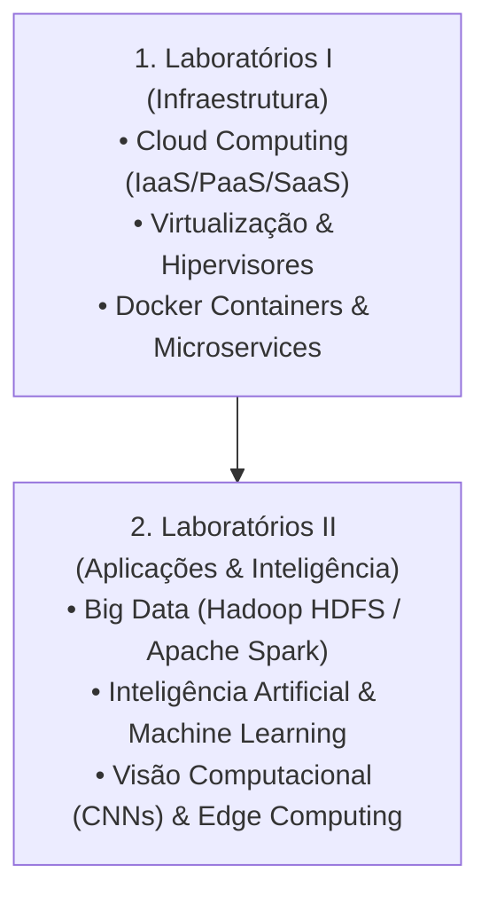

# 🏷️ Guia de Estudo Simultâneo: Tag E (Laboratórios de Novas Tecnologias)

> [!important] 🎯 Objetivo da Tag E
> Estudar e conectar **simultaneamente** as disciplinas do último dia de exames (07/09/2026):
> 1. **Laboratórios I (Manhã):** Computação em Nuvem (NIST, IaaS, PaaS, SaaS), Virtualização vs Contentorização (Docker), Hipervisores Tipo 1 (Bare-Metal) vs Tipo 2 (Hosted).
> 2. **Laboratórios II (Tarde):** Big Data (5 Vs: Volume, Velocidade, Variedade, Veracidade, Valor), Ecossistema Hadoop/Spark, Inteligência Artificial, Machine Learning (Supervisionado vs Não-Supervisionado), Redes Convolucionais (CNN) e Edge Computing.

---

## 🔗 Matriz de Conexão Cognitiva (Como Estudar em Conjunto)

---

## 📚 Links Rápidos de Estudo da Tag E
- **Laboratórios de Novas Tendências e Tecnologias I:**
  - 📖 [[Primeiro Semestre/Laboratórios de Novas Tendências e Tecnologias I/01 - Guia de Estudo Teórico|01 - Guia Teórico Labs I]]
  - 🛠️ [[Primeiro Semestre/Laboratórios de Novas Tendências e Tecnologias I/02 - Exercícios e Práticas|02 - Práticas & Docker Labs I]]
- **Laboratórios de Novas Tendências e Tecnologias II:**
  - 📖 [[Segundo Semestre/Laboratórios de Novas Tendências e Tecnologias II/01 - Guia de Estudo Teórico|01 - Guia Teórico Labs II]]
  - 🛠️ [[Segundo Semestre/Laboratórios de Novas Tendências e Tecnologias II/02 - Exercícios e Práticas|02 - Práticas & IA/Big Data Labs II]]
