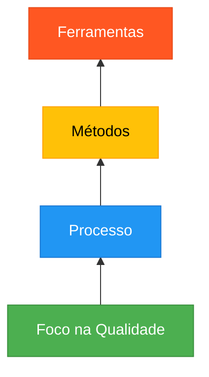
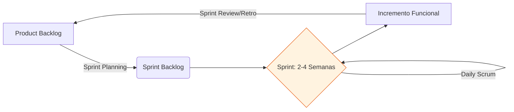
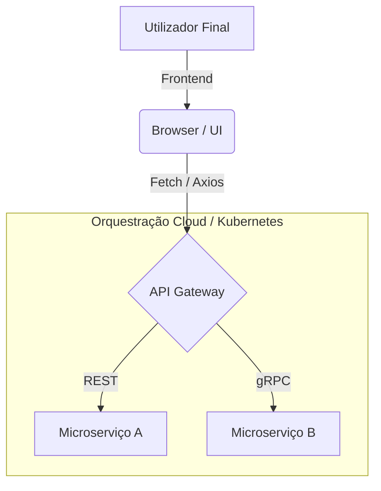

# Guia de Estudo Teórico: Engenharia de Software I (V2)

Este guia exaustivo aborda os fundamentos, princípios, modelos e práticas da Engenharia de Software, servindo como material definitivo para o estudo universitário da disciplina. A Engenharia de Software transcende a simples programação, integrando processos sistemáticos para garantir qualidade, resiliência e adaptação das soluções.

---

## 1. O Software: Natureza, Características e Importância

O software é o motor lógico que impulsiona a sociedade moderna. É o equipamento lógico de um computador digital, compreendendo o conjunto de componentes necessários para a realização de tarefas específicas. Não se trata apenas de linhas de código, mas sim do conjunto completo que compreende o código executável, as estruturas de dados necessárias para que o programa manipule a informação de forma adequada, e a documentação que descreve a operação, instalação e manutenção do sistema.

### 1.1 Características Únicas do Software

Segundo Roger S. Pressman (2011), o software possui uma natureza lógica, não física. Esta característica fundamental demarca a engenharia de software da engenharia de hardware.

1. **O software é desenvolvido e construído intelectualmente (não manufaturado):** 
   Enquanto o hardware é fabricado por processos repetitivos, o software é construído intelectualmente. Cada cópia de um programa é idêntica à original; portanto, não existem "defeitos de produção", apenas erros de projeto. Os custos concentram-se na fase de desenvolvimento.
2. **O software não se desgasta, mas deteriora-se (Entropia do Software):**
   O hardware sofre com a fadiga do material. O software, contudo, não sofre desgaste físico. No entanto, sofre de "deterioração" funcional à medida que o ambiente muda (novos requisitos, sistemas operativos, etc.). Pressman denomina isso de *entropia do software*: sem manutenção, a qualidade degrada-se.
3. **Personalização:**
   O software raramente é universal; é construído sob medida para as necessidades específicas de um cliente ou contexto. Mesmo sistemas comerciais exigem parametrização.
4. **Intangibilidade:**
   O software não é físico. É um conjunto de instruções avaliado apenas através de sua execução ou artefactos (documentação, diagramas). Isto exige métricas rigorosas para avaliar o progresso.
5. **Facilidade de Modificação (Dificuldade de Gestão):**
   Alterar código é fácil, mas cada modificação pode introduzir novos erros e corromper a estrutura. Processos controlados de manutenção e *refatoração* são cruciais.
6. **Complexidade Crescente:**
   Sistemas possuem milhares de interações. Como estipula a Lei de Lehman, um sistema evolui, mas a sua complexidade intrínseca aumenta exponencialmente. Exige modularização.
7. **Dependência de Pessoas:**
   O software é um produto intelectual e cooperativo. Depende crucialmente da competência, motivação, comunicação e liderança das equipas envolvidas.

### 1.2 Problemas no Desenvolvimento de Software

A falha num projeto raramente é um único erro técnico. Resulta frequentemente de uma combinação de fatores técnicos, organizacionais e humanos.

> [!WARNING]
> **Causas Frequentes de Falhas em Projetos**
> - **Causas Técnicas:** Falta de testes sistemáticos; arquiteturas mal escolhidas; código sem padronização.
> - **Causas Organizacionais:** Planeamento deficiente e estimativas irreais; requisitos instáveis; falta de comunicação entre programadores e clientes; escopo mal definido.

> [!CAUTION]
> **Estudo de Caso: Sistema NHS (Reino Unido) - NPfIT**
> O National Programme for IT (NPfIT) pretendia unificar os registos clínicos do Reino Unido. Falhou espetacularmente devido a **problemas organizacionais** (definição de requisitos longa e burocrática sem consultar os profissionais de saúde) e **técnicos** (incompatibilidade com sistemas legados, instabilidade e lentidão). O projeto gastou milhares de milhões e foi cancelado em 2011. A falta de foco nas necessidades do utilizador final provou ser fatal.

---

## 2. A Engenharia de Software

A Engenharia de Software é uma disciplina da ciência da computação que oferece métodos, técnicas, princípios e procedimentos científicos para desenvolver e manter softwares de qualidade, eficientes e confiáveis, aplicando uma abordagem sistemática, ordenada e quantificável.

### 2.1 As Camadas da Engenharia de Software

1. **Foco na Qualidade:** A base. Exige um compromisso organizacional com padrões e melhoria contínua.
2. **Processo:** Define o fluxo de trabalho, os papéis, os marcos (*milestones*) e a gestão de entregáveis.
3. **Métodos:** Práticas técnicas detalhadas (Modelagem orientada a objetos, arquitetura de software, design de testes).
4. **Ferramentas (CASE):** Suporte automatizado (Ex: Git, Jira, IDEs, SonarQube).

### 2.2 Princípios Fundamentais

1. **Compreender o Problema antes de Codificar:** A fase de elicitação de requisitos é crítica. Um erro de requisito custa exponencialmente mais se for detetado apenas em produção.
2. **Planeamento Adequado:** Define escopo, cronograma, recursos e riscos. Planos realistas evitam derrapagens.
3. **Modularidade e Abstração:** "Dividir para conquistar". Um software deve ser estruturado em módulos com **alta coesão** e **baixo acoplamento**.
4. **Qualidade Contínua (Validação e Verificação):** 
   * *Validação:* Atender às necessidades de negócio.
   * *Verificação:* Garantir a corretude técnica. Uso de revisões formais (peer reviews) e testes unitários/integração.
5. **Rigor e Método:** Substituir a intuição improvisada por documentação e métricas formais.
6. **Foco nas Pessoas:** Projetos são construídos por equipas. A comunicação eficaz supera a tecnologia mais avançada.
7. **Melhoria Contínua:** Processos evoluem (SPI). Aprender com cada projeto.

---

## 3. Qualidade do Software

A qualidade não é acidental; é projetada. Segundo Pressman, é o grau em que um sistema satisfaz requisitos declarados, normas documentadas e necessidades implícitas. Fatores de sucesso dividem-se em Produto, Processo e Pessoas. 

Alcançar a qualidade reduz falhas, diminui custos de manutenção e eleva a satisfação. O modelo de McCall classifica a qualidade em três dimensões:

### 3.1 Operação do Produto (Perspetiva do Utilizador)
* **Correção:** Execução lógica correta.
* **Confiabilidade:** Probabilidade de operar sem falhas. A falta de confiabilidade resulta em perda de dados (ex: ausência de cópias de segurança).
* **Eficiência / Desempenho:** Uso otimizado de recursos. Lentidão em picos de acesso destrói a usabilidade.
* **Segurança / Integridade:** Proteção contra acessos indevidos e corrupção de dados.
* **Usabilidade:** Qualidade da experiência do utilizador (UX). 

### 3.2 Revisão do Produto (Perspetiva do Desenvolvedor)
* **Manutenibilidade:** Facilidade de localizar e corrigir defeitos. Um código sem controlo de versões ou documentação perde a sua manutenibilidade.
* **Flexibilidade:** Facilidade de adaptar o software a novas mudanças.
* **Testabilidade:** Capacidade da arquitetura de suportar testes automatizados rigorosos.

### 3.3 Transição do Produto
* **Portabilidade:** Capacidade de migrar a aplicação para diferentes ambientes.
* **Interoperabilidade:** Integração sistémica através de APIs e serviços.
* **Reusabilidade:** Módulos que podem ser reaproveitados.

| Fator de Qualidade | Falha Prática Comum (Exemplo) | Consequência |
| :--- | :--- | :--- |
| **Confiabilidade** | Ausência de backup após falha do servidor | Usuários perdem confiança devido a perdas de dados críticas |
| **Usabilidade** | Interface confusa não testada | Frustração, erros operacionais e abandono do sistema |
| **Desempenho** | Bloqueios em períodos de pico | Interrupções de serviço, perda de produtividade/transações |

> [!IMPORTANT]
> **Estudo de Caso Prático: Sistema de Gestão Académica (SGA) e E-commerce Angolano**
> Em casos reais, como uma plataforma de e-commerce angolana ou um SGA universitário falhados em poucos meses, notamos que a **falta de testes de usabilidade** e a **comunicação deficiente** (requisitos a mudar sem controlo de versão) afundam o projeto. Sem adotar testes de carga e validação constante com utilizadores finais, a confiabilidade e eficiência são irremediavelmente perdidas.

---

## 4. Modelos de Processo (Ciclo de Vida)

### 4.1 Modelo Cascata (Waterfall)
Abordagem linear. Extremamente rígido. Requer requisitos congelados, o que é irrealista no mercado atual. Se o cliente solicitar mudanças na fase de testes, os custos disparam. Útil apenas para projetos altamente previsíveis e curtos.

### 4.2 Modelo em Espiral (Boehm)
Aborda o desenvolvimento em iterações baseadas numa **análise de risco rigorosa**. Combina a prototipagem com os aspetos sistemáticos do cascata. Ideal para projetos críticos onde os riscos técnicos ou de negócio são muito altos.

### 4.3 Desenvolvimento Ágil (Scrum)
Focado em entrega contínua, adaptação e colaboração profunda com o cliente. Trabalha com ciclos curtos chamados *Sprints*. 
**Vantagem Crítica:** Previne fracassos por permitir validação rápida. Projetos que sofrem de "requisitos voláteis" (como startups ou sistemas universitários) beneficiam enormemente, dado que as entregas incrementais geram *feedback* constante e permitem correções de rota antes que o dinheiro acabe.

---

## 5. Engenharia de Requisitos e Modelagem de Negócios

A engenharia de requisitos lida com a tradução da necessidade do negócio num modelo técnico. O fluxo inicial em metodologias iterativas começa pela **Modelagem de Negócio**.

### 5.1 Requisitos Funcionais e Não Funcionais
* **RF:** Ações que o sistema executa (Ex: "Fazer uma reserva", "Gerar pauta de notas").
* **RNF:** Restrições de desempenho, segurança ou escalabilidade (Ex: "A reserva deve ser confirmada em menos de 2s", "Suportar 1000 acessos simultâneos nas matrículas").
* **Regras de Negócio:** Políticas inquebráveis da empresa.

### 5.2 Modelagem de Processos de Negócio
Para compreender o ecossistema antes da automação, utilizam-se diagramas para mapear processos reais. Isto garante a identificação de gargalos (melhorias) a serem resolvidos via software. Evita o erro fatal de automatizar um processo defeituoso.

---

## 6. A UML e Abstração do Software

A Unified Modeling Language (UML) é a planta arquitetónica do software. Permite comunicação sem ambiguidades.

### Principais Diagramas
1. **Casos de Uso:** Mapeia a interação entre atores (utilizadores, outros sistemas) e funcionalidades do sistema.
2. **Atividades:** Modela fluxos de controle e lógicas procedimentais de negócio.
3. **Classes:** A espinha dorsal do *design* orientado a objetos. Modela as entidades estáticas e os seus relacionamentos estruturais.
4. **Sequência:** Revela a troca de mensagens dinâmicas entre os objetos para satisfazer um fluxo específico.

---

## 7. Anexo Profundo: Eixos Tecnológicos e Curriculares Complementares (GII)

Com base na extração exaustiva de conhecimentos do Grado em Ingeniería Informática. Estes módulos interligam-se diretamente com o ciclo de vida do software.

> [!TIP]
> **A Natureza Holística do Software**
> O engenheiro de software moderno não apenas concebe o código, mas compreende o **ecossistema de negócio, as plataformas distribuídas, a conformidade legal e as infraestruturas de orquestração cloud**.

### 7.1 Arquitetura e Integração Web
*   **Fundamentos Frontend:** **HTML5** para estruturação semântica e **CSS3** para interfaces responsivas.
*   **Comportamento:** **ECMAScript 6+**, manipulação de **DOM** para UX otimizada.
*   **Comunicação:** Chamadas assíncronas via **AJAX, Fetch e Axios**.
*   **Backend:** **RESTful APIs** e **Node.js** para servidores não-bloqueantes escaláveis.

### 7.2 Sistemas Distribuídos e Paralelos
*   Arquiteturas Cliente-Servidor e **SOA** (Service Oriented Architecture).
*   Programação Assíncrona e Concorrência para maximizar a performance em rede.

### 7.3 Infraestruturas Cloud e Virtualização
*   **IaaS, PaaS, SaaS**: Modelos de hospedagem na nuvem.
*   **Contenerização:** Utilização de **Docker** para isolamento leve e reprodutível, e **Kubernetes** para orquestração.
*   **Microserviços:** Sustentados por **DDD (Domain-Driven Design)** e *Clean Architecture*.

### 7.4 Segurança Informática e Criptografia
*   **Segurança by Design:** Integrada desde o princípio para evitar injeções de código ou acessos indevidos.
*   **Passiva (Backups/Disaster Recovery)** vs **Ativa (Firewalls/Criptografia)**.

### 7.5 Direção e Estratégia de SI e Deontologia
*   Planeamento estratégico (CANVAS, DAFO).
*   **Ética e Legislação:** Cumprimento de regulamentos de proteção de dados (RGPD), essencial para a integridade legal da corporação e responsabilidade profissional.
