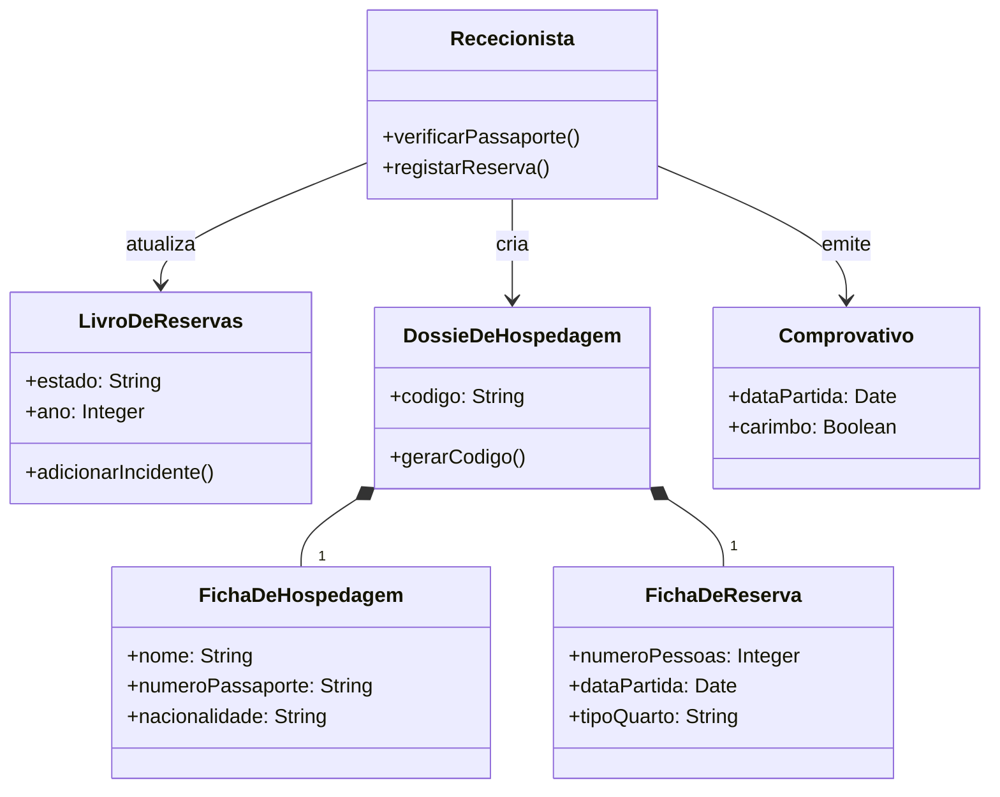

# Exercícios e Práticas: Engenharia de Software I

Este documento compila estudos de caso práticos acompanhados de resoluções exaustivas e rigorosas, aplicando os conceitos teóricos da Engenharia de Software a cenários reais de fracasso e sucesso.

---

## Caso Prático 1: Plataforma de E-commerce Angolana

### Enunciado
Em 2022, uma startup angolana decidiu criar uma plataforma nacional de e-commerce para pequenos comerciantes. O projeto foi iniciado com grande entusiasmo e investimento, mas três meses após o lançamento apresentou falhas graves:
*   O site ficou fora do ar nos dias de maior tráfego.
*   Pagamentos eletrónicos falhavam, causando perda de transações.
*   Falhas de segurança expunham dados de clientes.
*   Equipas de desenvolvimento e marketing não se comunicavam bem, resultando em versões instáveis e mudanças de última hora.
*   O projeto foi suspenso no final de 2023.

### Resolução Exaustiva

**1. Identificação do Problema: Principais erros cometidos**
*   **Ausência de Testes de Carga e *Stress* (Técnico):** O sistema colapsar nos dias de maior tráfego indica uma arquitetura não escalável e a completa omissão de testes de performance (como testes com Apache JMeter) para simular acessos concorrentes maciços.
*   **Falta de Transações de Base de Dados ACID (Técnico):** A falha nos pagamentos com perda de transações revela que as operações de base de dados não cumpriam as propriedades ACID (Atomicidade, Consistência, Isolamento, Durabilidade). Se um pagamento falha, a transação deve sofrer *rollback* completo.
*   **Vulnerabilidades Críticas (Técnico):** A exposição de dados (possivelmente devido a *SQL Injection*, falta de criptografia de senhas, ou APIs abertas) demonstra que a segurança não foi tratada como um Requisito Não Funcional desde o *design* (falta de *Security by Design*).
*   **Comunicação Silenciada (Organizacional):** A divisão (silos) entre a equipa de Marketing (que possivelmente fazia campanhas sem avisar a TI) e os Desenvolvedores (que não escalavam os servidores atempadamente) demonstra um problema gravíssimo na Gestão do Projeto.

**2. Causas do Fracasso**
A causa raiz foi uma gestão focada na **pressa de lançamento (*Time to Market*) em detrimento da qualidade**. A ausência de processos estabelecidos (como *Code Reviews* ou testes automatizados) permitiu que código defeituoso chegasse à produção. A falta de planeamento e comunicação mitigou qualquer chance de reverter os erros a tempo.

**3. Princípios da Engenharia de Software Violados**
*   **Planeamento Adequado:** Não houve gestão de riscos (ex: "O que acontece se o tráfego triplicar na Black Friday?").
*   **Qualidade Contínua (V&V):** Ausência total de Verificação (testes de código e segurança) e Validação (garantir que as funcionalidades de pagamento funcionavam de forma robusta e segura).
*   **Foco nas Pessoas e Comunicação:** Ignorou-se a necessidade de comunicação transversal entre *stakeholders* (Marketing e *Development*).

**4. Estratégias de Prevenção**
*   **Definição rigorosa de Requisitos Não Funcionais (RNFs):** Estabelecer métricas claras (ex: o sistema deve suportar 10.000 requisições simultâneas; transações de pagamento devem ter *timeout* de 3 segundos).
*   **Implementar pipelines de CI/CD (Continuous Integration / Continuous Deployment):** Garantir que nenhuma alteração de código vai para produção sem passar por uma bateria automatizada de testes unitários e de integração.
*   **Auditorias de Segurança e *Penetration Testing*:** Contratar equipas externas para testar as vulnerabilidades da plataforma antes do lançamento oficial.

**5. Lições Aprendidas e Modelo Alternativo**
O desenvolvimento de software crítico (que lida com dinheiro e dados pessoais) não tolera amadorismos. A adoção de um **Modelo Ágil (Scrum)** teria forçado a equipa a entregar pequenos incrementos de valor. Em vez de lançar tudo de uma vez com erros massivos, poderiam ter lançado apenas um catálogo, depois testado os pagamentos com utilizadores "beta", ajustando a infraestrutura gradualmente. Reuniões de alinhamento diárias (*Daily Stand-ups*) teriam sincronizado Marketing e TI.

---

## Caso Prático 2: Sistema de Gestão Académica Universitária (SGA)

### Enunciado
Em 2021, uma universidade angolana desenvolveu um SGA para processos de matrícula e pautas, usando uma equipa mista de docentes e estudantes finalistas, com um cronograma de seis meses. O sistema falhou: interface confusa, bloqueios em picos, perda de dados por falta de backups, mudanças constantes de requisitos sem controlo, e ausência de testes de usabilidade. A universidade teve de regressar aos processos manuais.

### Resolução Exaustiva

**1. Identificação de Erros (Técnicos e Gestão)**
*   **Falta de Design Centrado no Utilizador (Técnico):** Uma interface confusa dita a morte de um SGA. O utilizador final (docentes idosos, alunos, funcionários administrativos) não esteve envolvido na modelação das interfaces.
*   **Riscos de Infraestrutura Não Geridos (Gestão/Técnico):** A ausência de backups automáticos e recuperação de desastres (*Disaster Recovery*) é inaceitável. O facto de os dados se terem perdido revela uma total falta de planeamento de resiliência.
*   **Cronograma Irrealista e *Scope Creep* (Gestão):** Seis meses para um ERP académico desenvolvido por estudantes (que têm outras cadeiras) e docentes (com horários de aula) é utópico. Mudanças constantes nos requisitos sem controlo de versão originaram o clássico *Scope Creep* (aumento descontrolado do âmbito do projeto).

**2. Fatores de Qualidade Comprometidos (Modelo ISO/McCall)**
*   **Usabilidade:** Fortemente afetada pela interface pouco intuitiva.
*   **Confiabilidade:** Nula. O sistema falhou sob carga (matrículas) e não cumpriu o seu propósito.
*   **Integridade:** Os dados perderam-se, demonstrando falta de integridade física da base de dados.
*   **Manutenibilidade:** Devido a alterações *ad-hoc* sem gestão de configuração, o código provavelmente tornou-se insustentável.

**3. Princípios Violados**
*   **Compreender o Problema:** A equipa não fez elicitação correta de requisitos com as secretarias.
*   **Rigor e Método:** Estudantes finalistas geralmente carecem de disciplina processual (ex: uso rigoroso de Git, *branching strategies*). A coordenação falhou em impor engenharia rigorosa.

**4. Estratégias de Melhoria**
*   **Prototipagem Rápida:** Criar protótipos de alta fidelidade (ex: no Figma) e validá-los com as secretarias *antes* de escrever qualquer código.
*   **Plano de Continuidade de Negócio (Backups):** Configurar replicação da base de dados em diferentes zonas e scripts diários (cron jobs) para backups automáticos e encriptados na *cloud*.
*   **Gestão Formal de Mudanças:** Utilizar um *Change Advisory Board* (CAB). Sempre que a administração pedir uma alteração, deve ser avaliada a nível de custo e tempo antes de ser aprovada, rejeitando-se o caos das "mudanças informais".

**5. Modelo de Processo Recomendado**
Um **Modelo Iterativo e Incremental**. Em vez de tentar entregar todas as funcionalidades de uma vez (matrículas, relatórios, pautas, histórico), a equipa deveria ter focado em apenas *um* módulo de cada vez. Por exemplo: Iteração 1 (Registo de Alunos), Iteração 2 (Inserção de Pautas), Iteração 3 (Matrículas Complexas).

---

## Caso Prático 3: O Megaprojeto do Sistema NHS (Reino Unido)

### Enunciado
O National Programme for IT (NPfIT) tentou unificar os registos de saúde do Reino Unido (década de 2000). Com orçamento de bilhões, o projeto fracassou (encerrado em 2011). Sistemas lentos, perda de registos, incompatibilidade com sistemas legados regionais, requisitos ditados politicamente sem consultar médicos, e instruções de configuração vagas para equipas locais.

### Resolução Exaustiva

**1. Problemas Observados**
*   **Técnicos:** 
    *   Arquitetura desastrosa na integração com Sistemas Legados. Tentar unificar uma infraestrutura nacional fragmentada usando uma base de dados centralizada (monolítica) foi um erro de arquitetura. Uma abordagem em barramento de serviços (ESB / SOA) teria sido mais viável.
    *   Lentidão extrema (falta de eficiência) que colocava vidas em risco (forçando o uso de papel em urgências).
*   **Organizacionais:**
    *   Resistência e falta de formação dos utilizadores finais (médicos e enfermeiros), que viam o sistema como uma imposição e não como uma ferramenta.
    *   Decisões *top-down* (políticas) em vez de decisões *bottom-up* (técnicas). Os médicos não foram ouvidos na fase de requisitos.
*   **De Gestão de Projeto:**
    *   Subestimação massiva da complexidade e dos custos.
    *   Gestão ineficaz de fornecedores terceirizados. Várias empresas privadas não comunicavam entre si, gerando retrabalho e incompatibilidades de código.

**2. Fatores de Qualidade Comprometidos**
*   **Confiabilidade e Eficiência:** O sistema "demorava a carregar" e "registos perdiam-se". Em sistemas de saúde (*Life-critical systems*), a disponibilidade tem de ser 99,999%.
*   **Usabilidade:** Foi totalmente negligenciada, tornando o sistema um obstáculo à prestação de cuidados médicos.

**3. Princípios Ignorados**
*   **Compreender o Problema:** A ignorância face às necessidades dos *stakeholders* primários (médicos) violou o princípio número um da engenharia de requisitos.
*   **Modularidade:** Tentar um lançamento "Big Bang" em vez de adotar implementações faseadas e modulares independentes.

**4. Estratégias de Melhoria (Boas Práticas)**
1.  **Elicitação Colaborativa de Requisitos (JAD):** Sessões de *Joint Application Design* com verdadeiros profissionais de saúde, para mapear fluxos de trabalho reais de um hospital.
2.  **Arquitetura Orientada a Serviços (SOA/Microserviços):** Em vez de forçar as clínicas a mudarem os seus sistemas locais, usar *APIs* e *gateways* HL7/FHIR (protocolos de saúde) para que os sistemas legados apenas enviassem dados estruturados para a nuvem central.
3.  **Desenvolvimento Incremental com *Pilots*:** Implementar a solução completa num *único* hospital (piloto), identificar todos os problemas, corrigi-los, afinar a experiência de uso, e só então expandir regionalmente.
4.  **Gestão Robusta de *Stakeholders* e Gestão da Mudança:** Criar programas de embaixadores (médicos treinadores) para garantir a adoção suave pelas equipas clínicas, mitigando a resistência técnica.

---

Este documento de práticas fornece uma visão realista sobre como as falhas nos princípios da Engenharia de Software têm impactos económicos e organizacionais devastadores, preparando o aluno para evitar estas armadilhas no mercado de trabalho.

---

## Caso Prático 4: Modelagem de Negócios no "Hotel X"

### Enunciado
O desenvolvimento de um sistema de reservas para o "Hotel X" requer a automação de processos até então manuais. Baseando-se nas entrevistas realizadas pelo Business Designer (DN) com a Gerência:

*   **Identifique regras de negócio** a serem aplicadas.
*   **Modele os Casos de Uso de Negócios** (UML).
*   **Esboce o Modelo de Objetos de Negócios** (Diagrama de Classes).

### Resolução Exaustiva Passo-a-Passo

**1. Identificação de Regras de Negócio**
A partir da transcrição da entrevista, o engenheiro extrai as seguintes restrições intransigentes do sistema:
*   **Regra de Capacidade:** *"Sempre o quarto solicitado deve ter capacidade para o número de pessoas especificado. Isso não pode ser violado."*
*   **Regras de Pagamento:** Aceita-se dinheiro, cheque e (após melhorias sugeridas) cartão de crédito.
*   **Regras de Retenção de Dados:** Os dossiês de hospedagem mantêm-se arquivados durante 1 mês e, posteriormente, no arquivo geral por 1 ano (3 anos na proposta de melhoria para análise de histórico de clientes).
*   **Regras de Identificação:** O código do dossiê é gerado concatenando a data da reserva e o número do quarto atribuído.

**2. Modelação de Casos de Uso de Negócios (UML)**
Os processos fundamentais detetados foram: `Reservar Quarto`, `Cancelar Reserva`, `Relatar Avaria` e `Terminar Reserva`.
*   Ato repetitivo: Para reservar e para realocar um cliente (em caso de avaria irreparável no imediato), a rececionista procura no *Livro de Reservas*. Extrai-se o caso de uso `Procurar Quarto Disponível`.
*   A relação de `Reservar Quarto` para `Procurar Quarto Disponível` é **\<\<include>>** (obrigatória).
*   A relação de `Relatar Avaria` para `Procurar Quarto Disponível` é **\<\<extend>>** (condicional: só ocorre se a avaria for severa).

```mermaid
usecaseDiagram
    actor Cliente
    actor Hospede as "Hóspede"
    
    usecase "Reservar Quarto" as UC1
    usecase "Cancelar Reserva" as UC2
    usecase "Terminar Reserva" as UC3
    usecase "Relatar Avaria" as UC4
    usecase "Procurar Quarto Disponível" as UC5
    
    Cliente --> UC1
    Hospede --> UC2
    Hospede --> UC3
    Hospede --> UC4
    
    UC1 ..> UC5 : <<include>>
    UC4 ..> UC5 : <<extend>>
```

**3. Modelo de Objetos de Negócios (Classes Iniciais)**
O modelo de classes inicial deriva dos substantivos e trabalhadores do processo manual:
*   **Trabalhador (*Worker*):** `Rececionista`
*   **Entidades Manipuladas:** `Livro de Reservas`, `Ficha de Hospedagem`, `Ficha de Reserva`, `Dossiê de Hospedagem`, `Comprovativo de Reserva`.
*   O Dossiê de Hospedagem é, na verdade, uma *agregação* composta pela Ficha de Hospedagem e pela Ficha de Reserva.



Com este modelo preliminar baseado na Modelagem de Negócios do RUP, a equipa tem uma base sólida de requisitos e lógica de domínio para prosseguir com a arquitetura de software de forma robusta.
