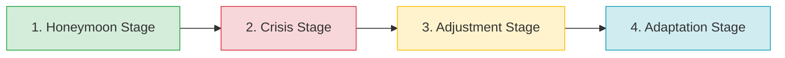

# 📘 Guia de Estudo Teórico: Inglês III

Este guia abrange de forma exaustiva os conteúdos teóricos, culturais, lexicais e gramaticais exigidos para a disciplina de Inglês III em nível universitário, incluindo novos exemplos e tópicos extraídos diretamente das avaliações e materiais da disciplina.

---

## 📌 Sumário
1. [Estudos Culturais e Sociedade](#1-estudos-culturais-e-sociedade)
2. [O Fenômeno do Choque Cultural (Culture Shock)](#2-o-fenômeno-do-choque-cultural-culture-shock)
3. [Comunicação Animal vs. Humana](#3-comunicação-animal-vs-humana)
4. [A Sociedade de Consumo (Consumer Society)](#4-a-sociedade-de-consumo-consumer-society)
5. [Fundamentos Gramaticais e Estruturais](#5-fundamentos-gramaticais-e-estruturais)

---

## 1. Estudos Culturais e Sociedade

Para o estudo da língua inglesa em um contexto global, a compreensão de elementos culturais e sociopolíticos é imprescindível.

### 1.1 Culture vs. Tradition
* **Culture (Cultura):** É um macrossistema complexo. Refere-se ao conjunto de valores, crenças, costumes, conhecimento, linguagem e práticas que caracterizam um grupo de pessoas e orientam o seu modo de vida. A cultura é dinâmica e evolui com as gerações.
* **Tradition (Tradição):** É um subconjunto da cultura. Refere-se a práticas específicas, rituais ou costumes que são passados de geração em geração (ex.: reunir a família aos domingos, celebrar o Dia de Ação de Graças).

> [!NOTE]
> **Questões Frequentes de Prova (Q&A):**
> * **Como prevenir conflitos culturais?** Através da promoção do diálogo, respeito e apreciação das diferenças (education, cultural exchange, peaceful communication).
> * **Qual o valor de aprender outro idioma?** Permite a comunicação com mais pessoas, a compreensão de diferentes culturas e a criação de fortes conexões sociais.
> * **Exemplo de tradição familiar:** Reuniões aos domingos (*gathering every Sunday for a special meal*) ajudam a fortalecer os laços familiares e manter a união.

### 1.2 Emancipation vs. Democracy
* **Emancipation (Emancipação):** O processo de libertação de restrições, opressão ou dependência legal, política e social (ex.: a abolição da escravidão ou o direito das mulheres à independência financeira).
* **Democracy (Democracia):** Um sistema sociopolítico no qual os cidadãos têm o direito de participar do processo de tomada de decisão, direta ou indiretamente, geralmente através do voto (representação política).

---

## 2. O Fenômeno do Choque Cultural (Culture Shock)

A imigração, turismo ou estudo no exterior frequentemente desencadeiam o chamado **Culture Shock**. O antropólogo canadense **Kalervo Oberg** categorizou este processo em 4 estágios universais.

### 2.1 Os Quatro Estágios (The Four Stages)
1. **Honeymoon Stage (Estágio de Lua de Mel):** Ocorre nas primeiras semanas. É um período de fascinação, excitação e interesse (*intriguing*). As diferenças culturais são vistas de maneira romântica.
2. **Crisis Stage (Estágio de Crise):** Começa geralmente aos três meses. As emoções positivas começam a desaparecer (*fade*). A confusão, desorientação e a barreira linguística (*language barrier*) causam frustração, ansiedade e saudade de casa (*homesickness*). **Exemplo Prático:** Sentir falta do clima, da comida ou da família após chegar num país frio e desconhecido.
3. **Adjustment Stage (Estágio de Ajustamento):** Acontece entre seis meses a um ano. O indivíduo começa a aceitar as diferenças. Aprende a lidar com os desafios do dia a dia e começa a superar as barreiras de costume e de idioma.
4. **Adaptation / Mastery Stage (Estágio de Adaptação):** O indivíduo torna-se integrado (*integrated*). Estabelece novas rotinas e amizades. **Exemplo Prático:** Estabelecer uma rotina de sucesso no exterior, como gerir o próprio negócio e reunir a família regularmente, sentindo-se feliz no novo país.

### 2.2 Reverse Culture Shock (Choque Cultural Reverso)
Trata-se da experiência de choque ao regressar ao próprio país de origem após muito tempo fora. As expectativas de encontrar tudo familiar são frustradas pelas mudanças que o país e a própria pessoa sofreram durante o período no exterior.

---

## 3. Comunicação Animal vs. Humana

A linguagem é uma das marcas definidoras da cultura humana. No entanto, os animais também se comunicam através de sistemas não-verbais restritos.
* **Sons (Sounds):** Pássaros cantam para atrair parceiros ou marcar território; golfinhos usam assobios (*whistles*) e cliques para coordenar ações em grupo.
* **Linguagem Corporal (Body Language):** Cães abanam a cauda ou latem para expressar emoção.
* **Sinais Químicos (Chemical Signals):** Insetos, como as formigas, deixam trilhas químicas.
* **Movimentos (Visual Displays):** As abelhas realizam "danças" para indicar a direção e distância de fontes de alimento (famosa *waggle dance*).

---

## 4. A Sociedade de Consumo (Consumer Society)

Uma "sociedade de consumo" (*consumer society*) é definida por promover ativamente a aquisição contínua de bens e serviços.

* **Pontos Positivos:** Maior conforto e acessibilidade a produtos que antes eram luxo (celulares, computadores).
* **Pontos Negativos:** Estimula compras excessivas, gerando desperdício. O avanço constante de tecnologia cria uma enorme quantidade de lixo.
* **O Consumidor Responsável:** Uma nova tendência em que indivíduos refletem criticamente sobre o impacto de suas compras no meio ambiente.

> [!TIP]
> Nas provas, textos sobre *Consumer Society* frequentemente testam a habilidade de encontrar **adjetivos comparativos** (ex: *bigger*, *better*, *smarter*, *faster*). Esteja atento a frases como: "People in consumer societies tend to live **more comfortably**" ou "The market is growing **faster**".

---

## 5. Fundamentos Gramaticais e Estruturais

O nível 3 de Inglês foca em garantir coesão textual e a expressão de ideias com complexidade adequada.

### 5.1 Linking Words (Conectores)
As conjunções organizam sentenças e evitam frases fragmentadas.

| Conector | Função Linguística | Exemplo e Tradução |
|:---:|:---|:---|
| **AND** | Adição (Adiciona informações). | *She is smart **and** hardworking.* |
| **BUT** | Contraste (Oposição direta). | *I like coffee, **but** I don't like tea.* |
| **HOWEVER** | Contraste / Concessão (Formal). | *It was raining. **However**, we went out.* |
| **SO** | Consequência / Resultado. | *I have exams soon, **so** I'm not going out.* |
| **BECAUSE**| Causa / Motivo. | *She is saving money **because** she is getting married.* |

**Exemplo Prático (Texto "Two Sisters"):**
> "My sister and I are different, **but** we get on well together... I have exams soon, **so** I’m not going out very much at the moment... She’s trying to save some money **because** she’s going to get married this year."

### 5.2 The Present Perfect Tense
O *Present Perfect* conecta o passado ao presente. Diferente do *Simple Past*, o tempo exato não importa ou a ação tem relevância direta para o presente.
**Formação:** Sujeito + *have / has* + *Past Participle* (Particípio Passado).

* **Transformação do Simple Past para Present Perfect:**
  * *Past:* My sister bought a new engine yesterday.
  * *Present Perfect:* My sister **has bought** a new engine.
  * *Past:* Taissa put some fuel in the engine.
  * *Present Perfect:* Taissa **has put** some fuel in the engine.

#### Uso de *For* e *Since* com o Present Perfect
Muitas vezes, usamos o Present Perfect para falar de ações que começaram no passado e continuam até o presente, utilizando **For** (duração) e **Since** (ponto de início).

* **FOR (Por / Há):** Usado para indicar uma **duração de tempo**.
  * *I haven't seen Keith **for** a while.* (Por um tempo)
  * *He has worked for them **for** several years.* (Por vários anos)
  * *I have known them **for** many years.* (Por muitos anos)
* **SINCE (Desde):** Usado para indicar um **ponto específico de início** no passado.
  * *He's been in China **since** January.* (Desde janeiro)
  * *They have lived next to me **since** their son was born.* (Desde que o filho nasceu)

### 5.3 Relative Pronouns (Pronomes Relativos) - *Novo*
Os pronomes relativos são usados para ligar frases e fornecer mais informações sobre pessoas, coisas ou lugares, evitando a repetição.

| Pronome Relativo | Uso principal | Exemplo em Contexto |
|:---:|:---|:---|
| **WHO** | Pessoas | *People **who** are born near the river are called Geordies.* |
| **WHICH** | Coisas ou Animais | *There are five bridges **which** link Newcastle to the next town.* |
| **WHERE** | Lugares | *That's the house **where** I was born.* |
| **THAT** | Pessoas e Coisas (Geral) | *There are the policemen **that** caught the thief.* |

**Exercício Prático de Junção de Frases:**
* Duas Frases: *There is the boy. He broke the window.*
* Com pronome relativo: *There is the boy **who** broke the window.*
* Duas Frases: *That's the palace. The king lives in it.*
* Com pronome relativo: *That's the palace **where** the king lives.*

### 5.4 Comparative Adjectives
Os adjetivos comparativos servem para contrapor dois elementos.

* **Regras de formação:**
  1. **Adjetivos curtos (1 sílaba):** Adiciona-se `-er` + *than*. Ex: *fast* $\rightarrow$ *faster than* / *smart* $\rightarrow$ *smarter than*.
  2. **Adjetivos terminados em 'y':** Troca-se o 'y' por 'i' e adiciona-se `-er`. Ex: *easy* $\rightarrow$ *easier than*.
  3. **Adjetivos longos (2 sílabas ou mais):** Usa-se *more* antes do adjetivo + *than*. Ex: *comfortable* $\rightarrow$ *more comfortable than* / *advanced* $\rightarrow$ *more advanced than*.
  4. **Irregulares:** *Good* $\rightarrow$ *better than* / *Bad* $\rightarrow$ *worse than* / *Far* $\rightarrow$ *farther / further than*.
