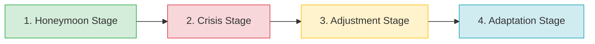

# 📘 Guia de Estudo Teórico: Inglês III

Este guia abrange de forma exaustiva os conteúdos teóricos, culturais, lexicais e gramaticais exigidos para a disciplina de Inglês III em nível universitário.

---

## 📌 Sumário
1. [Estudos Culturais e Sociedade](#1-estudos-culturais-e-sociedade)
2. [O Fenômeno do Choque Cultural (Culture Shock)](#2-o-fenômeno-do-choque-cultural-culture-shock)
3. [Comunicação Animal vs. Humana](#3-comunicação-animal-vs-humana)
4. [A Sociedade de Consumo (Consumer Society)](#4-a-sociedade-de-consumo-consumer-society)
5. [Fundamentos Gramaticais e Estruturais](#5-fundamentos-gramaticais-e-estruturais)

---

## 1. Estudos Culturais e Sociedade

Para o estudo da língua inglesa em um contexto global, a compreensão de elementos culturais e sociopolíticos é imprescindível.

### 1.1 Culture vs. Tradition
* **Culture (Cultura):** É um macrossistema complexo. Refere-se ao conjunto de valores, crenças, costumes, conhecimento, linguagem e práticas que caracterizam um grupo de pessoas e orientam o seu modo de vida. A cultura é dinâmica e evolui com as gerações.
* **Tradition (Tradição):** É um subconjunto da cultura. Refere-se a práticas específicas, rituais ou costumes que são passados de geração em geração (ex.: reunir a família aos domingos, celebrar o Dia de Ação de Graças).

### 1.2 Emancipation vs. Democracy
* **Emancipation (Emancipação):** O processo de libertação de restrições, opressão ou dependência legal, política e social (ex.: a abolição da escravidão ou o direito das mulheres à independência financeira).
* **Democracy (Democracia):** Um sistema sociopolítico no qual os cidadãos têm o direito de participar do processo de tomada de decisão, direta ou indiretamente, geralmente através do voto (representação política).

---

## 2. O Fenômeno do Choque Cultural (Culture Shock)

A imigração, turismo ou estudo no exterior frequentemente desencadeiam o chamado **Culture Shock**. O antropólogo canadense **Kalervo Oberg** categorizou este processo em 4 estágios universais.

### 2.1 Os Quatro Estágios (The Four Stages)
1. **Honeymoon Stage (Estágio de Lua de Mel):** Ocorre nas primeiras semanas. É um período de fascinação, excitação e interesse (*intriguing*). As diferenças culturais são vistas de maneira romântica e aventureira.
2. **Crisis Stage (Estágio de Crise):** Começa geralmente aos três meses. As emoções positivas começam a desaparecer (*fade*). A confusão, desorientação e a barreira linguística (*language barrier*) causam frustração, ansiedade e saudade de casa (*homesickness*). 
3. **Adjustment Stage (Estágio de Ajustamento):** Acontece entre seis meses a um ano. O indivíduo começa a aceitar as diferenças. Aprende a lidar com os desafios do dia a dia e começa a superar as barreiras de costume e de idioma.
4. **Adaptation / Mastery Stage (Estágio de Adaptação):** O indivíduo torna-se integrado (*integrated*). Ele estabelece novas rotinas e amizades, alcançando um equilíbrio em que não precisa entender tudo da cultura para se sentir confortável e ter uma vida plena.

### 2.2 Reverse Culture Shock (Choque Cultural Reverso)
Trata-se da experiência de choque ao regressar ao próprio país de origem após muito tempo fora. As expectativas de encontrar tudo familiar são frustradas pelas mudanças que o país e a própria pessoa sofreram durante o período no exterior.

---

## 3. Comunicação Animal vs. Humana

A linguagem é uma das marcas definidoras da cultura humana. No entanto, os animais também se comunicam através de sistemas não-verbais restritos.
* **Sons (Sounds):** Pássaros cantam para atrair parceiros ou marcar território; golfinhos usam assobios (*whistles*) e cliques para coordenar ações em grupo.
* **Linguagem Corporal (Body Language):** Cães abanam a cauda ou latem para expressar emoção.
* **Sinais Químicos (Chemical Signals):** Insetos, como as formigas, deixam trilhas químicas.
* **Movimentos (Visual Displays):** As abelhas realizam "danças" para indicar a direção e distância de fontes de alimento (famosa *waggle dance*).

---

## 4. A Sociedade de Consumo (Consumer Society)

Uma "sociedade de consumo" (*consumer society*) é definida por promover ativamente a aquisição contínua de bens e serviços.

* **Pontos Positivos:** Maior conforto e acessibilidade a produtos que antes eram luxo (celulares, computadores).
* **Pontos Negativos:** Estimula compras excessivas, gerando desperdício. O avanço constante de tecnologia (como novos celulares a cada ano) cria montanhas de lixo eletrônico.
* **O Consumidor Responsável:** Uma nova tendência em que indivíduos refletem criticamente sobre o impacto de suas compras no meio ambiente.

---

## 5. Fundamentos Gramaticais e Estruturais

O nível 3 de Inglês foca em garantir coesão textual e a expressão de ideias com complexidade adequada.

### 5.1 Linking Words (Conectores)
As conjunções organizam sentenças e evitam frases fragmentadas.

| Conector | Função Linguística | Exemplo e Tradução |
|:---:|:---|:---|
| **AND** | Adição (Adiciona informações). | *She is smart **and** hardworking.* (Ela é inteligente e trabalhadora). |
| **BUT** | Contraste (Oposição direta). | *I like coffee, **but** I don't like tea.* (Eu gosto de café, mas não gosto de chá). |
| **HOWEVER** | Contraste / Concessão (Mais formal). | *It was raining. **However**, we went out.* (Estava chovendo. No entanto, nós saímos). |
| **SO** | Consequência / Resultado. | *I was sick, **so** I stayed home.* (Eu estava doente, então fiquei em casa). |
| **BECAUSE**| Causa / Motivo. | *I stayed home **because** I was sick.* (Eu fiquei em casa porque estava doente). |

### 5.2 The Present Perfect Tense
O *Present Perfect* conecta o passado ao presente. Diferente do *Simple Past*, o tempo exato não importa ou a ação tem relevância direta para o presente.
**Formação:** Sujeito + *have / has* + *Past Participle* (Particípio Passado do verbo).

* **Exemplo 1 (Experiência de Vida):** *I **have traveled** to the USA.* (Eu viajei para os EUA - não importa quando).
* **Exemplo 2 (Ação recente com efeito no presente):** *She **has finished** her work.* (Ela terminou o trabalho - ela está livre agora).
* **Transformação do Simple Past para Present Perfect:**
  * *Past:* My sister bought a car yesterday.
  * *Present Perfect:* My sister **has bought** a car. 

### 5.3 Comparative Adjectives
Os adjetivos comparativos servem para contrapor dois elementos.

* **Regras de formação:**
  1. **Adjetivos curtos (1 sílaba):** Adiciona-se `-er` + *than*. Ex: *fast* $\rightarrow$ *faster than* / *smart* $\rightarrow$ *smarter than*.
  2. **Adjetivos terminados em 'y':** Troca-se o 'y' por 'i' e adiciona-se `-er`. Ex: *easy* $\rightarrow$ *easier than*.
  3. **Adjetivos longos (2 sílabas ou mais):** Usa-se *more* antes do adjetivo + *than*. Ex: *comfortable* $\rightarrow$ *more comfortable than* / *advanced* $\rightarrow$ *more advanced than*.
  4. **Irregulares:** *Good* $\rightarrow$ *better than* / *Bad* $\rightarrow$ *worse than* / *Far* $\rightarrow$ *farther / further than*.

* **Exemplos no contexto da Consumer Society:**
  * "People in consumer societies tend to live **more comfortably**."
  * "They eat a **wider** variety of food."
  * "The market is growing **faster**."
  * "'Smarter' phones come out every year."
