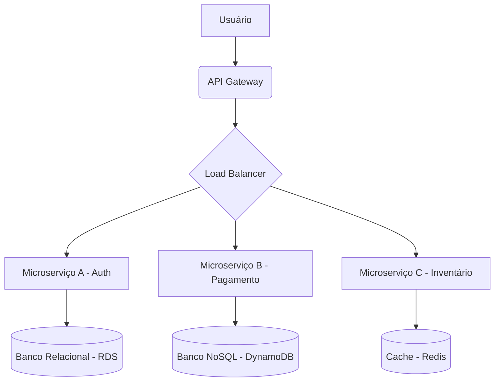

# 01 - Guia de Estudo Teórico: Laboratórios de Novas Tendências e Tecnologias I

Este guia exaustivo e aprofundado cobre as fundações, arquiteturas, e paradigmas avançados das tecnologias emergentes no cenário da engenharia de software e ciência da computação moderna. Abordaremos Computação em Nuvem (AWS, Azure, GCP), Frameworks Web Avançados (Lumen, Laravel, Express.js, Vue.js), Visão Artificial, e Informática Quântica. O objetivo é fornecer uma visão de nível universitário, conectando a teoria subjacente à aplicação prática e ao design de sistemas.

---

## 1. Computação em Nuvem (Cloud Computing)

A computação em nuvem revolucionou a forma como as organizações consomem, gerenciam e implantam recursos de TI. Ela abstrai a complexidade do hardware físico, oferecendo serviços sob demanda via internet, com tarifação baseada no uso (pay-as-you-go).

### 1.1 Modelos de Serviço
A nuvem é fundamentalmente dividida em três modelos de serviço primários:
- **IaaS (Infrastructure as a Service):** Fornece recursos de computação, armazenamento e rede virtualizados. O provedor gerencia a infraestrutura física, enquanto o cliente gerencia o sistema operacional, middleware e aplicações. *Exemplos: Amazon EC2, Google Compute Engine.*
- **PaaS (Platform as a Service):** Oferece um ambiente de desenvolvimento e implantação completo na nuvem, abstraindo o sistema operacional e a infraestrutura subjacente. Focado em desenvolvedores de aplicações. *Exemplos: AWS Elastic Beanstalk, Google App Engine.*
- **SaaS (Software as a Service):** Entrega software como um serviço completo, pronto para uso, acessível via navegador ou API. O provedor gerencia tudo. *Exemplos: Google Workspace, Microsoft 365, Salesforce.*

### 1.2 Modelos de Implantação
- **Nuvem Pública:** Infraestrutura operada por provedores terceirizados (AWS, Azure, GCP) e acessível a múltiplas organizações pela internet.
- **Nuvem Privada:** Infraestrutura dedicada exclusivamente a uma única organização. Pode ser hospedada internamente (on-premises) ou por terceiros.
- **Nuvem Híbrida:** Combina nuvem pública e privada, permitindo que dados e aplicações sejam compartilhados entre elas (ex: "cloud bursting").
- **Multicloud:** Uso de múltiplos provedores de nuvem pública simultaneamente para evitar "vendor lock-in", otimizar custos ou aproveitar serviços específicos (ex: usar GCP para Machine Learning e AWS para computação geral).

### 1.3 Os Gigantes da Nuvem: AWS vs. Azure vs. GCP

#### Amazon Web Services (AWS)
A pioneira e atual líder de mercado. A AWS possui o maior ecossistema de serviços e a presença global mais extensa.
- **Computação:** EC2 (Máquinas Virtuais), Lambda (Serverless/FaaS), ECS/EKS (Containers).
- **Armazenamento:** S3 (Object Storage), EBS (Block Storage), Glacier (Archival).
- **Banco de Dados:** RDS (Relacional), DynamoDB (NoSQL), Aurora (Relacional Otimizado).
- **Forças:** Profundidade de serviços, maturidade, documentação extensa e rede global massiva.

#### Microsoft Azure
O Azure é conhecido por sua integração nativa com o ecossistema empresarial da Microsoft (Windows Server, Active Directory, .NET, SQL Server).
- **Computação:** Virtual Machines, Azure Functions, Azure Kubernetes Service (AKS).
- **Armazenamento:** Blob Storage, Disk Storage, Archive Storage.
- **Banco de Dados:** Azure SQL Database, Cosmos DB (NoSQL globalmente distribuído).
- **Forças:** Híbrido por excelência (Azure Arc, Azure Stack), adoção corporativa massiva, forte suporte a PaaS.

#### Google Cloud Platform (GCP)
O GCP alavanca a mesma infraestrutura que suporta o Google Search e o YouTube. É altamente conceituado nas áreas de dados, machine learning e open source.
- **Computação:** Compute Engine, Cloud Functions, Google Kubernetes Engine (GKE - o padrão ouro para Kubernetes).
- **Armazenamento:** Cloud Storage, Persistent Disk, Coldline/Archive.
- **Banco de Dados:** Cloud SQL, Cloud Spanner (Relacional globalmente escalável), BigQuery (Data Warehouse).
- **Forças:** Big Data, Machine Learning (TensorFlow TPUs), rede de fibra óptica global própria, criadores do Kubernetes.

### 1.4 Arquiteturas Nativas da Nuvem (Cloud-Native)
Para tirar o máximo proveito da nuvem, não basta "fazer lift-and-shift" (mover servidores locais para VMs na nuvem). É necessário arquitetar para a nuvem:
- **Microserviços:** Dividir a aplicação em serviços pequenos, fracamente acoplados e independentemente implantáveis.
- **Containers:** Empacotar aplicações e suas dependências (Docker) para garantir portabilidade e consistência, orquestrados por Kubernetes.
- **Serverless (FaaS):** Executar código em resposta a eventos sem provisionar ou gerenciar servidores (AWS Lambda). Paga-se apenas pelos milissegundos de execução.
- **Infraestrutura como Código (IaC):** Gerenciar a infraestrutura através de código usando ferramentas como Terraform, AWS CloudFormation ou Ansible, permitindo versionamento e automação.

---

## 2. Frameworks Avançados (Lumen, Laravel, Express.js, Vue.js)

O desenvolvimento de aplicações web modernas exige a escolha de ferramentas adequadas (frameworks) que aceleram a entrega de valor, garantem a segurança e promovem a escalabilidade do código.

### 2.1 Ecossistema PHP: Laravel e Lumen

**Laravel**
O Laravel é um framework "full-stack" para PHP baseado na arquitetura Model-View-Controller (MVC). Ele é focado na experiência do desenvolvedor (DX), oferecendo uma sintaxe elegante e expressiva.
- **Eloquent ORM:** Um Object-Relational Mapper ativo e poderoso que facilita a interação com bancos de dados relacionais.
- **Artisan:** A interface de linha de comando (CLI) do Laravel que automatiza tarefas repetitivas (criação de controllers, models, migrações).
- **Roteamento e Middleware:** Sistema robusto para definição de endpoints e filtragem de requisições HTTP (autenticação, CORS).
- **Blade:** O motor de templates leve, mas poderoso, para renderização de views (embora seja frequentemente substituído por frameworks frontend puros em aplicações SPA - Single Page Applications).

**Lumen**
O Lumen foi desenvolvido pelos mesmos criadores do Laravel como um "micro-framework". Enquanto o Laravel é para aplicações complexas e monolíticas, o Lumen foi desenhado para criar APIs RESTful e microserviços ultrarrápidos. Ele sacrifica algumas funcionalidades prontas do Laravel (como o sistema de sessões completo e views) em troca de um tempo de resposta (boot time) muito menor. *(Nota: Atualmente, a comunidade Laravel sugere usar o Laravel puro com Octane para alta performance em vez do Lumen, devido à otimização contínua do framework principal).*

### 2.2 Ecossistema Node.js: Express.js

**Express.js**
O Express é o framework de facto e "minimalista" para Node.js. Ele fornece uma camada fina de recursos fundamentais para aplicações web, sem obscurecer as características do Node.js.
- **Assíncrono e Não Bloqueante:** Aproveita o Event Loop do Node.js para lidar com milhares de conexões concorrentes de forma eficiente.
- **Arquitetura Baseada em Middlewares:** Quase tudo no Express é um middleware — funções que têm acesso aos objetos de requisição (`req`), resposta (`res`) e à próxima função de middleware (`next`). Eles podem modificar a requisição, validar tokens de autenticação, etc.
- **Flexibilidade Extrema:** Diferente do Laravel, o Express não impõe uma estrutura de diretórios, um ORM ou um motor de templates. O desenvolvedor é livre para escolher (Mongoose para MongoDB, Sequelize para SQL, etc.).

### 2.3 Frontend Reativo: Vue.js

**Vue.js**
O Vue.js é um framework JavaScript progressivo para a construção de interfaces de usuário. Diferente do Angular (que é opinativo) ou React (que é uma biblioteca e requer muitas adições), o Vue tenta oferecer o melhor dos dois mundos.
- **Reatividade Transparente:** O sistema de reatividade do Vue rastreia dependências e atualiza o DOM (Document Object Model) de forma eficiente quando os dados mudam, utilizando o Virtual DOM.
- **Componentização:** A interface é construída como uma árvore de componentes encapsulados (Single-File Components - `.vue`), que contêm o template HTML, a lógica JavaScript e o estilo CSS no mesmo arquivo.
- **Diretivas:** Sintaxe especial no template (ex: `v-if`, `v-for`, `v-model`) que aplica comportamentos reativos ao DOM de forma declarativa.
- **Vuex / Pinia:** Ferramentas de gerenciamento de estado global, fundamentais para aplicações de médio e grande porte onde o estado precisa ser compartilhado entre múltiplos componentes não diretamente relacionados.

### Arquitetura SPA Integrada (Vue + Laravel/Express)
O padrão moderno mais comum é separar completamente o Frontend do Backend.
O Backend (desenvolvido em Laravel ou Express.js) expõe uma API REST ou GraphQL sem estado (stateless). O Frontend (desenvolvido em Vue.js) consome essa API e gerencia toda a interface de usuário, roteamento do lado do cliente (vue-router) e estado da aplicação. A comunicação é feita via requisições assíncronas (AJAX/Fetch/Axios) trocando dados no formato JSON.

---

## 3. Visão Artificial (Computer Vision)

A Visão Artificial é um subcampo da Inteligência Artificial (IA) e da Ciência da Computação que visa permitir que computadores entendam e processem imagens e vídeos de maneira similar à visão humana.

### 3.1 Fundamentos de Processamento de Imagens
Uma imagem digital é, em sua essência, uma matriz bidimensional de pixels (ou tridimensional, no caso de imagens coloridas com canais RGB). O processamento tradicional de imagens envolve aplicar filtros e transformações matemáticas a essas matrizes.
- **Convolução:** Operação matemática onde um "kernel" (uma pequena matriz de filtro) desliza pela imagem para extrair características (ex: detecção de bordas usando o filtro de Sobel, desfoque gaussiano).
- **Limiarização (Thresholding):** Converter imagens em tons de cinza em imagens binárias com base em um valor de corte.
- **Extração de Características:** Algoritmos clássicos como SIFT e SURF procuram pontos-chave em uma imagem que são invariantes a escala, rotação e iluminação.

### 3.2 O Revolucionário Papel do Deep Learning
A Visão Artificial sofreu uma revolução com o advento das Redes Neurais Convolucionais (CNNs).
- **CNNs (Convolutional Neural Networks):** Ao contrário dos métodos tradicionais onde os kernels eram definidos manualmente, as CNNs *aprendem* os valores desses filtros através de "backpropagation" e grandes volumes de dados (como o dataset ImageNet). Camadas iniciais aprendem a detectar linhas e bordas; camadas intermediárias detectam texturas e formas; e camadas finais detectam objetos complexos (ex: rostos, carros).
- **Transfer Learning (Aprendizado por Transferência):** Como treinar uma CNN do zero é computacionalmente caro e exige muitos dados, os desenvolvedores frequentemente utilizam modelos pré-treinados (como ResNet, VGG, Inception) e ajustam apenas as camadas finais para sua tarefa específica.

### 3.3 Principais Tarefas da Visão Artificial
- **Classificação de Imagens:** Determinar a qual classe principal a imagem pertence (ex: "é um gato ou um cachorro?").
- **Localização de Objetos e Detecção de Objetos:** Identificar classes de objetos e desenhar "bounding boxes" (caixas delimitadoras) ao redor deles. Algoritmos de ponta incluem o **YOLO (You Only Look Once)**, famoso por sua extrema velocidade que permite a detecção em tempo real, e as redes baseadas em propostas de região (R-CNN, Faster R-CNN).
- **Segmentação Semântica e de Instância:** Vai um passo além das bounding boxes. O objetivo é classificar cada pixel individual da imagem (ex: Máscara R-CNN). Muito utilizado em carros autônomos para delinear a estrada exata, pedestres e veículos.
- **Reconhecimento Facial e Análise de Expressão:** Mapeamento de landmarks faciais para biometria e análise de sentimentos.

### 3.4 Ferramentas e Bibliotecas
- **OpenCV (Open Source Computer Vision Library):** A biblioteca mais abrangente para processamento clássico de imagens e vídeo, escrita em C/C++ mas com extensas APIs para Python.
- **TensorFlow e PyTorch:** Os principais frameworks para construção, treinamento e inferência de modelos de Deep Learning voltados para visão computacional.

---

## 4. Informática Quântica (Quantum Computing)

A Informática Quântica é um paradigma fundamentalmente novo de computação que tira proveito das propriedades da mecânica quântica para resolver determinados tipos de problemas exponencialmente mais rápido do que os computadores clássicos.

### 4.1 Limitações da Computação Clássica
Os computadores clássicos operam com "bits", que podem estar no estado 0 ou 1. Eles resolvem problemas de forma linear. Para problemas extremamente complexos (como fatoração de números primos gigantes, simulação de dobramento de proteínas e otimização logística global), o número de combinações cresce de forma combinatória, tornando inviável para um supercomputador clássico encontrar a resposta, mesmo se rodasse por bilhões de anos.

### 4.2 O Qubit: A Unidade Fundamental
A contraparte quântica do bit é o **Qubit** (Quantum Bit). O poder da computação quântica deriva de três fenômenos fundamentais da física quântica:

- **Superposição (Superposition):** Ao contrário de um bit clássico que é 0 ou 1, um qubit pode existir em uma superposição de estados — ele pode representar 0 e 1 simultaneamente até que seja medido. Se tivermos 2 qubits, temos 4 estados simultâneos; com 3 qubits, 8 estados. O poder computacional escala exponencialmente ($2^n$).
- **Emaranhamento (Entanglement):** Qubits podem ser "conectados" de forma íntima. O estado de um qubit emaranhado está intrinsecamente ligado ao estado de outro, não importando a distância física entre eles. Medir um instantaneamente determina o estado do outro. Isso permite operações lógicas altamente complexas e correlações que não existem na física clássica.
- **Interferência (Interference):** Os algoritmos quânticos exploram as probabilidades ondulatórias. A interferência construtiva é usada para amplificar as probabilidades das respostas corretas, enquanto a interferência destrutiva cancela as probabilidades das respostas incorretas, convergindo para a solução ótima.

### 4.3 Portas e Circuitos Quânticos
Assim como computadores clássicos usam portas lógicas (AND, OR, NOT), computadores quânticos usam portas quânticas (Pauli-X, Hadamard, CNOT).
- A **Porta Hadamard (H)**, por exemplo, é a porta que coloca um qubit no estado de superposição.
- Circuitos quânticos são desenhados aplicando uma série destas portas a um conjunto de qubits ao longo do tempo.

### 4.4 Algoritmos Quânticos Revolucionários
- **Algoritmo de Shor (1994):** Capaz de fatorar números inteiros grandes exponencialmente mais rápido que o melhor algoritmo clássico conhecido. Isso representa uma ameaça teórica a toda a criptografia moderna (RSA), que é baseada na dificuldade de fatoração. Impulsionou o desenvolvimento da "Criptografia Pós-Quântica".
- **Algoritmo de Grover (1996):** Permite a busca em uma base de dados não estruturada com uma aceleração quadrática. Se uma busca clássica precisa checar $N$ itens no pior caso, Grover pode encontrar a resposta em $\sqrt{N}$ tentativas.

### 4.5 Desafios de Hardware e Computação Quântica Atual
O maior obstáculo atual é a **Decoerência Quântica (Quantum Decoherence)**. Os qubits são extremamente sensíveis. Flutuações térmicas mínimas, radiação ou ruído eletromagnético do ambiente fazem com que eles "entrem em colapso" e percam sua superposição.
- **Era NISQ (Noisy Intermediate-Scale Quantum):** É a fase atual da computação quântica. Possuímos computadores quânticos com dezenas a centenas de qubits (criados pela IBM, Google, Rigetti), mas eles são "ruidosos" e propensos a erros.
- **Tipos de Qubits:**
  - *Supercondutores:* (Usados por Google, IBM). Circuitos resfriados a temperaturas próximas do zero absoluto (-273,15 °C).
  - *Íons Aprisionados (Trapped Ions):* (Usados por IonQ). Átomos individuais aprisionados por campos eletromagnéticos.
  - *Qubits Fotônicos:* Usam partículas de luz (fótons).

### 4.6 Conclusão
A informática quântica não vai substituir o computador pessoal. É provável que ela exista como um co-processador na nuvem (Quantum-as-a-Service, como o Amazon Braket ou IBM Quantum Experience), utilizado por cientistas, químicos e especialistas em logística para resolver gargalos computacionais hiper-específicos inacessíveis à computação tradicional.
