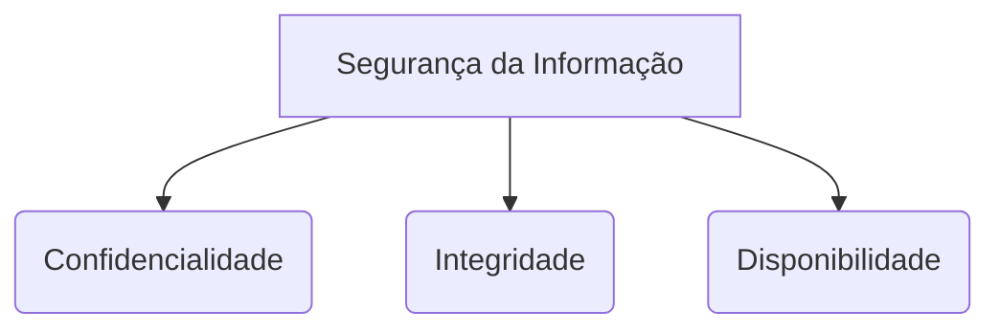

# Guia de Estudo Teórico: Segurança Informática e Criptografia - V2

Bem-vindo ao guia exaustivo e aprofundado de **Segurança Informática e Criptografia**. Este documento foi sintetizado e expandido para fornecer uma base sólida, de nível universitário, combinando as diretrizes de Gestão de Sistemas de Informação com os fundamentos matemáticos e técnicos da segurança cibernética, bem como as práticas de auditoria.

---

## 1. Introdução à Segurança da Informação

O objetivo principal da Segurança da Informação é proteger dados contra acessos não autorizados, alterações indevidas, destruição ou indisponibilidade. O foco é garantir que a informação permaneça segura, confiável e acessível apenas para quem tem permissão, não se limitando apenas a instalar antivírus ou configurar firewalls.

### 1.1 A Tríade CID (CIA Triad)
A base teórica sobre a qual se assenta toda a arquitetura de segurança da informação é a Tríade CID (Confidencialidade, Integridade e Disponibilidade).

| Princípio | Descrição | Mecanismos de Contramedida |
| :--- | :--- | :--- |
| **Confidencialidade** | A informação não pode ser disponibilizada ou revelada a indivíduos, entidades ou processos não autorizados. | Criptografia de dados (em trânsito e em repouso), controle de acesso (senhas, biometria) e permissões de arquivos. |
| **Integridade** | Refere-se à manutenção da exatidão e completude da informação e dos seus métodos de processamento. Garante que os dados não foram alterados indevidamente. | Funções *Hash* (ex: SHA-256), Assinaturas Digitais e controles de versão. |
| **Disponibilidade** | Garante o acesso e a utilização da informação e dos sistemas por parte dos utilizadores autorizados sempre que necessária. | Redundância, backups, clusters e balanceamento de carga. Proteção contra ataques DoS. |

### 1.2 Outros Princípios Fundamentais
*   **Autenticidade:** Garantia de que usuários e dados são legítimos. A origem da informação é quem afirma ser.
*   **Não Repúdio (Non-repudiation):** Garante que uma pessoa não possa negar uma ação que realizou (ex.: o emissor não pode negar ter enviado uma mensagem e o recetor não pode negar tê-la recebido).

> [!NOTE]
> A conformidade mínima com normas e padrões de segurança (como ISO 27001) marca o início da qualificação para a aplicação dos **Controles de Qualidade** na organização.

---

## 2. Gestão de Sistemas e Governança de TI

Com base no material de estudo das direções de Sistemas de Informação (DSI), a segurança deve estar alinhada com a gestão e implantação de projetos tecnológicos (como iniciativas de E-Business).

### 2.1 SGSI (Sistema de Gestão da Segurança da Informação)
Um SGSI é um processo sistemático, documentado e conhecido por toda a organização, desenvolvido a partir de um enfoque de risco empresarial. Ele atua em várias camadas e baseia-se em normas consagradas:
1.  **Diretrizes e Políticas:** Define o alcance, objetivos e políticas de alto nível (Ex: ISO/IEC 27001, NIST Cybersecurity Framework, COBIT).
2.  **Procedimentos Operacionais:** Planejamento, operação e controle diário da segurança.
3.  **Instruções de Trabalho:** Tarefas específicas de como configurar ou gerir ativos de TI.
4.  **Registos:** Evidências objetivas de que as normas estão a ser cumpridas.

### 2.2 Frameworks de Governança (ITIL e COBIT)
*   **ITIL (Information Technology Infrastructure Library):** Focado no alinhamento dos serviços de TI com as necessidades do negócio. Um processo de Gestão de Segurança da Informação dentro do ITIL garante que as operações de serviços suportam as políticas do SGSI.
*   **Modelos de Maturidade (CMM, CMMI, Trillium):** Avaliam o nível de organização de uma empresa no desenvolvimento de software e gestão de projetos. Um nível "Otimizado" ou "Completamente Integrado" implica que a segurança não é uma reflexão tardia, mas um requisito integrado no ciclo de vida de desenvolvimento (Secure SDLC).

---

## 3. Ameaças, Vulnerabilidades e Ataques

Para defender um sistema, é necessário compreender as formas como ele pode ser atacado e entender o conceito de **cibercrime**.
**Cibercrime** é qualquer atividade ilegal realizada através de computadores, redes ou dispositivos digitais, com o objetivo de causar danos, roubar informações ou interromper serviços.

*   **Phishing e Engenharia Social:** Manipulação psicológica de pessoas para que revelem informações confidenciais.
    *   *Exemplo Prático:* Um funcionário de um escritório administrativo recebe um e-mail falso supostamente do banco. O link leva a um site fraudulento, onde as credenciais da empresa são roubadas e usadas para acessar informações financeiras.
*   **Malware (Software Malicioso):** Inclui Vírus (precisam de hospedeiro), Worms (autorreplicáveis via rede), Trojans (escondidos em software legítimo) e Ransomware (criptografa dados exigindo resgate).
    *   *Exemplo Prático:* Um colaborador num hospital abre um anexo infectado com Ransomware, causando a criptografia de todos os dados de pacientes. Os criminosos exigem pagamento para liberar os arquivos, afetando o atendimento médico.
*   **Man-in-the-Middle (MitM):** O atacante interceta e, possivelmente, altera a comunicação entre duas partes sem que estas percebam.
*   **Ataques de Injeção (SQL Injection, XSS):** Exploração de vulnerabilidades no código da aplicação (especialmente web) para manipular o banco de dados ou executar scripts maliciosos.

> [!WARNING]
> O impacto de um ataque de Ransomware em infraestruturas críticas (como a saúde) pode resultar em perda de vidas além das perdas financeiras, destacando a necessidade de backups rigorosos e testados.

---

## 4. Fundamentos de Criptografia

A criptografia é o núcleo da Confidencialidade, Integridade e Autenticidade na Internet moderna.

### 4.1 Criptografia Clássica
Baseia-se no princípio de substituição ou transposição de caracteres. 
*   **Cifra de César:** Substituição simples onde cada letra do texto é deslocada $k$ posições no alfabeto.
*   **Cifra de Vigenère:** Expande a cifra de César usando uma palavra-chave para alterar o deslocamento de cada caractere, criando uma cifra polialfabética.

### 4.2 Criptografia Simétrica (Chave Partilhada)
Utiliza a mesma chave tanto para cifrar (encriptar) quanto para decifrar (desencriptar) a mensagem.
*   **Vantagens:** Muito rápida, ideal para grandes volumes de dados.
*   **Desvantagens:** O "Problema da Distribuição de Chaves" – como enviar a chave ao recetor de forma segura?
*   **Exemplos Padrão:** AES (Advanced Encryption Standard), DES, 3DES, RC4.

### 4.3 Criptografia Assimétrica (Chave Pública)
Resolve o problema de distribuição de chaves utilizando um par de chaves matematicamente relacionadas:
1.  **Chave Pública:** Pode ser distribuída livremente.
2.  **Chave Privada:** Mantida em segredo absoluto pelo proprietário.

*   **Confidencialidade:** Se o remetente cifra com a **Chave Pública** do destinatário, apenas a **Chave Privada** do destinatário poderá decifrar.
*   **Autenticidade:** Se o remetente cifra com a sua própria **Chave Privada**, qualquer pessoa com a sua **Chave Pública** pode decifrar, provando a autoria.
*   **Exemplos:** RSA, Diffie-Hellman, Curvas Elípticas (ECC).

### 4.4 Funções de Hash e Assinaturas Digitais
*   **Hash:** Uma função matemática de mão única que recebe dados de tamanho variável e devolve um *digest* de tamanho fixo. Garante a **Integridade**. Exemplos: SHA-256.
*   **Assinatura Digital:** Combina Hash com Criptografia Assimétrica. Um documento passa por um Hash, e esse Hash é cifrado com a Chave Privada do remetente.

---

## 5. Segurança de Redes e Infraestrutura

A aplicação dos conceitos criptográficos no mundo real é feita através de protocolos e equipamentos de rede.

*   **Firewalls:** Dispositivos (hardware ou software) que controlam o tráfego de entrada e saída.
*   **IDS/IPS:** Sistemas de Detecção de Intrusão (apenas alertam) e Sistemas de Prevenção de Intrusão (bloqueiam ativamente o tráfego anômalo).
*   **IPsec e VPNs:** Utilizam tunelamento e criptografia para criar ligações seguras através de redes públicas.
*   **SSL/TLS (HTTPS):** Protocolos que garantem segurança na comunicação web, usando criptografia assimétrica no handshake e simétrica na transferência dos dados.

---

## 6. Auditoria de Sistemas e Segurança

### 6.1 O que é Auditoria?
Auditoria é um processo sistemático e independente de avaliação que verifica se atividades, registros, processos e controles estão em conformidade com normas, políticas e requisitos estabelecidos.

| Tipo de Auditoria | Foco Principal | Objetivo | Instrumentos |
| :--- | :--- | :--- | :--- |
| **Auditoria Contábil** | Demonstrações financeiras e registros contábeis. | Validar dados financeiros e prevenir fraudes. | Documentos contábeis, balancetes, livros financeiros. |
| **Auditoria de TI** | Sistemas de informação, controles tecnológicos e processos de TI. | Garantir confiabilidade, integridade de dados e eficiência de processos. | Logs, controles de acesso, infraestrutura. |
| **Auditoria de Segurança** | Avaliação de controles de segurança e proteção de dados. | Detectar vulnerabilidades, avaliar riscos e garantir conformidade. | Testes de intrusão, scanners de vulnerabilidade, análise de riscos. |

### 6.2 Planeamento de Auditoria e Entidades
No planeamento de uma auditoria de TI, estão envolvidas diversas entidades:
*   **Equipe de Auditoria:** Responsável por conduzir as atividades.
*   **Cliente da Auditoria (Auditado):** Área ou setor avaliado que fornecerá informações.
*   **Stakeholders:** Pessoas interessadas ou afetadas pela auditoria.
*   **Órgãos Reguladores:** Entidades externas que exigem conformidade (leis e normas).
*   **Comitê de Auditoria / Alta Administração:** Aprova o plano e garante alinhamento com objetivos estratégicos.

> [!IMPORTANT]
> **Fatores Externos que afetam a Auditoria de TI:** Leis e regulamentos (ex. proteção de dados), normas internacionais (ISO 27001), mudanças tecnológicas constantes, situação econômica (cortes de investimento), e pressão competitiva do mercado.

### 6.3 Automação na Auditoria e TI
Para tornar a auditoria mais eficiente, diversos processos podem ser automatizados:
*   **Auditoria Automatizada:** Coleta de logs, comparação de configurações com padrões, varredura de vulnerabilidades, identificação de anomalias e geração de relatórios.
*   **Automação Geral de TI:** Backups automáticos, criação/remoção de contas, atualizações e patches (gestão de patches), monitoramento de rede e testes automáticos de software.

### 6.4 Relatórios de Auditoria
Um relatório de auditoria deve conter: **Objetivo, Escopo, Metodologia, Constatações, Recomendações e Conclusão**.
Quando projetos complexos, como **Business Process Reengineering (BPR)** (ex. migração de Mainframes para servidores distribuídos) são auditados, as constatações comuns podem incluir:
1.  **Processos não implementados totalmente:** Causa risco de retrabalho e atrasos na migração.
2.  **Falta de treinamento adequado:** Resulta em resistência à mudança e aumento de erros humanos.
3.  **Matrizes de responsabilidade (RACI) desatualizadas:** Causa conflitos de competência e falhas de comunicação.

---

## 7. Bibliografia Recomendada e Padrões

*   **Padrões de Referência:** ISO/IEC 27001:2022 (Sistemas de Gestão de Segurança da Informação), NIST Cybersecurity Framework (CSF 2.0).
*   **Literatura Base:**
    *   Stallings, W. (2022). *Cryptography and Network Security: Principles and Practice*. Pearson.
    *   Whitman, M. E., & Mattord, H. J. (2023). *Principles of Information Security*. Cengage Learning.
    *   Pfleeger, C. P., & Pfleeger, S. L. (2021). *Security in Computing*. Pearson.
    *   OWASP Top 10 (2024) – Vulnerabilidades web críticas.

---
*Este guia reúne os elementos corporativos de governança de projetos e TI, combinados com as metodologias de proteção matemática de dados essenciais para o curso universitário, bem como os pilares de auditoria contemporânea.*
