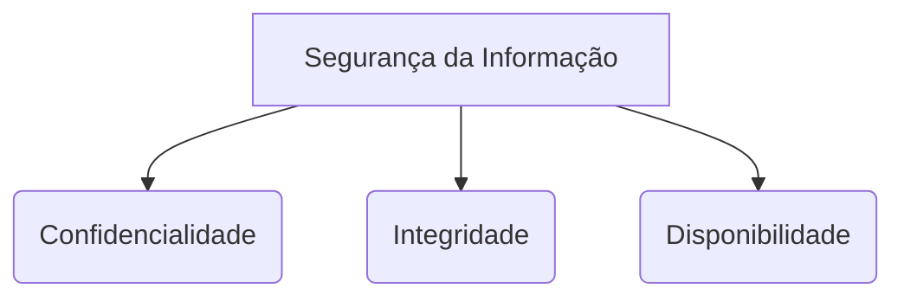

# Guia de Estudo Teórico: Segurança Informática e Criptografia

Bem-vindo ao guia exaustivo e aprofundado de **Segurança Informática e Criptografia**. Este documento foi sintetizado e expandido para fornecer uma base sólida, de nível universitário, combinando as diretrizes de Gestão de Sistemas de Informação com os fundamentos matemáticos e técnicos da segurança cibernética.

---

## 1. Introdução à Segurança da Informação

A Segurança da Informação não se trata apenas de instalar antivírus ou configurar firewalls. Trata-se de um conjunto de políticas, processos e tecnologias concebidos para proteger dados essenciais contra acessos não autorizados, modificações, interrupções ou destruição.

### 1.1 A Tríade CID (CIA Triad)
A base teórica sobre a qual se assenta toda a arquitetura de segurança da informação é a Tríade CID (Confidencialidade, Integridade e Disponibilidade).

*   **Confidencialidade (Confidentiality):** A informação não pode ser disponibilizada ou revelada a indivíduos, entidades ou processos não autorizados. Mecanismos para garantir a confidencialidade incluem criptografia de dados (em trânsito e em repouso), controle de acesso (senhas, biometria) e permissões de arquivos.
*   **Integridade (Integrity):** Refere-se à manutenção da exatidão e completude da informação e dos seus métodos de processamento. A integridade garante que os dados não foram alterados de forma não autorizada. Utilizam-se funções *Hash* (ex: SHA-256), Assinaturas Digitais e controles de versão.
*   **Disponibilidade (Availability):** Garante o acesso e a utilização da informação e dos sistemas por parte dos utilizadores autorizados sempre que necessário. Ataques como DoS (Denial of Service) visam quebrar este pilar. Contramedidas incluem redundância, backups, clusters e balanceamento de carga.

### 1.2 Outros Princípios Fundamentais
*   **Autenticidade:** Garantir que a origem da informação é quem afirma ser.
*   **Não Repúdio (Non-repudiation):** Garantir que o emissor não pode negar ter enviado uma mensagem e o recetor não pode negar tê-la recebido. 

---

## 2. Gestão de Sistemas e Governança de TI

Com base no material de estudo das direções de Sistemas de Informação (DSI), a segurança deve estar alinhada com a gestão e implantação de projetos tecnológicos (como iniciativas de E-Business).

### 2.1 SGSI (Sistema de Gestão da Segurança da Informação)
Um SGSI (baseado tipicamente na norma ISO/IEC 27001) é um processo sistemático, documentado e conhecido por toda a organização, desenvolvido a partir de um enfoque de risco empresarial. Ele atua em várias camadas:
1.  **Diretrizes e Políticas:** Define o alcance, objetivos e políticas de alto nível.
2.  **Procedimentos Operacionais:** Planejamento, operação e controle diário da segurança.
3.  **Instruções de Trabalho:** Tarefas específicas de como configurar ou gerir ativos de TI.
4.  **Registos:** Evidências objetivas de que as normas estão a ser cumpridas.

### 2.2 Frameworks de Governança (ITIL e COBIT)
*   **ITIL (Information Technology Infrastructure Library):** Focado no alinhamento dos serviços de TI com as necessidades do negócio. Um processo de Gestão de Segurança da Informação dentro do ITIL garante que as operações de serviços suportam as políticas do SGSI.
*   **Modelos de Maturidade (CMM, CMMI, Trillium):** Avaliam o nível de organização de uma empresa no desenvolvimento de software e gestão de projetos. Um nível "Otimizado" ou "Completamente Integrado" implica que a segurança não é uma reflexão tardia, mas um requisito integrado no ciclo de vida de desenvolvimento (Secure SDLC).

---

## 3. Ameaças, Vulnerabilidades e Ataques

Para defender um sistema, é necessário compreender as formas como ele pode ser atacado.

*   **Malware (Software Malicioso):** Inclui Vírus (precisam de hospedeiro), Worms (autorreplicáveis via rede), Trojans (escondidos em software legítimo) e Ransomware (criptografa dados do utilizador exigindo resgate).
*   **Phishing e Engenharia Social:** Manipulação psicológica de pessoas para que revelem informações confidenciais, muitas vezes através de emails falsos.
*   **Man-in-the-Middle (MitM):** O atacante interceta e, possivelmente, altera a comunicação entre duas partes sem que estas percebam.
*   **Ataques de Injeção (SQL Injection, XSS):** Exploração de vulnerabilidades no código da aplicação (especialmente web) para manipular o banco de dados ou executar scripts maliciosos.

---

## 4. Fundamentos de Criptografia

A criptografia é o núcleo da Confidencialidade, Integridade e Autenticidade na Internet moderna.

### 4.1 Criptografia Clássica
Baseia-se no princípio de substituição ou transposição de caracteres. 
*   **Cifra de César:** Substituição simples onde cada letra do texto é deslocada $k$ posições no alfabeto.
*   **Cifra de Vigenère:** Expande a cifra de César usando uma palavra-chave para alterar o deslocamento de cada caractere, criando uma cifra polialfabética.

### 4.2 Criptografia Simétrica (Chave Partilhada)
Utiliza a mesma chave tanto para cifrar (encriptar) quanto para decifrar (desencriptar) a mensagem.
*   **Vantagens:** Muito rápida, ideal para grandes volumes de dados.
*   **Desvantagens:** O "Problema da Distribuição de Chaves" – como enviar a chave ao recetor de forma segura?
*   **Exemplos Padrão:** AES (Advanced Encryption Standard), DES, 3DES, RC4.

### 4.3 Criptografia Assimétrica (Chave Pública)
Resolve o problema de distribuição de chaves utilizando um par de chaves matematicamente relacionadas, mas que não podem ser deduzidas uma da outra:
1.  **Chave Pública:** Pode ser distribuída livremente.
2.  **Chave Privada:** Mantida em segredo absoluto pelo proprietário.

Se o remetente cifra com a **Chave Pública** do destinatário, apenas a **Chave Privada** do destinatário poderá decifrar (Garante a Confidencialidade).
Se o remetente cifra com a sua própria **Chave Privada**, qualquer pessoa com a sua **Chave Pública** pode decifrar e provar que a mensagem veio efetivamente dele (Garante Autenticidade / Assinatura Digital).
*   **Exemplos:** RSA (baseado na fatoração de números primos grandes), Diffie-Hellman (algoritmo de troca de chaves), Curvas Elípticas (ECC).

### 4.4 Funções de Hash e Assinaturas Digitais
*   **Hash:** Uma função matemática de mão única que recebe dados de tamanho variável e devolve uma cadeia de caracteres de tamanho fixo (o *digest*). Um único bit alterado na mensagem original muda completamente o *digest*. Garante a **Integridade**. Exemplos: MD5 (obsoleto), SHA-1 (obsoleto), SHA-256.
*   **Assinatura Digital:** Combina Hash com Criptografia Assimétrica. Um documento passa por um Hash, e esse Hash é cifrado com a Chave Privada do remetente. O destinatário decifra o Hash com a Chave Pública e compara com um novo Hash gerado por ele mesmo a partir do documento.

---

## 5. Segurança de Redes e Infraestrutura

A aplicação dos conceitos criptográficos no mundo real é feita através de protocolos e equipamentos de rede.

*   **Firewalls:** Dispositivos (hardware ou software) que controlam o tráfego de entrada e saída com base num conjunto de regras de segurança preestabelecidas.
*   **IDS/IPS:** Sistemas de Detecção de Intrusão (apenas alertam) e Sistemas de Prevenção de Intrusão (bloqueiam ativamente o tráfego anômalo).
*   **IPsec e VPNs:** As Virtual Private Networks utilizam tunelamento e criptografia (como o conjunto de protocolos IPsec) para criar ligações seguras através de redes públicas, garantindo confidencialidade a trabalhadores remotos (contexto de E-Business).
*   **SSL/TLS (HTTPS):** Protocolos que garantem segurança na comunicação web, usando criptografia assimétrica na troca de chaves (handshake) e simétrica na transferência dos dados.

---
*Este guia reúne os elementos corporativos de governança de projetos e TI, combinados com as metodologias de proteção matemática de dados essenciais para o curso universitário.*
