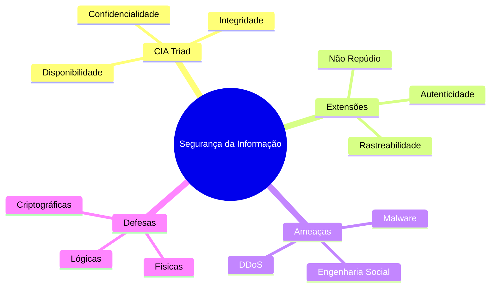

# Guia de Estudo Teórico: Segurança Informática e Criptografia

## 1. Introdução à Segurança da Informação

A Segurança da Informação refere-se ao conjunto de práticas, políticas, ferramentas e mecanismos concebidos para proteger os dados e os sistemas de informação de uma organização contra acesso, uso, divulgação, interrupção, modificação ou destruição não autorizados. No atual ecossistema digital, em que a informação é frequentemente o ativo mais valioso de uma instituição (seja ela pública ou privada), garantir a sua proteção é um pilar estratégico que assegura a continuidade dos negócios, a conformidade legal e a reputação.

O ecossistema informático atual baseia-se numa rede ubíqua de dispositivos, desde servidores corporativos até dispositivos móveis pessoais (BYOD) e sistemas de Internet das Coisas (IoT). Cada ponto de conexão introduz potenciais vulnerabilidades, exigindo uma abordagem sistémica e multifacetada, designada comummente como *Defesa em Profundidade* (Defense in Depth).

### 1.1 O Paradigma Segurança-Funcionalidade-Usabilidade

Na conceção de qualquer arquitetura de segurança, existe um compromisso fundamental (trade-off) entre três fatores:
1. **Segurança (Protection):** A robustez dos mecanismos de controlo, autenticação e encriptação.
2. **Funcionalidade (Functionality):** As características operacionais, de interoperabilidade e capacidades oferecidas pelo sistema.
3. **Usabilidade (Usability):** A facilidade e intuição com que os utilizadores interagem com o sistema.

Aumentar excessivamente a segurança (por exemplo, exigindo autenticação multifator a cada 5 minutos, ou passwords de 30 caracteres) reduz drasticamente a usabilidade, podendo levar os utilizadores a adotar comportamentos de risco (como apontar a password num post-it) para contornar as restrições, o que paradoxalmente diminui a segurança real do sistema.

## 2. Princípios Fundamentais: O Triângulo CIA e Extensões

Os objetivos primários da Segurança da Informação são frequentemente sumarizados na sigla **CIA**, à qual se adicionam, modernamente, outras dimensões críticas.

### 2.1 Confidencialidade (Confidentiality)
Garantir que a informação só é acedida por pessoas, processos ou sistemas devidamente autorizados. Previne a divulgação não autorizada (disclosure).
*   **Mecanismos típicos:** Encriptação de dados em repouso e em trânsito, listas de controlo de acesso (ACLs), permissões de ficheiros, esteganografia.
*   **Ameaças comuns:** Escuta (sniffing), engenharia social, roubo de dispositivos físicos.

### 2.2 Integridade (Integrity)
Garantir que os dados mantêm a sua exatidão e consistência ao longo de todo o ciclo de vida, prevenindo alterações, corrupções ou destruições não autorizadas (tanto acidentais como intencionais).
*   **Mecanismos típicos:** Funções de resumo (Hashing - MD5, SHA-256), assinaturas digitais, códigos de autenticação de mensagem (MAC), controlos de versão.
*   **Ameaças comuns:** Injeção de código, alteração de dados em trânsito (ataques Man-in-the-Middle), falhas de hardware (corrupção de bits).

### 2.3 Disponibilidade (Availability)
Assegurar que a informação e os sistemas que a processam estão operacionais e acessíveis de forma tempestiva e fiável sempre que solicitados por utilizadores autorizados.
*   **Mecanismos típicos:** Redundância de hardware (RAID), clusters de alta disponibilidade, balanceamento de carga, backups regulares e planos de contingência (Disaster Recovery), sistemas de alimentação ininterrupta (UPS).
*   **Ameaças comuns:** Ataques de Negação de Serviço (DoS/DDoS), desastres naturais, falhas de infraestrutura (falhas elétricas ou de rede).

### 2.4 Extensões Críticas

Além do triângulo CIA, a segurança moderna exige:
*   **Autenticidade (Authenticity):** A garantia absoluta sobre a origem da informação ou a identidade do remetente/utilizador. Fundamental em transações comerciais.
*   **Não Repúdio (Non-repudiation):** A capacidade de provar que uma ação ou comunicação ocorreu, impedindo que o autor negue ter enviado a mensagem ou realizado a transação. Assegurado tipicamente por assinaturas digitais com criptografia assimétrica e certificados digitais emitidos por Autoridades de Certificação (CA).
*   **Rastreabilidade (Accountability):** A capacidade de associar inequivocamente ações executadas no sistema à entidade que as realizou (normalmente através de logs seguros).

## 3. Gestão de Riscos, Ameaças e Vulnerabilidades

A segurança absoluta é uma utopia técnica e económica. Por isso, a Segurança da Informação é, fundamentalmente, uma disciplina de **Gestão de Riscos**.

### 3.1 Definições Básicas
*   **Ativo (Asset):** Qualquer elemento de valor para a organização (dados, hardware, software, reputação, pessoas).
*   **Vulnerabilidade (Vulnerability):** Uma fraqueza ou falha no desenho, implementação ou operação de um ativo ou dos seus controlos de segurança, que pode ser explorada.
*   **Ameaça (Threat):** Uma circunstância ou evento potencial com capacidade de explorar uma vulnerabilidade e causar um impacto negativo na organização.
*   **Risco (Risk):** A probabilidade de uma ameaça explorar uma vulnerabilidade, conjugada com a magnitude do impacto resultante. `Risco = Probabilidade x Impacto`.

### 3.2 Categorias de Vulnerabilidades e Ameaças
As ameaças podem ser internas (funcionários descontentes, erros acidentais) ou externas (cibercriminosos, hacktivistas, estados-nação).
As principais formas de ataque (Cibercrime) incluem:
*   **Malware (Software Malicioso):**
    *   *Vírus:* Requer ação humana para se propagar, infetando outros ficheiros.
    *   *Worm:* Auto-replicável através da rede, não precisa de intervenção humana (ex: WannaCry).
    *   *Trojan:* Esconde código malicioso dentro de um software aparentemente legítimo.
    *   *Ransomware:* Criptografa os dados do utilizador e exige um resgate (normalmente em criptomoeda) para fornecer a chave de desencriptação.
*   **Engenharia Social e Phishing:** Exploração do elo mais fraco (o ser humano). Uso de técnicas psicológicas para induzir utilizadores a revelar credenciais ou clicar em links maliciosos.
*   **Ataques de Rede:**
    *   *Man-in-the-Middle (MitM):* Interceção de comunicação entre dois pontos.
    *   *Denial of Service (DoS / DDoS):* Sobrecarga de um serviço até que este se torne indisponível para utilizadores legítimos.

## 4. Tipologias de Segurança

### 4.1 Segurança Física vs. Segurança Lógica
*   **Segurança Física:** Proteção tangível do hardware e das instalações. Inclui controlos de acesso a edifícios (biometria, torniquetes), sistemas de combate a incêndios, videovigilância, controlo de temperatura e humidade nos Data Centers, e fechaduras.
*   **Segurança Lógica:** Controlos implementados através de software ou mecanismos digitais. Inclui firewalls, encriptação, gestão de identidades e acessos (IAM), software antivírus e sistemas de deteção de intrusão (IDS).

### 4.2 Segurança Ativa vs. Segurança Passiva
*   **Segurança Ativa (Prevenção e Deteção):** Medidas que atuam diariamente para prevenir que ocorram incidentes ou para detetar ataques em tempo real. Exemplos: Firewalls, políticas de senhas fortes, monitoramento de rede, antivírus, autenticação 802.1x.
*   **Segurança Passiva (Recuperação):** Medidas destinadas a minimizar o impacto de um incidente de segurança quando as medidas ativas falham, garantindo a recuperação rápida. Exemplos: Backups de dados, sistemas redundantes (RAID, Clusters), UPS (fontes de alimentação ininterrupta), planos de continuidade de negócio (BCP).

---

## 5. Criptografia: O Coração da Segurança Lógica

A criptografia (do grego *kryptós*, oculto, e *gráphein*, escrita) é a ciência subjacente à proteção da informação. O seu propósito principal é transformar dados num formato ilegível para utilizadores não autorizados (cifragem), garantindo a Confidencialidade e, noutros usos, a Integridade, Autenticidade e o Não Repúdio.

Existem dois grandes ramos na criptografia moderna: **Simétrica** (chave secreta) e **Assimétrica** (chave pública).

### 5.1 Criptografia Simétrica (Chave Secreta)
Na criptografia simétrica, utiliza-se a **mesma chave** tanto para cifrar como para decifrar a mensagem. Remetente e destinatário têm de partilhar e manter em segredo esta chave.

*   **Vantagens:** Extrema velocidade computacional; altamente eficiente para processar grandes volumes de dados (ex: encriptação de discos inteiros, streaming de vídeo).
*   **Desvantagens (O Problema da Distribuição de Chaves):** Se dois utilizadores comunicam, precisam de uma chave. Para `n` utilizadores numa rede fechada, são necessárias `n(n-1)/2` chaves secretas. É complexo partilhar chaves de forma segura através de um canal inseguro.
*   **Tipos de Cifras Simétricas:**
    *   **Cifras de Bloco (Block Ciphers):** Processam os dados em blocos de tamanho fixo (ex: 64 ou 128 bits). 
        *   *DES (Data Encryption Standard):* Antigo padrão de 56 bits. Hoje totalmente quebrado e obsoleto.
        *   *3DES (Triple DES):* Aplica o algoritmo DES três vezes com chaves diferentes. Mais forte, mas lento e em desuso.
        *   *AES (Advanced Encryption Standard - Rijndael):* O padrão atual e global. Utiliza blocos de 128 bits e suporta chaves de 128, 192 ou 256 bits. Considerado invulnerável a ataques de força bruta com a tecnologia atual.
        *   *Blowfish / Twofish:* Alternativas viáveis ao AES.
    *   **Cifras de Fluxo (Stream Ciphers):** Encriptam os dados bit a bit ou byte a byte continuamente, usando um gerador de fluxo de chaves pseudoaleatório (Keystream).
        *   *RC4:* Historicamente muito utilizado em WEP (Wi-Fi) e SSL antigas, mas hoje considerado quebrado devido a vulnerabilidades de viés.
        *   *A5/1 e A5/2:* Usados em comunicações móveis GSM (ambos também vulneráveis atualmente).
        *   *ChaCha20:* Moderna cifra de fluxo altamente segura e performática, frequentemente usada com Poly1305.

### 5.2 Criptografia Assimétrica (Chave Pública)
Concebida para resolver o problema da distribuição de chaves, a criptografia assimétrica utiliza um **par de chaves matemáticas relacionadas**:
1.  **Chave Pública:** Distribuída livremente e conhecida por todos.
2.  **Chave Privada:** Mantida em absoluto segredo pelo seu proprietário.

O princípio é: **O que uma chave cifra, só a outra pode decifrar.**

*   **Vantagens:** Resolve o problema da partilha prévia de segredos; permite a criação de Assinaturas Digitais (Garante Não Repúdio e Autenticidade).
*   **Desvantagens:** Computacionalmente muito mais pesada e lenta (milhares de vezes mais lenta que a simétrica). Por isso, não se usa para cifrar grandes dados, mas sim para cifrar *chaves de sessão simétricas* ou resumos de dados.
*   **Principais Algoritmos:**
    *   **RSA (Rivest-Shamir-Adleman):** Baseado na dificuldade matemática da fatorização de números primos extremamente grandes. É o algoritmo mais universal para troca de chaves e assinaturas. Requer chaves grandes (ex: 2048 ou 4096 bits).
    *   **Diffie-Hellman (DH):** Não serve propriamente para cifrar mensagens, mas sim como um método engenhoso para duas partes gerarem uma chave secreta partilhada ao longo de um canal inseguro, baseando-se no problema dos logaritmos discretos.
    *   **ECC (Elliptic Curve Cryptography):** Oferece o mesmo nível de segurança que o RSA mas com chaves muito menores (ex: 256 bits em ECC é comparável a 3072 bits em RSA). Isto resulta em cálculos mais rápidos, sendo ideal para dispositivos móveis e IoT.

#### Uso Combinado (Criptografia Híbrida)
Na prática (ex: HTTPS/TLS, PGP), os dois métodos são combinados. A criptografia **Assimétrica** é usada no início da comunicação para que cliente e servidor troquem, de forma segura, uma chave de sessão temporária. A partir daí, utiliza-se a criptografia **Simétrica** (com essa chave de sessão) para cifrar o grande volume de dados transmitidos rapidamente.

### 5.3 Funções de Resumo Criptográfico (Hashing)
Uma função de Hash é um algoritmo matemático que mapeia dados de tamanho variável para um valor de comprimento fixo (o hash, *digest* ou resumo).
Características vitais de um bom hash:
1.  **Unidirecionalidade:** É computacionalmente impossível reverter o hash para descobrir a mensagem original (não é encriptação, não tem chave de retorno).
2.  **Efeito Avalanche:** Uma mínima alteração no dado original (ex: trocar uma vírgula) gera um hash completamente diferente.
3.  **Resistência a Colisões:** Deve ser inviável encontrar duas mensagens diferentes que gerem exatamente o mesmo hash.

*Objetivo Central:* Garantir a **Integridade**. (Ex: verificação de integridade no download de ISOs, armazenamento seguro de passwords nos sistemas operacionais em vez de guardar as passwords em texto claro).
*   **Algoritmos principais:**
    *   *MD5 (Message-Digest 5):* 128 bits. Obsoleto devido a múltiplas colisões documentadas.
    *   *SHA-1 (Secure Hash Algorithm 1):* 160 bits. Obsoleto, também vulnerável a colisões (ataque SHAttered).
    *   *SHA-2:* Família segura que inclui SHA-256 e SHA-512. É o standard atual na indústria (usado em Bitcoin, certificados SSL, etc.).
    *   *SHA-3:* O standard mais recente, utiliza uma arquitetura interna completamente diferente (esponja) do SHA-2, oferecendo maior resistência contra vulnerabilidades futuras.

### 5.4 Assinatura Digital e Infraestrutura de Chaves Públicas (PKI)

**Assinatura Digital:** É o equivalente eletrónico avançado de uma assinatura física. Garante Integridade, Autenticidade e Não Repúdio.
Como funciona:
1.  O emissor calcula o HASH da mensagem original.
2.  O emissor **cifra esse HASH usando a sua Chave Privada** (isto é a assinatura em si).
3.  A mensagem original (que pode estar em claro ou cifrada) é enviada juntamente com o Hash cifrado (assinatura).
4.  No destino, o recetor usa a **Chave Pública do emissor para decifrar** o hash recebido.
5.  O recetor calcula de forma independente o HASH da mensagem recebida.
6.  Se o hash calculado pelo recetor for igual ao hash decifrado, a assinatura é validada (a mensagem não foi alterada e veio realmente de quem diz vir, pois apenas o emissor tem a chave privada capaz de criar aquele hash cifrado).

**Infraestrutura de Chaves Públicas (PKI) e Certificados Digitais:**
Como o recetor tem a certeza que a Chave Pública realmente pertence ao emissor legitimo e não a um impostor (que forjou um ataque MitM)? Através de Certificados Digitais.
Um **Certificado Digital** (padrão X.509) é um documento digital assinado por uma Autoridade de Certificação (CA) confiável. O certificado contém a identidade do proprietário, a sua Chave Pública, o período de validade, o uso a que se destina e, o mais importante, a assinatura digital da CA atestando que aquela chave pública pertence àquela entidade.
O nosso browser e sistema operacional contêm de fábrica uma lista de CAs confiáveis (Raízes ou Root CAs). Quando nos ligamos a um site HTTPS, o site envia o seu certificado, e o browser confia no site se a assinatura da CA for válida.

---

## 6. Segurança em Redes e Aplicações

O vetor de rede e das aplicações web constitui a principal porta de entrada para ataques. A proteção baseia-se em várias camadas tecnológicas.

### 6.1 Segurança de Rede
*   **Firewalls:** Analisam o tráfego de rede (entrada/saída) baseando-se num conjunto de regras predefinidas (IP de origem/destino, portos, protocolos). As firewalls de nova geração (NGFW) conseguem analisar a camada de aplicação e aplicar prevenção contra ameaças de alto nível.
*   **IDS / IPS (Intrusion Detection/Prevention Systems):** Sistemas que monitorizam a rede em busca de comportamentos anómalos ou assinaturas de ataques conhecidos. O IDS apenas alerta; o IPS toma ações ativas para bloquear o tráfego anómalo.
*   **VPN (Virtual Private Network):** Utiliza protocolos criptográficos (como o IPsec ou OpenVPN/TLS) para criar um túnel seguro e criptografado sobre uma rede pública (Internet), garantindo a confidencialidade e integridade dos dados, muito usado para acesso remoto corporativo seguro.
*   **VLANs e Segmentação:** Divisão lógica e física de grandes redes corporativas em zonas menores. Se um atacante comprometer uma sub-rede, a segmentação impede-o de aceder facilmente a servidores vitais alojados noutras sub-redes isoladas.

### 6.2 Segurança em Aplicações Web (Ameaças Comuns - OWASP)
O desenvolvimento seguro de software é crítico. Os erros mais comuns de codificação resultam nas falhas mais perigosas da Web (classificadas no OWASP Top 10):
1.  **Injection (Injeção SQL):** Ocorre quando dados não confiáveis são enviados para um interpretador como parte de um comando, enganando o servidor de base de dados para que execute comandos não intencionais (ex: extração de dados confidenciais). A solução passa pela sanitização e validação de todas as entradas, uso de *Prepared Statements*.
2.  **Cross-Site Scripting (XSS):** O atacante consegue injetar scripts no cliente, de forma que o script é executado no browser da vítima, podendo roubar tokens de sessão ou forçar ações indesejadas em nome da vítima. A mitigação passa por escapar/encodificar o output de dados antes de os apresentar no browser.
3.  **Gestão de Autenticação e Sessões Quebradas:** Vulnerabilidades na forma como a aplicação gere as passwords, sessões de utilizador ou chaves. Ocorre se uma sessão não caduca, se os cookies (como IDs de sessão) não são transmitidos de forma segura, permitindo o roubo de sessão (Session Hijacking).

## 7. Conclusão da Teoria
A Segurança Informática não é um produto que se compra e instala (não se resolve apenas adquirindo uma firewall). É um processo contínuo e orgânico. Exige Políticas e Governança robustas, arquiteturas técnicas resilientes, e, crucialmente, uma consciencialização contínua dos utilizadores humanos — pois nenhuma tecnologia criptográfica avançada consegue proteger um sistema se um utilizador enviar a sua password num post-it ou clicar indiscriminadamente num anexo malicioso de phishing. A gestão sistemática de patches, as auditorias (ex: BPR) regulares, os planos de resposta a incidentes e o cumprimento normativo (como as certificações ISO 27001) ditam a resiliência efetiva de uma organização.

---
*Fim do Guia Teórico Exhaustivo*
