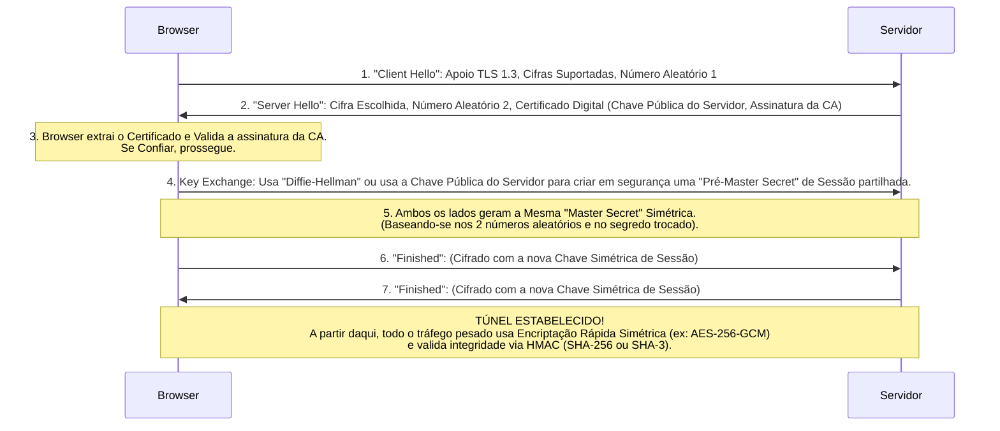

# Exercícios e Práticas: Segurança Informática e Criptografia

## Parte 1: Resolução Detalhada do Questionário Teórico

Este questionário cobre os conceitos centrais de gestão de risco, objetivos da segurança, auditorias e conformidade em sistemas de informação. As respostas são expandidas para um nível académico exaustivo.

### Questão 1: Qual é o objetivo da segurança da informação? Quais são os seus elementos e o que cada um indica?

**Resolução Detalhada:**
O objetivo fundamental da Segurança da Informação é proteger e salvaguardar a informação crítica (e os sistemas operacionais que a sustentam) de uma vasta gama de ameaças tecnológicas, ambientais ou humanas. Em vez de simplesmente "proteger computadores", o objetivo estratégico de negócio é assegurar a continuidade da organização, minimizando os danos causados por incidentes de segurança e otimizando o retorno sobre investimentos em tecnologia.

Os elementos clássicos, frequentemente referidos como o **Triângulo CIA** (ou *CIA Triad*), são as métricas essenciais sob as quais a segurança é avaliada. Expandindo este triângulo para os requisitos modernos, obtemos os seguintes cinco elementos críticos:

1.  **Confidencialidade (Confidentiality):**
    *   *O que indica:* A propriedade que dita que a informação não é disponibilizada ou divulgada a indivíduos, entidades ou processos não autorizados.
    *   *Mecanismos Práticos:* É alcançada e implementada através de robustos sistemas de cifragem (Criptografia AES/RSA), controlos de acesso granulares (IAM, ACLs) e princípios operacionais como o de "Menor Privilégio" (Least Privilege) e "Necessidade de Saber" (Need-to-Know).
2.  **Integridade (Integrity):**
    *   *O que indica:* A garantia absoluta da precisão, completude e inalterabilidade da informação ao longo de todo o seu ciclo de vida. Impede a corrupção de dados, seja por intenções maliciosas (ataques MitM) ou de forma acidental (erros de hardware ou transmissão).
    *   *Mecanismos Práticos:* Assegurada primordialmente por Funções de Resumo (Hashes criptográficos como o SHA-256) e Assinaturas Digitais, bem como cópias de segurança para restauro do estado íntegro original.
3.  **Disponibilidade (Availability):**
    *   *O que indica:* A certeza de que um sistema informático, as redes subjacentes e os dados estão sempre operacionais e acessíveis de forma fiável pela entidade autorizada, no exato momento em que forem solicitados.
    *   *Mecanismos Práticos:* Evita-se a indisponibilidade desenhando arquiteturas tolerantes a falhas. Implementa-se através de sistemas de hardware redundantes (RAID, servidores em cluster, balanceadores de carga), backups off-site, geradores de energia (SAI/UPS) e planos rigorosos de recuperação de desastres (DRP/BCP).
4.  **Autenticidade (Authenticity):**
    *   *O que indica:* A capacidade de provar que as credenciais do utilizador, as identidades ou a origem dos dados recebidos são fidedignas (i.e. as coisas são exatamente quem dizem ser).
5.  **Não Repúdio (Non-repudiation):**
    *   *O que indica:* A criação de prova legal irrefutável sobre uma transação. Se um utilizador A enviar uma ordem de pagamento, o sistema, mediante Certificados Digitais e Assinaturas, cria um estado no qual o utilizador A nunca pode negar legalmente ter emitido essa ordem (irrevogabilidade da autoria).

### Questão 2: A partir de que nível de segurança da informação é considerado o critério para qualificação para os Controles de Qualidade?

**Resolução Detalhada:**
A qualificação para os Controlos de Qualidade num ambiente empresarial só pode ser atribuída quando uma organização ultrapassa o "nível zero" (operações ad-hoc e sem regras documentadas) e demonstra um estado inicial de conformidade com normas internacionalmente padronizadas (Standardization). 

Na prática, o critério de qualificação requer, no mínimo:
*   A **documentação formal de políticas** (como a Política Geral de Segurança da Informação).
*   A implementação de um **Sistema de Gestão de Segurança da Informação (SGSI)** básico.
*   Cumprimento e alinhamento com normativas de referência técnica, entre as quais se destacam a **ISO/IEC 27001** (que exige planeamento e melhoria contínua - o ciclo PDCA), as matrizes do **COBIT** (focadas no alinhamento da TI com o negócio e auditoria governamental) ou as recomendações práticas do **NIST Cybersecurity Framework**.
*   A demonstração prática de que os ativos são periodicamente avaliados (análise de risco e matrizes de impacto). Se uma organização não monitoriza as suas vulnerabilidades, não tem forma empírica de qualificar a qualidade da sua segurança perante clientes e entidades reguladoras.

### Questão 3: Como se define o cibercrime? Desenvolva dois exemplos que poderiam ocorrer em um ambiente de trabalho específico.

**Resolução Detalhada:**
O Cibercrime (ou crime informático) engloba qualquer atividade ilícita cujas origens, execução ou objetivo primordial envolvam a manipulação intrusiva de computadores, dispositivos interligados, infraestruturas de rede ou ambientes Cloud. Classifica-se, por norma, em duas vertentes: crimes onde a tecnologia é o *alvo* (espalhar vírus, DDoS) e crimes onde a tecnologia é a *ferramenta* (fraude financeira online, extorsão, furto de dados comerciais).

**Exemplo Prático 1: Spear Phishing e Comprometimento de E-mail Corporativo (BEC)**
*Cenário num escritório do departamento financeiro corporativo:*
O diretor financeiro (CFO) recebe um e-mail aparentemente proveniente do CEO (Endereço forjado ou "Spoofed"). O e-mail usa tom de urgência e detalha instruções para realizar uma transferência bancária maciça a um "novo fornecedor asiático" vital para contornar uma crise logística. Como o e-mail reflete a assinatura exata e terminologia comum da empresa, o departamento financeiro executa a ordem, transferindo fundos irrevogáveis para as contas-mula dos atacantes. Este é um crime de engenharia social avançada alavancada por ausência de controlos rigorosos (como políticas multi-assinatura para grandes valores e verificação out-of-band).

**Exemplo Prático 2: Exfiltração e Ataque de Ransomware Multicamada**
*Cenário num hospital moderno e digitalizado:*
Uma enfermeira com turno exaustivo introduz no computador de um posto de emergência uma pen-drive USB não sanitizada (ou clica num anexo de currículo armadilhado que recebeu no seu e-mail). O ficheiro é executado e liberta de imediato um payload de Ransomware que não só encripta os dados locais usando cifras inquebráveis (como AES-256), mas simultaneamente realiza movimento lateral na rede, alcançando os servidores de Bases de Dados dos Pacientes (EHR). O cibercriminoso rouba (exfiltra) os relatórios clínicos sensíveis e só depois bloqueia as máquinas, exigindo um resgate em Bitcoin. Com os servidores inoperacionais, o hospital regressa ao papel, atrasando cirurgias críticas e colocando vidas em risco, para além do risco de exposição pública de informações confidenciais se o resgate não for pago.

### Questão 4: Defina auditoria em geral.

**Resolução Detalhada:**
Uma auditoria é um processo pericial metódico, altamente estruturado e fundamentalmente independente (isentos de conflito de interesses) que se destina a avaliar criticamente evidências empíricas. O seu objetivo primordial é verificar inequivocamente se as atividades operacionais, os controlos implementados, os relatórios produzidos ou os processos em vigor numa organização cumprem e estão perfeitamente alinhados com as regras normativas predefinidas, sejam elas políticas internas elaboradas pela administração ou leis estatais e standards internacionais. Na sua essência, a auditoria é uma ferramenta de garantia de conformidade, melhoria contínua e minimização ativa de falhas.

### Questão 5: Descreva os elementos fundamentais que distinguem uma auditoria contábil, uma auditoria de TI e uma auditoria de segurança.

**Resolução Detalhada:**
Embora as metodologias de análise sejam semelhantes, o escopo, ferramentas e objetivos destas três tipologias diferem profundamente:

1.  **Auditoria Contábil/Financeira:**
    *   **Foco Principal:** Análise de demonstrações, balanços, e relatórios financeiros e patrimoniais da instituição.
    *   **Objetivo Vital:** Assegurar com elevado grau de confiança a veracidade incondicional dos dados contabilísticos, de forma a garantir transparência para com os acionistas, o estado (fiscal) e detetar qualquer vestígio de desfalque, corrupção ou fraude financeira.
    *   **Instrumentos Usados:** Avaliação do razão geral, extratos bancários físicos/digitais, faturas e conciliação de fluxos de caixa.
2.  **Auditoria de Sistemas/Tecnologia de Informação (TI):**
    *   **Foco Principal:** A arquitetura, sistemas de informação, governança tecnológica e metodologias de desenvolvimento de software da empresa.
    *   **Objetivo Vital:** Certificar que os sistemas geram a informação contabilística de forma rigorosa e, acima de tudo, avaliar a eficácia, eficiência e alinhamento dos investimentos tecnológicos com as metas estratégicas corporativas.
    *   **Instrumentos Usados:** Matrizes RACI, frameworks COBIT/ITIL, avaliação de acordos de nível de serviço (SLAs), análise dos ciclos de vida do desenvolvimento de software (SDLC) e gestão de alterações (Change Management).
3.  **Auditoria de Segurança (Cibersegurança):**
    *   **Foco Principal:** A robustez dos controlos técnicos, procedimentais e lógicos que limitam as vulnerabilidades do ambiente tecnológico.
    *   **Objetivo Vital:** Identificar rigorosamente as fragilidades das defesas do sistema antes que hackers mal-intencionados o façam. Averiguar o grau de conformidade perante regulamentos de proteção de dados (como o RGPD europeu).
    *   **Instrumentos Usados:** Scanners automáticos de vulnerabilidade (ex: Nessus), testes de intrusão manuais e avançados (Pentesting), análise do tráfego através de SIEM e revisão aprofundada de configurações de firewall.

### Questão 6: Dê cinco exemplos de fatores externos que afetam a auditoria de TI.

**Resolução Detalhada:**
A auditoria de TI não é imune ao ambiente onde a organização opera; pelo contrário, é ditada pelas pressões sistémicas globais:
1.  **Pressão Regulatória e Legislativa Rigorosa:** A obrigatoriedade legal de obedecer a regimes como o RGPD (na Europa), SOX (nos EUA, com pesado impacto na transparência da TI), ou PCI-DSS (para transações com cartões de crédito), mudam por completo o que o auditor necessita de analisar.
2.  **O Ecossistema de Normativas e Standards Globais:** Exigências por parte de clientes B2B (Business-to-Business) que requerem comprovação de alinhamento com metodologias como a ISO/IEC 27001 para estabelecerem contratos.
3.  **A Volatilidade e Evolução Tecnológica Rápida:** A migração contínua e, frequentemente desorganizada, de infraestruturas legacy locais (on-premise) para ecossistemas Cloud, micro-serviços ou uso de IA não governado, criando diariamente vetores de auditoria não mapeados.
4.  **Agressividade Cibernética e Cenário de Ameaças (Threat Landscape):** A sofisticação crescente do cibercrime organizado impõe que os standards mínimos de defesa auditable aumentem rapidamente ano a ano, forçando o auditor a procurar controlos mais avançados.
5.  **Contexto Macroeconómico e Restrição de Capital:** As crises económicas podem levar a reduções de orçamentos massivas nos departamentos de TI e Cybersegurança, obrigando o auditor a focar-se primariamente nos processos vitais (onde há o maior risco não mitigado resultante da falta de investimento).

### Questão 7: Quais procedimentos podem ser automatizados na execução de uma auditoria? Dê pelo menos cinco exemplos de automação de TI em geral.

**Resolução Detalhada:**
As auditorias convencionais baseiam-se numa abordagem por amostragem. No entanto, as infraestruturas modernas, perante os enormes fluxos de dados, requerem Automação de Auditoria. Os procedimentos automatizados incluem:
*   A varredura regular por vulnerabilidades nas redes internas utilizando scanners pré-programados.
*   Monitorização da conformidade de configuração da Cloud em tempo real, onde as mudanças feitas num servidor são imediatamente verificadas contra uma "baseline de segurança" ideal (por ex. via Cloud Security Posture Management - CSPM).
*   Recolha, centralização e indexação automática de ficheiros de *log* maciços através de soluções de SIEM (ex. Splunk), detetando anomalias no tráfego que um humano demoraria anos a analisar.

**Exemplos essenciais de automação generalista de operações TI:**
1.  **Orquestração de Backups e Disater Recovery:** Automatização dos horários, dos testes de resiliência e a duplicação off-site (ex. enviar os snapshots para o Amazon S3 sem intervenção humana).
2.  **Gestão de Identidade (Provisioning e Deprovisioning):** O processo onde um funcionário demitido no software de Recursos Humanos é instantânea e automaticamente banido no Active Directory e removido das caixas de e-mail (revogação imediata de acesso lógico).
3.  **Gestão Automática de Patches (Patch Management):** Ferramentas que fazem roll-out periódico e instalação noturna (não obstrutiva) de correções de segurança nos Sistemas Operativos e Office para todo o parque informático da empresa, com relatórios gerados autonomamente.
4.  **Integração e Entrega Contínuas (Pipelines CI/CD):** Em desenvolvimento de software, a automação que testa, realiza testes estáticos ao código (SAST) à procura de vulnerabilidades lógicas (SQLi), compila e faz deploy de novas aplicações nas plataformas sem ação manual.
5.  **Sistemas de Recuperação e Self-Healing de Infraestrutura:** Ferramentas que monitorizam as cargas da rede, sendo capazes de reciclar e reconstruir instâncias de servidores virtuais sempre que estas falham abruptamente (Garantia automática do Pilar da Disponibilidade).

### Questão 8: Quais entidades estão presentes no planejamento da auditoria de TI? Descreva-as.

**Resolução Detalhada:**
O sucesso metodológico de uma auditoria de TI assenta num planeamento holístico e inclusivo. As entidades cruciais envolvidas incluem:
*   **O Comitê de Auditoria (Direção Executiva e Conselho de Administração):** O órgão topo da organização. Eles patrocinam o ato de auditoria e são o recetor último dos relatórios. Eles tomam decisões orçamentais estratégicas com base nos riscos e nas fragilidades que são reportadas.
*   **A Equipa Técnica Especializada de Auditores (Auditoria Interna/Externa):** O núcleo operativo de especialistas profissionais — independentes e imparciais. Ficam responsáveis por conceber a matriz e os testes da auditoria, requisitar as provas formais, entrevistar as pessoas-chave e deduzir conclusões forenses isentas.
*   **O Cliente Auditado (ex. A Direção de Sistemas de Informação ou o Departamento de Rede):** Representa a parte passiva que está a ser analisada. O seu dever principal é facilitar uma cooperação franca com os auditores, fornecendo acesso, logs, organogramas e prestando depoimentos realistas e rigorosos.
*   **Os Stakeholders Funcionais (Gestores de Unidades de Negócio):** Compreendem os departamentos organizacionais chave, cujas rotinas diárias dependem essencialmente dos serviços de TI oferecidos. Participam no planeamento para assegurar que a equipa auditora conhece as particularidades e metas do seu processo de negócio.
*   **Entidades Reguladoras ou Oficiais Governamentais (Em contextos altamente regulamentados, ex: Saúde, Finanças):** Em alguns enquadramentos, estes atores devem ser envolvidos e, por fim, os relatórios elaborados têm a obrigatoriedade de ser redigidos num formato que corresponda perfeitamente aos standards impostos por essa entidade estatal para ser considerado válido (e não incorrer em multas).

---

## Parte 2: Estudo de Caso Prático - Auditoria de Sistemas (BPR)

### Contexto da AutoMotion Industries
Em uma empresa automotiva, foi realizada uma auditoria de Redução de Processos de Negócio (BPR). O projeto envolvia a substituição de uma infraestrutura obsoleta baseada em *mainframes* por um sistema de servidores distribuídos entre departamentos, juntamente com a reescrita de todas as aplicações. As falhas constatadas foram gravíssimas: processos incompletos, falta drástica de capacitação técnica da equipa, e uma ausência total de redefinição de papéis e responsabilidades na matriz de governação do projeto.

### Relatório de Auditoria Extensivo e Avançado

**1. Sumário Executivo e Objetivos da Auditoria**
A presente auditoria avaliou a execução do megaprojeto de Reengenharia de Processos de Negócio (BPR) na AutoMotion Industries. O objetivo consistiu em aferir os progressos obtidos na migração transacional *mainframe-para-distribuído*, avaliar a robusteza das políticas de governação de TI implantadas no processo e garantir o alinhamento estreito entre o risco assumido (pela elevada disrupção do negócio) e as mitigações implementadas pelas lideranças operacionais.

**2. Escopo da Auditoria e Metodologia**
A equipa independente efetuou um foco em:
*   Integridade de Dados ao longo da migração da Base de Dados DB2 legada para o novo sistema RDBMS nos servidores distribuídos.
*   Análise da matriz orgânica e funcional (Matriz RACI) de governação do projeto.
*   Revisão dos Planos de Capacitação de Utilizadores.
A metodologia aplicou: Análise pormenorizada documental de planeamento; Entrevistas semi-estruturadas a dezenas de empregados operacionais e Diretores; e Simulações teóricas diretas de Processos de Negócio num ambiente de *Sand-box* face ao novo software.

**3. Constatações Analíticas**
*   **3.1. Processos de Negócio Gravemente Lacunares:** Demonstrou-se que cerca de 35% dos processos mapeados no papel estão "estacionados", sendo contornados na prática pelos operacionais devido à deficiente codificação das novas aplicações. Existe, portanto, dependência extrema de macros não homologadas no Excel e sistemas informais paralelos conhecidos como "Shadow IT" instalados pelos funcionários sem supervisão.
*   **3.2. Catástrofe na Estratégia de Treinamento e Gestão da Mudança:** A formação restringiu-se a uma circular interna teórica, descurando sessões imersivas, pelo que mais de metade da estrutura desconhecia qual a interface do sistema nos servidores, provocando bloqueios drásticos na produção de peças auto e um decréscimo visível da qualidade da montagem no mês de auditoria.
*   **3.3. Colapso da Governança e da Matriz de Decisão:** Durante os momentos de crise no *deploy* dos servidores, departamentos divergiram repetidamente. O departamento de Engenharia e o departamento de Logística disputaram a autoridade na introdução de registos e dados (Data Ownership), derivado de uma inexistente atualização da matriz de responsabilidades organizacionais no novo processo BPR, criando silos informáticos não previstos.

**4. Recomendações e Plano de Ação**
*   **Ações Imediatas (15 dias):** A Administração deverá paralisar o processo de desmantelamento total do mainframe e instaurar o "Comitê Diretor de Reengenharia".
*   **Mapeamento Documental e RACI (30 dias):** Reuniões obrigatórias entre a consultoria externa e líderes departamentais para construir a nova Matriz RACI: re-adjudicar inequivocamente quem é Responsável por executar (Responsible), quem tem a autoridade final para aprovar a infraestrutura e a decisão final sobre dados de fábrica (Accountable), quem deve ser apenas ser Consultado, e quem deve ser Informado.
*   **Ações de Implementação e Roll-out de Treinamento (3 Meses):** Criação intensiva de academias operacionais *hands-on*, dividindo a empresa em grupos pequenos antes do *cut-over* final dos novos servidores.

---

## Parte 3: Aplicações Práticas de Criptografia

Nesta secção avançada, exemplificamos os algoritmos estudados na teoria de forma aplicável, expondo a matemática e as infraestruturas.

### 3.1. Exemplo Passo a Passo: Algoritmo Assimétrico RSA (Matemática Básica)
O RSA é o padrão de facto para assinatura digital e cifra inicial. Para propósitos didáticos, vamos simplificar com pequenos números, muito embora o verdadeiro opere com grandes primos (ex: $10^{300}$).

**Fase 1: Geração das Chaves (Alice)**
1. **Escolher Primos:** Alice escolhe $p = 61$ e $q = 53$.
2. **Calcular o Módulo $n$:** $n = p \times q = 61 \times 53 = 3233$. (Este valor $n$ fará parte da Chave Pública e da Privada).
3. **Calcular a Função Totiente $\phi(n)$:**
   $\phi(n) = (p-1) \times (q-1) = 60 \times 52 = 3120$.
4. **Escolher Expoente Público $e$:** Escolher um inteiro $e$ (onde $1 < e < \phi(n)$) que seja co-primo de 3120. O valor mais usado no mundo real é 65537, mas, para o exemplo, escolhamos $e = 17$.
   *A Chave Pública da Alice é constituída por (n=3233, e=17).*
5. **Calcular a Chave Privada $d$:** Determinar $d$ tal que a equação $(d \times e) \pmod{\phi(n)} = 1$.
   $(d \times 17) \pmod{3120} = 1$. O valor de $d$ (usando Algoritmo de Euclides Estendido) será $d = 2753$.
   *A Chave Privada da Alice é constituída por (n=3233, d=2753).* (Isto permanece super secreto!)

**Fase 2: Cifrar a Mensagem (Bob para Alice)**
1. O Bob quer mandar uma mensagem secretíssima. Ele mapeia um caráter a um número, por exemplo, a mensagem "X" mapeia para o número $M = 65$. O Bob tem que garantir que $M < n$.
2. O Bob só sabe a Chave Pública (n=3233, e=17).
3. **Processo de Cifragem do Bob:** Calcula o texto Cifrado $C$ usando a fórmula matemática da Criptografia RSA: $C = M^e \pmod{n}$.
   Substituindo: $C = 65^{17} \pmod{3233}$. 
   $C = 2790$.
4. O Bob envia o valor ininteligível (o número 2790) pela Internet, sendo intercetado num Wi-Fi de um aeroporto, contudo os atacantes não podem inferir o "65" original porque não possuem a Chave Privada da Alice.

**Fase 3: Decifrar a Mensagem (Alice)**
1. Alice recebe o texto cifrado $C = 2790$.
2. **Processo de Decifragem da Alice:** Ela aplica a sua valiosa e hiper secreta chave $d = 2753$.
   Fórmula de Desencriptação: $M = C^d \pmod{n}$.
   Substituindo: $M = 2790^{2753} \pmod{3233}$.
3. Graças a um milagre modular definido pelo teorema de Euler, a super potência modular de $2790^{2753}$ resultará exatamente no valor original! $M = 65$. Alice decifrou a mensagem com pleno e absoluto sucesso.

### 3.2. Criptografia em Trânsito: Como funciona o TLS (HTTPS) na Prática
Quando um utilizador digita um endereço HTTPS na web e clica no ícone de "Cadeado Verde", desencadeia-se uma negociação extremamente sofisticada designada por **TLS Handshake**. Ela conjuga tudo o que aprendemos sobre funções de HASH, Chaves Simétricas, Chaves Assimétricas e Certificados Digitais, em milionésimos de segundo:

Esta é a verdadeira engenharia de segurança que evita ciberataques bancários à escala global a cada minuto. O uso de mecanismos assimétricos para certificar a identidade (o lado onde ocorreu mais fraude no passado), aliado à distribuição segura da cifra simétrica em tempo real para permitir transmissão streaming contínua e sem latência percetível ao consumidor.
