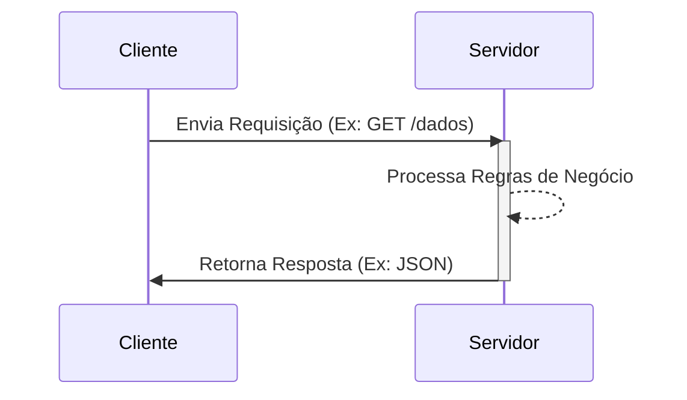
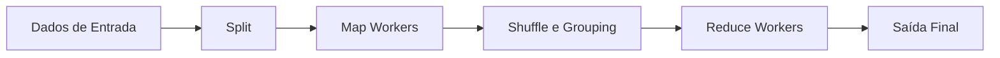

# Guia de Estudo Teórico: Sistemas Distribuídos e Programação em Paralelo - V2

Este guia compreensivo foi desenvolvido para cobrir exaustivamente todos os tópicos fundamentais e avançados da disciplina de Sistemas Distribuídos e Programação em Paralelo, enriquecido com materiais das aulas teóricas e práticas.

## Índice
1. [Introdução aos Sistemas Distribuídos](#1-introdução-aos-sistemas-distribuídos)
2. [Modelos Arquiteturais](#2-modelos-arquiteturais)
3. [Comunicação e Protocolos](#3-comunicação-e-protocolos)
4. [Sincronização e Tempo em Sistemas Distribuídos](#4-sincronização-e-tempo-em-sistemas-distribuídos)
5. [Arquitetura Orientada a Serviços (SOA) e Web Services](#5-arquitetura-orientada-a-serviços-soa-e-web-services)
6. [Segurança em Sistemas Distribuídos](#6-segurança-em-sistemas-distribuídos)
7. [Computação em Nuvem e MapReduce](#7-computação-em-nuvem-e-mapreduce)

---

## 1. Introdução aos Sistemas Distribuídos

### 1.1 Definição
Segundo Andrew Tanenbaum, um **Sistema Distribuído** é definido como "um conjunto de computadores independentes que se apresentam aos seus usuários como um sistema único e coerente". Em essência, as máquinas (nós) são interconectadas por uma rede, comunicam-se primariamente através de troca de mensagens e colaboram para alcançar um objetivo comum, compartilhando um estado e recursos.

**Exemplos do dia-a-dia:** Redes sociais, sistemas de e-commerce, cloud computing (Google, Facebook, YouTube).

### 1.2 Principais Características (Vantagens e Desvantagens)

| Característica | Descrição |
| --- | --- |
| **Vantagens** | |
| **Compartilhamento de Recursos** | Hardware e software são compartilhados por todos os elementos. |
| **Concorrência** | Múltiplos processos são executados simultaneamente em diferentes nós, maximizando o desempenho. |
| **Escalabilidade** | Capacidade de lidar com aumento de carga facilmente (especialmente escala horizontal). |
| **Tolerância a Falhas** | A redundância permite que o sistema continue operando mesmo se um nó falhar. Outro elemento cobre a máquina danificada. |
| **Independência Tecnológica** | Componentes podem ser construídos usando diferentes linguagens e sistemas operacionais. |
| **Desvantagens** | |
| **Complexidade** | Programação exige controle de mais variáveis (concorrência, latência, sincronização). |
| **Segurança** | Mais suscetíveis a violações. A superfície de ataque é significativamente expandida devido à exposição na rede. |
| **Gerenciamento** | Mais esforço para gerenciar; inícios de produção e variáveis a controlar são maiores. |

### 1.3 Tipos de Sistemas Distribuídos

> [!NOTE]
> Os sistemas distribuídos podem ser classificados em três grandes categorias, cada uma com propósitos distintos.

1. **Sistemas de Computação Distribuídos:**
   - **Computação em Cluster:** Conjunto de máquinas semelhantes (hardware/SO) conectadas por uma rede local de alto desempenho. Usado para programação paralela intensa.
   - **Computação em Grade (Grid):** Alto grau de heterogeneidade (diferentes hardwares, SOs, redes). Recursos de diferentes organizações são reunidos em uma "organização virtual".
   - **Computação em Nuvem:** Armazém virtual de recursos escaláveis e elásticos acessados via internet.

2. **Sistemas de Informação Distribuídos:**
   - **Sistemas de Processamento de Transações (STP):** Garantem segurança e confiabilidade em operações críticas.
   - **Integração de Aplicações Empresariais (EAI):** Permite a comunicação e interoperabilidade entre softwares diferentes de uma empresa (vendas, finanças).

3. **Sistemas Distribuídos Pervasivos:** Pequenos dispositivos embarcados integrados ao ambiente (ex: IoT).

### 1.4 Transações e Propriedades ACID em Sistemas Distribuídos (STP)
Sistemas de Processamento de Transações (STP) exigem garantias rigorosas, conhecidas pelo acrônimo **ACID**:
- **Atômicas:** Uma transação ocorre inteiramente ou não ocorre (indivisível para o mundo exterior).
- **Consistentes:** A transação não viola invariantes lógicas do sistema.
- **Isoladas:** Transações concorrentes não interferem umas nas outras.
- **Duráveis:** Uma vez validada (commit), a alteração é permanente.

### 1.5 Modelos de Falhas

Em sistemas distribuídos, as falhas são inevitáveis. Os principais modelos incluem:
- **Falhas de Omissão:** Mensagem não enviada ou não recebida.
- **Falhas de Temporização:** Resposta chega fora do tempo esperado (comum em sistemas síncronos).
- **Falhas de Falecimento (Crash):** Processo/nó para de funcionar inesperadamente. Detectado via *timeout*.
- **Falhas Bizantinas:** Processo age de forma incorreta ou maliciosa, enviando informações inconsistentes. Exige protocolos de consenso complexos (ex: PBFT em blockchain).

---

## 2. Modelos Arquiteturais

A arquitetura define como os componentes do sistema são distribuídos e como interagem.

### 2.1 Arquitetura Cliente-Servidor
A mais tradicional arquitetura. 
- **Cliente:** Inicia as requisições. Precisa conhecer a localização (IP/Porta) do servidor.
- **Servidor:** Fica em estado de escuta passiva, processa requisições e retorna respostas.
- **Vantagens:** Simplicidade, centralização de controle.
- **Desvantagens:** Ponto único de falha, limitações de escalabilidade.

### 2.2 Arquitetura Peer-to-Peer (P2P)
Nesta arquitetura, a distinção entre cliente e servidor desaparece. Todo nó (Peer) atua simultaneamente como cliente e servidor (fornece e consome recursos).
- Não há um ponto central fixo.
- **Vantagens:** Alta escalabilidade, tolerância a falhas.
- **Desvantagens:** Controle e segurança complexos, inconsistência potencial.
- Exemplos: BitTorrent, redes Blockchain.

### 2.3 Middleware
O middleware atua como o "encanamento". É uma camada de software que esconde a heterogeneidade da rede, sistema operacional e linguagens de programação, facilitando a comunicação entre diferentes sistemas ou aplicativos.

---

## 3. Comunicação e Protocolos

A comunicação é a espinha dorsal. Sem memória compartilhada física, os processos usam a rede.

### 3.1 Modelos de Comunicação
- **Síncrona:** Emissor e receptor precisam estar ativos e sincronizados. O emissor espera a resposta (ex: chamadas telefônicas). Tem menor tolerância a falhas e escalabilidade.
- **Assíncrona:** Emissor não espera resposta imediata; envia e prossegue. Garante maior tolerância a falhas e melhor uso de recursos, porém é mais complexa de gerenciar.

### 3.2 Protocolos da Camada de Transporte
- **TCP/IP (Transmission Control Protocol):** Garante a entrega, eficiência e confiabilidade dos dados (orientado a conexão). Utiliza as 4 camadas clássicas (Aplicação, Transporte, Rede/Enlace, Física).
- **UDP (User Datagram Protocol):** Rápido, leve e não confiável (não garante entrega ou ordem). Ideal para transmissões que exigem velocidade (streaming, VoIP, jogos online).

### 3.3 Sockets de Rede
Um socket é a porta de entrada (IP + Porta) permitindo a comunicação entre dois processos finais.
Existem três estados fundamentais na programação com sockets no servidor:
1. **Listen (Escuta de Recebimento):** O servidor aguarda conexões de clientes (`listen()`).
2. **Accept (Escuta de Conexão):** Aceita a conexão criando um *novo socket* dedicado para se comunicar com o cliente de forma independente (`accept()`).
3. **Send/Recv (Escuta de Dados):** Troca de dados bidirecional.

> [!TIP]
> **Requisito Prático para Exame:** É exigido implementar uma aplicação com 3+ processos comunicando-se via Sockets (TCP/UDP) simulando um chat, sistema de consultas ou jogo.

### 3.4 RPC (Remote Procedure Call)
O RPC abstrai a comunicação. Permite que um programa execute uma função em outro computador como se fosse local, escondendo detalhes de empacotamento da rede. Baseia-se primariamente na arquitetura cliente-servidor.

### 3.5 Comunicação Baseada em Mensagens
Os processos trocam informações através de mensagens descentralizadas.
- **Ponto a Ponto:** Um emissor envia diretamente a um receptor (Ex: primeiro "LOGIN" no ARPANET em 1969).
- **Filas de Mensagens:** Mensagens são armazenadas temporariamente. Oferece desacoplamento temporal e espacial, tolerância a falhas e entrega garantida (Ex: RabbitMQ, E-mail criado por Ray Tomlinson).
- **Multicast/Broadcast:** Mensagem enviada para vários nós.

---

## 4. Sincronização e Tempo em Sistemas Distribuídos

Em sistemas distribuídos, não existe um "relógio global". Cada máquina possui seu oscilador de quartzo com taxas de desvio diferentes.

### 4.1 Relógios Lógicos de Lamport
Leslie Lamport propôs que não precisamos saber a hora exata que um evento ocorreu, mas sim a **ordem** em que os eventos aconteceram (relação "happens-before").

**Algoritmo de Lamport:**
1. Cada processo $P_i$ mantém um contador local $C_i$, inicializado em 0.
2. Antes de executar um evento, $P_i$ incrementa $C_i = C_i + 1$.
3. Quando envia uma mensagem $m$, anexa o tempo lógico: $(m, C_i)$.
4. Quando recebe $(m, C_i)$, atualiza seu relógio: $C_j = \max(C_j, C_i) + 1$.

> [!IMPORTANT]
> **Projeto Prático (Exame):** Na implementação do seu projeto com Sockets, é *obrigatório* manter uma variável `clock` inicializada em 0, incrementá-la a cada evento e exibi-la no terminal (ex: `Cliente 1 enviou mensagem | Clock: 1`).

---

## 5. Arquitetura Orientada a Serviços (SOA) e Web Services

### 5.1 Conceitos de SOA
O aplicativo é decomposto em serviços autônomos, sem estado e fracamente acoplados.

### 5.2 SOAP vs REST
- **SOAP:** Baseado em XML, WSDL, forte rigor de tipagem.
- **REST:** Estilo arquitetural focado em recursos (HTTP GET, POST, PUT, DELETE), utiliza JSON, mais leve e moderno.

---

## 6. Segurança em Sistemas Distribuídos

Os dados trafegam por diversas máquinas e redes, criando uma ampla superfície de ataque.

### 6.1 Os Quatro Pilares e Ameaças
1. **Confidencialidade:** Evitar vazamento (Leakage).
2. **Integridade:** Impedir alteração não autorizada (Tampering).
3. **Disponibilidade:** Garantir acesso ao sistema (evitar DoS).
4. **Não-Repúdio:** Garantir autoria das ações.

**Ameaças Comuns:** Spoofing (personificação), introdução de código malicioso, escuta de mensagens.

### 6.2 Autenticação vs Autorização
- **Autenticação (Quem é você?):** Prova de identidade (Senhas, Biometria, Tokens, MFA/2FA). É a pré-condição.
- **Autorização (O que você pode fazer?):** Concessão de permissões aos recursos via ACLs ou RBAC (Controle por Papéis).

### 6.3 Comunicação Segura (SSL/TLS)
Garante confidencialidade, integridade e autenticação contra ataques MitM.
- O Handshake TLS inicia com o servidor enviando seu certificado digital.
- O cliente verifica a confiança, e ambos trocam chaves de sessão para criptografia simétrica.
- TLS 1.2 e 1.3 são as versões seguras e modernas; SSL é antigo e descontinuado.

### 6.4 Ataques Comuns e Mitigação

| Ataque | Descrição | Mitigação |
| --- | --- | --- |
| **DoS / DDoS** | Inunda servidores com tráfego excessivo (múltiplas fontes), esgotando recursos. | Balanceamento de Carga, CDN, Rate Limiting, Proteção Anti-DDoS (AWS Shield). |
| **Man-in-the-Middle (MitM)** | Interceptação entre partes (ex: Wi-Fi falso/Evil Twin, Sequestro de Sessão). | Criptografia Forte (HTTPS/TLS), VPNs, Autenticação MFA, Monitoramento de Rede. |

---

## 7. Computação em Nuvem e MapReduce

### 7.1 Computação em Nuvem
A nuvem é a entrega de recursos computacionais (servidores, armazenamento, bancos de dados, software) pela internet, com escalabilidade elástica.

### 7.2 O Paradigma MapReduce
Para processamento de enormes volumes de dados distribuídos (Big Data).
- **Map:** Filtra, processa e extrai informações locais emitindo pares de `chave-valor`.
- **Shuffle/Sort:** O framework agrupa todos os valores associados à mesma chave.
- **Reduce:** Nós de redução agregam os valores das chaves para produzir o resultado final.

