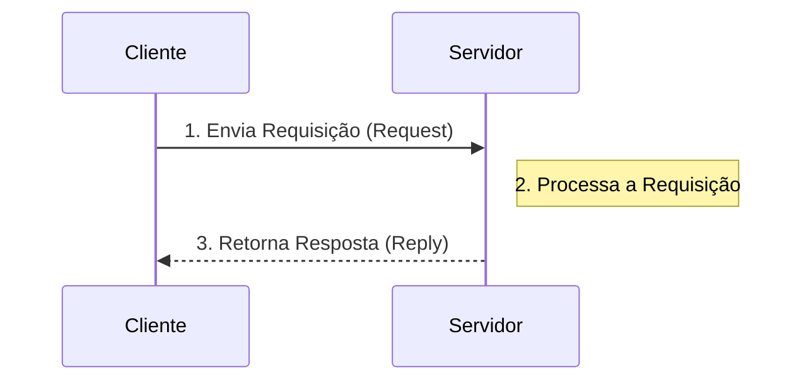

# Guia de Estudo Teórico: Sistemas Distribuídos e Programação em Paralelo

Bem-vindo ao guia exaustivo de estudos sobre **Sistemas Distribuídos e Programação em Paralelo**. Este material foi estruturado em nível universitário para oferecer uma compreensão profunda e detalhada dos fundamentos, arquiteturas, algoritmos, comunicação, segurança e paradigmas paralelos. 

---

## 1. Introdução aos Sistemas Distribuídos

Segundo Andrew S. Tanenbaum, um **Sistema Distribuído** é definido como *"um conjunto de computadores independentes que se apresentam aos seus usuários como um sistema único e coerente"*. 

A essência de um sistema distribuído é esconder a complexidade (distribuição física, falhas parciais, heterogeneidade de hardware e software) do usuário final. O usuário não precisa saber em qual servidor seus dados estão fisicamente armazenados ou qual nó de processamento está resolvendo sua requisição.

### Objetivos Principais
1. **Compartilhamento de Recursos:** Facilitar o acesso a recursos remotos de forma controlada.
2. **Transparência:** Ocultar a distribuição dos processos e recursos. Existem vários tipos de transparência (Acesso, Localização, Migração, Relocação, Replicação, Concorrência e Falha).
3. **Abertura (Openness):** Capacidade do sistema ser estendido e reimplementado facilmente, geralmente por meio de interfaces bem definidas (APIs e protocolos padrão).
4. **Escalabilidade:** Capacidade de crescer em tamanho (adicionar usuários/nós), geografia (distâncias maiores) e administração (múltiplas organizações) sem degradação excessiva de desempenho.

---

## 2. Arquiteturas de Sistemas Distribuídos

A organização lógica e física dos componentes dita como eles interagem.

### 2.1 Arquitetura Cliente-Servidor
É o modelo mais clássico. Os processos são divididos em dois papéis distintos:
- **Servidor:** Um processo que oferece um serviço específico (por exemplo, servidor web, banco de dados). Ele aguarda passivamente pelas requisições.
- **Cliente:** Um processo que consome os serviços oferecidos. Ele inicia ativamente a comunicação enviando uma requisição ao servidor.

**Vantagens:** Gerenciamento centralizado, facilidade de segurança e controle.
**Desvantagens:** O servidor pode se tornar um gargalo de desempenho e um ponto único de falha (*Single Point of Failure* - SPOF).

### 2.2 Arquitetura Peer-to-Peer (P2P)
Diferente do modelo cliente-servidor, na arquitetura P2P, todos os nós (chamados de *peers* ou pares) possuem capacidades e responsabilidades simétricas. Um par atua simultaneamente como cliente e servidor.

Existem variações:
- **P2P Não Estruturado:** Os nós se conectam de forma arbitrária (ex: Gnutella antigo). A busca por arquivos geralmente é feita por inundação (*flooding*), o que é ineficiente em redes grandes.
- **P2P Estruturado:** Utiliza topologias organizadas (como anéis, árvores) e Tabelas de Hash Distribuídas (DHTs) como o *Chord*. Isso permite buscas extremamente rápidas e roteamento determinístico.

**Vantagens:** Alta escalabilidade, tolerância a falhas distribuída (não há servidor central).
**Desvantagens:** Segurança complexa, difícil gerenciamento e indexação de dados.

---

## 3. Comunicação Interprocessos

Em sistemas distribuídos, a comunicação via rede substitui a memória compartilhada.

### 3.1 Sockets (TCP e UDP)
O **Socket** é o ponto final (*endpoint*) de um link de comunicação bidirecional entre dois programas rodando na rede. É identificado pela combinação de um **Endereço IP** e um **Número de Porta**.

As aplicações mais comuns utilizam sockets no modelo cliente-servidor, que envolvem três estados fundamentais de "escuta":
1. **Escuta de Recebimento (`listen`):** O servidor se coloca em estado passivo, aguardando pedidos de conexão.
2. **Escuta de Conexão (`accept`):** O servidor aceita a conexão, criando um novo socket dedicado exclusivamente àquele cliente, liberando o socket principal para novas conexões.
3. **Escuta de Dados (`recv`/`send`):** Ocorre o intercâmbio de dados.

**TCP (Transmission Control Protocol):** Orientado a conexão, confiável, garante entrega em ordem. (Ex: Web, E-mail, Transferência de Arquivos).
**UDP (User Datagram Protocol):** Não orientado a conexão, não garante entrega, mais rápido. (Ex: Streaming de vídeo, VoIP, Jogos online).

### 3.2 Chamada de Procedimento Remoto (RPC - Remote Procedure Call)
O RPC é uma abstração que permite a um programa executar um procedimento (função) em outro espaço de endereçamento (em outro computador), codificando-o como se fosse uma chamada de função local.
- **Stubs:** O cliente chama um "client stub" (que empacota os parâmetros na rede). O servidor tem um "server stub" (que desempacota e chama a função real).
- O processo de empacotamento é chamado de **Marshalling** (serialização).

### 3.3 Invocação de Método Remoto (RMI - Remote Method Invocation)
RMI é a evolução orientada a objetos do RPC. Enquanto o RPC foca em funções C, o RMI (como o Java RMI) permite que um objeto em uma JVM invoque métodos em um objeto residente em outra JVM. Ele suporta a passagem de objetos inteiros por valor ou por referência.

---

## 4. Sincronização e Relógios Lógicos

O tempo é fundamental para ordenar eventos. No entanto, em sistemas distribuídos, **não existe um relógio global**. Relógios físicos de diferentes máquinas sofrem de *drift* (desvio de relógio).

### 4.1 A Relação "Aconteceu-Antes" (Happens-Before)
Proposta por Leslie Lamport (1978), a relação "aconteceu-antes" ($\rightarrow$) captura a causalidade dos eventos sem depender de relógios físicos.
- Se $a$ e $b$ são eventos no mesmo processo, e $a$ ocorre antes de $b$, então $a \rightarrow b$.
- Se $a$ é o envio de uma mensagem e $b$ é o seu recebimento, então $a \rightarrow b$.
- Transitividade: Se $a \rightarrow b$ e $b \rightarrow c$, então $a \rightarrow c$.
- Se $a$ não aconteceu antes de $b$, e $b$ não aconteceu antes de $a$, eles são **concorrentes**.

### 4.2 Relógios Lógicos de Lamport
Para garantir uma ordem lógica, cada processo $P_i$ mantém um contador $C_i$ (seu Relógio Lógico), inicializado em 0.
**Regras de Atualização:**
1. Antes de executar qualquer evento (interno, envio ou recebimento), o processo incrementa: $C_i = C_i + 1$.
2. Quando $P_i$ envia uma mensagem $m$, ele anexa $C_i$ à mensagem ($m, C_i$).
3. Quando $P_j$ recebe $(m, C_{msg})$, ele atualiza seu relógio: $C_j = \max(C_j, C_{msg})$, e então aplica a regra 1 (incrementa seu relógio para o evento de recepção).

Esse mecanismo garante que, se $a \rightarrow b$, então $C(a) < C(b)$. (Nota: O inverso não é necessariamente verdadeiro. Para resolver o inverso, usam-se **Relógios Vetoriais**).

---

## 5. Tolerância a Falhas

Sistemas distribuídos devem operar mesmo quando parte deles falha.
- **Falha de Crash (Omissão):** O componente para de funcionar (ex: servidor desliga).
- **Falha Bizantina:** O componente age de maneira arbitrária ou maliciosa, enviando dados incorretos.

### Mascaramento de Falhas e Redundância
A chave para a tolerância é esconder a falha do resto do sistema por meio de **redundância**:
- **Redundância de Informação:** Adicionar bits de paridade, códigos ECC.
- **Redundância de Tempo:** Repetir a operação (ex: retransmissões do TCP).
- **Redundância Física:** Utilizar múltiplos servidores para fazer o mesmo trabalho (replicação).

---

## 6. Segurança em Sistemas Distribuídos

Segurança em sistemas distribuídos é a prática de proteger sistemas com múltiplos componentes interconectados contra ameaças, garantindo **confidencialidade**, **integridade**, **disponibilidade** e **não-repúdio**.

Devido à vasta superfície de ataque e a constante troca de mensagens entre componentes separados fisicamente, a segurança torna-se um pilar crítico.

### 6.1 Autenticação e Autorização
- **Autenticação:** Verifica *quem você é*. Utiliza fatores como senhas (o que você sabe), biometria (o que você é) e tokens (o que você possui). Em sistemas modernos, MFA (Autenticação de Múltiplos Fatores) é o padrão.
- **Autorização:** Define *o que você pode fazer*. Ocorre após a autenticação. Utiliza mecanismos como ACLs (Listas de Controle de Acesso) e RBAC (Controle de Acesso Baseado em Papéis). Em microsserviços, tokens como JWT (JSON Web Tokens) e OAuth2 são comuns para propagar identidade e permissões.

### 6.2 Comunicação Segura: SSL/TLS
A segurança de dados em trânsito é assegurada pelos protocolos criptográficos TLS (sucessor moderno e seguro do SSL).
- O TLS evita ataques interceptadores (Man-in-the-Middle) usando criptografia assimétrica (chaves públicas/privadas) durante o *Handshake* para negociar uma chave simétrica de sessão.
- **Certificados Digitais:** Assinados por Autoridades Certificadoras (CAs), provam a identidade de servidores, mitigando ataques de *spoofing* (personificação).

### 6.3 Ataques Comuns e Mitigação
1. **Negação de Serviço (DoS/DDoS):** Sobrecarrega o sistema de requisições, comprometendo a *disponibilidade*.
   - *Mitigação:* Balanceamento de carga, Rate Limiting, Filtros de tráfego (Firewalls) e serviços como Cloudflare/AWS Shield.
2. **Man-in-the-Middle (MitM):** O atacante intercepta ou manipula a comunicação (ex: ARP Poisoning, Wi-Fi falso). Compromete a *confidencialidade* e a *integridade*.
   - *Mitigação:* Uso restrito de HTTPS/TLS, VPNs e Autenticação robusta (MFA).

---

## 7. Introdução à Programação Paralela

A programação paralela divide um grande problema em tarefas menores que podem ser executadas simultaneamente, visando redução do tempo de processamento (*speedup*).

### 7.1 Paradigmas de Arquitetura de Memória

| Paradigma | Descrição | Tecnologia Exemplo |
| :--- | :--- | :--- |
| **Memória Compartilhada** | Todas as threads têm acesso ao mesmo espaço de memória. Facilita a comunicação, mas exige sincronização (locks/mutexes) para evitar condições de corrida (*race conditions*). | OpenMP, Pthreads |
| **Memória Distribuída** | Cada processo possui sua própria memória local isolada. A comunicação ocorre explicitamente pelo envio/recebimento de mensagens pela rede. | MPI |
| **Heterogênea (Data-Parallel)** | Offload de processamento intensivo para aceleradores, executando milhares de threads menores em blocos massivos de dados simultaneamente (SIMD). | CUDA, OpenCL |

### 7.2 Principais Ferramentas e Frameworks

**MPI (Message Passing Interface):** 
O padrão de ouro para programação em memória distribuída (clusters/supercomputadores). Processos não compartilham memória. Funções como `MPI_Send` e `MPI_Recv` são usadas para troca explícita de dados. É altamente escalável.

**OpenMP:** 
Padrão baseado em diretivas de compilador (ex: `#pragma omp parallel for` em C/C++) para arquiteturas de memória compartilhada (CPU multi-core). Extremamente amigável, pois permite adicionar paralelismo em loops existentes com poucas alterações de código.

**CUDA:** 
Plataforma da NVIDIA para programação paralela massiva em GPUs (Unidades de Processamento Gráfico). A CPU (*Host*) envia dados para a memória da GPU (*Device*), que dispara uma grade (*grid*) de milhares de blocos e threads para processar matrizes, vetores ou deep learning de forma simultânea. Requer o domínio do conceito de hierarquia de memória da GPU e execução SIMT (Single Instruction, Multiple Threads).

---
*Este documento é uma síntese profunda de sistemas distribuídos e paralelismo. Para consolidação deste conhecimento, veja o documento "02 - Exercícios e Práticas.md".*
