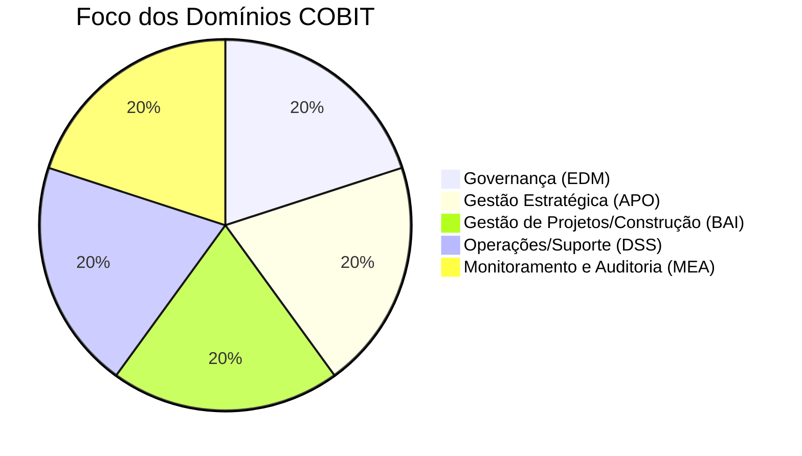

# Guia de Estudo Teórico: Direção de Sistemas de Informação

## Introdução e Escopo da Disciplina
A Direção de Sistemas de Informação (DSI) é o elo fundamental entre a estratégia de negócios e as tecnologias de informação que suportam essa estratégia. O estudo de DSI engloba o planejamento, a gestão e a governança de projetos tecnológicos, utilizando metodologias estabelecidas para assegurar a criação de valor, a mitigação de riscos e a otimização de recursos.

Este guia compila os tópicos centrais da disciplina, abordando desde a gestão prática de projetos de e-business até a aplicação de frameworks globais como ITIL, COBIT, PMBOK e PRINCE2.

---

## Parte 1: Gestão de Projetos e Aplicações e-Business

### 1.1. Definição Técnica de Projeto
Um **projeto** é um esforço temporário, empreendido para criar um produto, serviço ou resultado único. Diferencia-se das operações rotineiras (processos) por possuir um início e um fim definidos, um escopo específico e recursos limitados.

**Principais Motivações para Iniciar um Projeto:**
- **Demanda do mercado:** Uma nova oportunidade de negócio identificada.
- **Necessidade de negócio:** Melhoria de processos internos ou redução de custos.
- **Demanda de um cliente:** Pedido específico para um produto personalizado.
- **Avanço tecnológico:** Atualização de infraestrutura ou adoção de novas tecnologias (ex: migração para a nuvem).
- **Necessidade legal:** Adequação a novas legislações ou normativas.

### 1.2. Fatores Críticos de Êxito (FCE) em Aplicações e-Business
Para que um projeto de e-Business seja bem-sucedido, diversos fatores críticos devem ser estritamente observados:

1. **Clareza nos Objetivos de Negócios:** O projeto deve focar em aumentar lucros, reduzir gastos ou otimizar processos operacionais. Este objetivo deve ser o "norte" durante todo o ciclo de vida.
2. **Agregar Valor:** A tecnologia deve ser vista como um **habilitador** e um **facilitador da mudança**, jamais como a condutora cega do negócio. Os ganhos e benefícios devem estar no centro da iniciativa.
3. **Retroalimentação Rápida e Contínua:** Devido à acelerada mudança tecnológica, os projetos de e-business exigem resultados rápidos para gerar métricas de análise e validar premissas.
4. **Fechar as Portas (Evitar Gargalos):** As tarefas devem ser concluídas de forma definitiva e correta (fazer certo da primeira vez), evitando retrabalhos constantes que geram gargalos.
5. **Flexibilidade:** É uma condição *sine qua non*. O enfrentamento a contínuas mudanças mercadológicas e tecnológicas exige que o plano de projeto possua maleabilidade.
6. **Fixar Desafios Econômicos:** Estabelecer metas financeiras junto aos fornecedores e prestadores de serviços, alinhando interesses.
7. **Contar com Pequenas Vitórias (Quick Wins):** A pressão por trabalho rápido exige entregas fracionadas que gerem valor imediato, mantendo alta a motivação da equipe.
8. **Estabelecimento de uma Mudança Cultural:** Implementar um e-business muda a maneira como a organização enxerga o seu próprio modelo de negócio, exigindo aculturamento por parte dos colaboradores.

### 1.3. Fases e Ferramentas de Gestão de Projetos

A gestão de projetos geralmente se desdobra em fases distintas: Iniciação, Planejamento, Controle/Acompanhamento e Encerramento.

#### A. Iniciação
É a fase onde a visão geral é estabelecida.
- **Seleção do Gestor do Projeto:** O gestor deve ser capaz de informar a direção, comunicar-se com os usuários, planejar, coordenar e controlar orçamentos/riscos, além de liderar a equipe.
- **Capacitação:** Preparação prévia da equipe para os desafios técnicos.

#### B. Planejamento
O planejamento culmina no **Plano de Projeto**, um documento guia (mapa) que descreve o enfoque de desenvolvimento, servindo como base para futuras decisões.
- **WBS (Work Breakdown Structure / Estrutura de Decomposição do Trabalho):** Uma ferramenta essencial que divide o projeto em pacotes de trabalho menores e gerenciáveis. Sem um escopo bem definido, os custos finais elevam-se, prazos se dilatam e o moral da equipe decai.
- **Estimativas de Esforço e Custo:**
  - *Top-Down (De cima para baixo):* Estimativa por analogia usando custos de projetos semelhantes anteriores.
  - *Bottom-Up (De baixo para cima):* Estimativa a partir de tarefas individuais (na WBS), somando-as para obter o custo total.
  - *Curva-S:* Representação gráfica do orçamento em função do tempo, mostrando os custos acumulados programados.
- **Gráfico de Gantt:** Excelente ferramenta para as etapas iniciais do planejamento, pois facilita a visualização de prazos. Sua desvantagem é a dificuldade em mostrar dependências complexas (quando há muitas tarefas) e a omissão de custos.
- **Diagrama de Precedências (Redes de Projeto):** Métodos que conectam as atividades por setas, demonstrando o caminho crítico e as dependências estruturais que o Gantt oculta.

#### C. Controle e Acompanhamento
- **Garantia da Qualidade:** Uso de revisões (Walkthroughs), inspeções e testes de software.
- **Tempo e Custo:** Análise do Valor Agregado (Earned Value) para medir o desempenho do cronograma e orçamento.
- **Desempenho e Avaliação:** Controle técnico, gestão de configuração e mudanças.
- **Recursos Humanos:** Manutenção da motivação e resolução ágil de conflitos.

#### D. Encerramento
- **Encerramento Administrativo e de Contratos:** Verificação e documentação dos resultados para obter a aceite formal (sign-off) dos patrocinadores ou clientes, cumprindo eventuais procedimentos contratuais.

---

## Parte 2: Frameworks de Governança e Boas Práticas

### 2.1. ITIL (Information Technology Infrastructure Library)
O ITIL é o framework de melhores práticas mais adotado mundialmente para o Gestão de Serviços de TI (ITSM). 

**Módulos e Estrutura (ITIL 4):**
O ITIL 4 foca em flexibilidade e entrega de valor, deixando de lado os processos rígidos em prol de práticas adaptáveis. Seus principais componentes são:
- **Sistema de Valor de Serviço (SVS):** Descreve como as partes da organização colaboram para criar valor. Inclui: Princípios Orientadores, Governança, Cadeia de Valor de Serviço, Melhoria Contínua e Práticas.
- **As 4 Dimensões do Serviço:** Organizações e Pessoas, Informação e Tecnologia, Parceiros e Fornecedores, e Fluxos de Valor/Processos.
- **Práticas do ITIL (Substituindo os antigos "Processos"):** Existem 34 práticas divididas em Práticas de Gestão Geral, Gestão de Serviços (ex: Gestão de Incidentes, Central de Serviço) e Práticas Técnicas.

**Aplicação Conforme o Tamanho da Organização:**
O ITIL não é "tudo ou nada". O princípio *"Comece onde você está"* dita sua implementação.
- **Pequenas Empresas:** Adotam um subconjunto de práticas cruciais (ex: Central de Serviço e Gestão de Incidentes). Profissionais frequentemente acumulam funções, e o foco é organização imediata e estabilidade.
- **Médias Empresas:** Necessitam de maior formalização para lidar com o crescimento (escalabilidade), implementando a Gestão de Mudanças, Gestão de Problemas e catálogos de serviços.
- **Grandes Corporações:** Utilizam o ITIL em sua plenitude para garantir a governança corporativa. Adoção do SIAM (Service Integration and Management) para lidar com uma vasta rede de fornecedores terceirizados.

### 2.2. COBIT (Control Objectives for Information and Related Technologies)
Criado pela ISACA, o COBIT é o principal framework global focado em **Governança e Gestão de TI Corporativa**. Seu objetivo não é apenas gerir serviços (como o ITIL), mas garantir que os investimentos de TI gerem valor de negócio real, gerenciando riscos corporativos de TI e garantindo a conformidade.

**Domínios do COBIT:**
O modelo de referência do COBIT organiza seus processos em cinco domínios macro (a base se consolidou do COBIT 5 ao 2019):
1. **EDM (Evaluate, Direct and Monitor - Avaliar, Dirigir e Monitorar):** Pertence à esfera da Governança (Conselho de Administração). Avalia necessidades, direciona investimentos e monitora o cumprimento estratégico.
2. **APO (Align, Plan and Organize - Alinhar, Planejar e Organizar):** Gestão estratégica da TI. Como as táticas de TI se alinham ao negócio.
3. **BAI (Build, Acquire and Implement - Construir, Adquirir e Implementar):** Execução de projetos, aquisição e desenvolvimento de novas soluções de TI.
4. **DSS (Deliver, Service and Support - Entregar, Servir e Suportar):** Execução das operações do dia-a-dia de TI (onde o ITIL mais se sobrepõe e complementa o COBIT).
5. **MEA (Monitor, Evaluate and Assess - Monitorar, Avaliar e Avaliar):** Monitoramento interno de desempenho e controle de conformidade.

**Modelo de Maturidade / Capacidade:**
- No passado (COBIT 4.1 e 5), utilizava-se uma escala de maturidade de processos clássica (0 a 5).
- No **COBIT 2019**, adota-se um modelo de desempenho baseado no CMMI (Capability Maturity Model Integration). Avaliam-se os níveis de **capacidade** para atividades específicas (de 0 a 5), permitindo que a organização estabeleça níveis alvos distintos para cada processo, utilizando "Fatores de Desenho" para costumizar sua governança.

### 2.3. PRINCE2 versus PMBOK
Ambos são referências vitais para gerenciamento de projetos, mas com naturezas profundamente distintas.

| Característica | PMBOK (PMI) | PRINCE2 (AXELOS) |
| :--- | :--- | :--- |
| **Natureza** | **Descritivo**. Um corpo de conhecimento com boas práticas, técnicas e ferramentas. | **Prescritivo**. Uma metodologia baseada em processos estruturados, passo a passo. |
| **Foco Principal** | Competências, conhecimentos técnicos e habilidades do Gerente de Projetos. | Governança corporativa, definição de papéis e foco constante no **Business Case** (justificativa de negócio). |
| **Escopo e Flexibilidade** | Alta flexibilidade. O gerente seleciona quais ferramentas aplicar. | Rígido na estrutura de decisão. Foca no "como" o projeto será dirigido e governado. |
| **Tomada de Decisão** | Concentra poder e responsabilidade no Gerente de Projetos. | Descentraliza o poder. O Gerente de Projetos subordina-se a um *Project Board* (Comitê Diretor). |

**Qual Escolher?**
Em geral, eles não são excludentes, mas complementares. Uma organização altamente regulamentada e complexa pode usar a **estrutura de governança do PRINCE2** para comandar a aprovação de fases, e usar as **técnicas do PMBOK** no dia-a-dia de planejamento e estimativas de custos.
