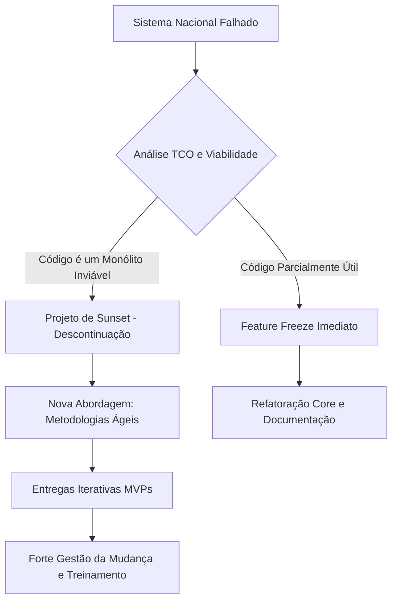

# Direção de Sistemas de Informação (DSI) - Exercícios e Práticas

Este documento contém a aplicação prática dos conceitos de Direção de Sistemas de Informação. Abaixo você encontrará Casos de Estudo clássicos (extraídos dos materiais de aula e contexto acadêmico), perguntas analíticas, reflexões e soluções detalhadas passo-a-passo.

---

## Prática 1: Análise e-Business e Forças de Porter - Caso "A Livraria Online"

**Descrição do Caso:**
Você é o CIO de uma livraria tradicional (física) que pretende fazer uma transição forte para um modelo de vendas *online* (e-Business). A administração acredita que "basta colocar um site no ar". No entanto, você sabe que há dezenas de desafios competitivos. A empresa nunca vendeu na internet e tem processos logísticos lentos. 

**Tarefa:**
1. Aplique o Modelo das 5 Forças de Porter a este novo projeto de Livraria Online.
2. Defina 3 requisitos críticos da Arquitetura Tecnológica que devem ser garantidos para que o projeto tenha sucesso.

### Resolução Detalhada (Passo-a-Passo)

**1. Aplicação das 5 Forças de Porter (Contexto da Livraria Online):**
*   **Ameaça de entrada de novos concorrentes (Alta):** O mercado online para livros tem barreiras de entrada muito baixas. Qualquer startup pode fazer dropshipping de livros. *Mitigação pelo CIO:* O sistema deve ter algoritmos avançados de recomendação que tornem a experiência do usuário superior à dos novos entrantes, focando na personalização extrema.
*   **Rivalidade entre os concorrentes (Altíssima):** Você está competindo com gigantes como Amazon, que possuem economias de escala brutais e logística perfeita. *Mitigação:* Focar em um nicho ou atendimento superespecializado, com sistemas integrados de comunidade literária no site.
*   **Poder de negociação dos fornecedores (Moderado a Alto):** Editoras detêm o poder sobre os títulos e lançamentos. *Mitigação:* Integração B2B SCM (Supply Chain Management). O sistema de TI da livraria deve estar interligado em tempo real ao ERP das editoras (EDI), reduzindo custos de estoque (Just-in-time) para ambas as partes.
*   **Poder de negociação dos compradores (Muito Alto):** Os clientes de e-commerce pesquisam preços em segundos. A fidelidade é baixa se não houver relacionamento. *Mitigação:* A implantação de uma solução de CRM robusta. O sistema precisa rastrear o ciclo de vida, enviar promoções precisas e oferecer um processo de *checkout* fácil (carrinho flexível e rápido).
*   **Ameaça de entrada de produtos substitutos (Alta):** E-books, Audiobooks, Resumos em PDF, Podcasts literários. *Mitigação:* A plataforma de TI deve suportar múltiplos formatos de entrega (download digital instantâneo com DRM, streaming de audiobooks), tornando a arquitetura escalável e diversificada.

**2. Requisitos Críticos de Arquitetura e-Business:**
Para responder às pressões acima, a arquitetura desenhada pelo CIO deve ser:
1.  **Disponível (Uptime 99.9%):** Um cliente que não consegue acessar a loja por falha no site comprará no concorrente a um clique de distância. A loja deve funcionar 24h, 365 dias por ano.
2.  **Escalável:** Como os picos de tráfego ocorrem de forma sazonal (Black Friday, Volta às Aulas, Lançamentos de Best-Sellers), a infraestrutura (idealmente em Cloud) deve crescer elástica e automaticamente para absorver a demanda sem lentidão.
3.  **Segura e Confiável:** Processamento de pagamentos com cartão de crédito exige conformidade com PCI-DSS (segurança eletrônica) para garantir confidencialidade dos dados dos clientes.

---

## Prática 2: Governança de TI - O Desafio do Novo CIO

**Descrição do Caso:**
A "Universidade X" e a sua grande empresa parceira vêm sofrendo quedas constantes nos sistemas acadêmicos e administrativos. Os departamentos operam em "Silos", não há documentação das falhas e a reitoria reclama que a TI gasta milhões por ano, mas ninguém entende os benefícios. Você foi contratado como novo CIO.

**Tarefa:**
Estruture um plano de ação utilizando os frameworks COBIT e ITIL para reverter este cenário e alcançar o Alinhamento Estratégico.

### Resolução Detalhada (Passo-a-Passo)

**Passo 1: Diagnóstico e Criação de Estrutura de Governança (Foco no COBIT)**
O problema principal não é apenas técnico, é falta de direção e transparência.
*   *Ação (COBIT):* Criação de um Comitê de Governança de TI (IT Steering Committee) com presença do CIO, Reitor (CEO), CFO e Diretores Acadêmicos.
*   *Objetivo:* Traduzir os objetivos da Universidade (ex: aumentar matrículas EAD, melhorar pesquisa) em metas de TI.
*   *Métrica:* O COBIT será usado para auditar orçamentos (garantir ROI), definir direitos de decisão (quem autoriza a compra de novos softwares?) e aplicar práticas de gestão de riscos (segurança da informação de dados dos alunos).

**Passo 2: Estabilização da Operação e Resolução de Quedas (Foco no ITIL)**
As quedas constantes e a falta de documentação revelam um serviço deficiente.
*   *Ação (ITIL - Gestão de Incidentes e Problemas):* Implementar uma Central de Serviços (Service Desk) como ponto único de contato (SPOC). Toda falha deve ser registrada.
*   *Ação (ITIL - Gestão do Conhecimento):* Criar uma base de dados de erros conhecidos. Se um servidor cai com frequência, a Gestão de Problemas do ITIL fará a análise de Causa-Raiz (Root-Cause Analysis) para eliminar o erro definitivamente, em vez de apenas reiniciar o servidor todos os dias.
*   *Acordos de Nível de Serviço (SLA):* Estabelecer formalmente que o sistema de matrícula não pode ficar fora do ar por mais de 10 minutos (SLA de 99,9%).

**Conclusão do Caso:** O COBIT alinhará os investimentos em TI aos desejos da reitoria (Governança e Estratégia), enquanto o ITIL organizará a "casa", melhorando o suporte, a estabilidade e os processos diários de tecnologia (Gestão de Serviços).

---

## Prática 3: Business Model Canvas (BMC) e SWOT na Gestão de TI

**Descrição do Caso:**
Você precisa apresentar à diretoria um plano para implementar um novo portal de CRM voltado à Gestão de Relacionamento (Marketing Relacional 1-to-1) com os melhores clientes da organização. 

**Tarefa:**
Realize a Análise SWOT deste plano e mostre como 3 blocos críticos do Business Model Canvas de TI serão afetados.

### Resolução Detalhada (Passo-a-Passo)

**1. Análise SWOT do Projeto CRM:**
*   **Forças (S):** Conhecimento prévio aprofundado dos processos internos; equipe de atendimento altamente motivada; base de dados rica em histórico de compras (Big Data).
*   **Fraquezas (W):** Sistemas de banco de dados isolados (o financeiro não se comunica com as vendas); falta de treinamento da equipe em ferramentas de software analítico.
*   **Oportunidades (O):** Tecnologias Cloud/SaaS com IA embarcada permitem personalização massiva ("1-to-1"); clientes hoje valorizam o autoatendimento.
*   **Ameaças (T):** Riscos de violação da privacidade e não-conformidade com a LGPD; fornecedores de software CRM podem cobrar preços abusivos na renovação de licenças.

**2. Impacto nos Blocos do Business Model Canvas (BMC) de TI:**
Com base no SWOT, o projeto reformula os seguintes blocos do BMC:
*   **Proposta de Valor:** Passamos de "Vender Produtos" para "Oferecer Experiências Personalizadas e Suporte Preditivo". O sistema não é mais passivo, ele antecipa as necessidades do cliente.
*   **Recursos Principais:** O foco muda de *Hardware Interno* para *Capacidades de Análise de Dados / Inteligência Artificial*. As bases de dados isoladas (fraqueza) precisam ser substituídas por um Data Lake centralizado.
*   **Atividades Chave e Estrutura de Custos:** Como há ameaça de LGPD e falta de conhecimento técnico, a principal *Atividade Chave* se torna a **Gestão de Segurança/Compliance e Integração de Dados**. Na *Estrutura de Custos*, o orçamento deve prever altos gastos com treinamento de equipe e licenças SaaS (OpEx).

---

## Questões para Reflexão Contínua e Aprofundamento

1. Por que, segundo a teoria de alinhamento estratégico, a implementação da tecnologia *sem* a transformação do processo central de negócios resulta frequentemente no fracasso do e-Business?
2. Explique a diferença crucial entre a "Dimensão de Gestão" e a "Dimensão de Construção" em um projeto tecnológico. Como o CIO faz a ponte entre essas dimensões?
3. Analise o impacto da "Demografia da Web" na adoção de tecnologias B2B e B2C. Como a evolução geracional afeta o desenho de interfaces e a acessibilidade da arquitetura de sistemas?

---

## Questões de Exames e Testes (Análise Exaustiva)

> [!NOTE]
> As secções seguintes consolidam questões reais de testes, exames e frequências passadas da disciplina de Direção de Sistemas de Informação (DSI). As respostas foram enriquecidas com um elevado nível de detalhe académico para servir como material de estudo definitivo.

### 1. Modelos de Desenvolvimento e Gestão de Software

> [!TIP]
> A escolha do modelo de desenvolvimento (Ciclo de Vida) dita a estrutura, a orçamentação e os riscos de todo o projeto de SI.

**Caso/Questão: Desenvolvimento para prazo curto (2 a 3 meses) - Qual modelo utilizar?**
* **Recomendação:** Modelo Rápido e Incremental (RAD - *Rapid Application Development*) ou Metodologias Ágeis (Scrum/XP).
* **Fases do Modelo RAD:** Modelagem de Gestão, Modelagem de Dados, Modelagem de Processos, Geração de Aplicações (Construção Rápida) e Testes/Entrega.
* **Considerações Críticas para o Sucesso:** Exige envolvimento contínuo do utilizador final para *feedback* imediato, equipas altamente autônomas e qualificadas, e uma rigorosa modularização do sistema (entregas funcionais independentes).

**Caso/Questão: O Modelo Espiral e a sua representação gráfica**
* **Características:** Combina a natureza iterativa da prototipagem com os aspetos sistemáticos e controlados do modelo em cascata. O seu foco principal é a **Análise de Riscos** rigorosa a cada novo ciclo antes de avançar.
* **Leitura do Gráfico:** A distância radial em relação ao centro ("Início") representa o *custo acumulado* do projeto, enquanto a dimensão angular representa o *progresso* dentro da fase atual (Comunicação, Planejamento, Modelagem, Construção, Entrega).

**Caso/Questão: Programação Extrema (XP) - Princípios e Práticas**
* **Princípios (Os 5 Valores Morais):** Comunicação, Simplicidade, Feedback, Coragem e Respeito.
* **Práticas (Características Operacionais):** *Pair Programming* (Programação em Par), *Test-Driven Development* (TDD - os testes são escritos antes do código), Integração Contínua, Refatoração constante de arquitetura, Propriedade Coletiva do Código e Cliente no Local (*On-site Customer*).

**Caso/Questão: Dificuldades Inerentes na Gestão de Software (Perspectiva de Fred Brooks)**
* **Características Essenciais (Por que é difícil gerir?):** 
  1. *Intangibilidade:* O software não tem forma física, tornando a visualização do progresso altamente subjetiva.
  2. *Complexidade:* Crescimento exponencial e interações não lineares de módulos.
  3. *Mutabilidade:* O software sofre pressões constantes para mudanças de requisitos.
  4. *Conformidade:* A TI precisa conformar-se a instituições, fluxos humanos e sistemas legados muitas vezes arbitrários.
* **Estratégias de Mitigação:** Adoção de processos iterativos e arquiteturas modulares que dividam a complexidade em componentes mais isolados.

### 2. Estratégia e-Business e Organização

**Caso/Questão: Os 4 Pilares da Transição (Tradicional para e-Business)**
* **Os Pilares:** 1) Pessoas e Cultura, 2) Processos, 3) Tecnologia/Infraestrutura, 4) Estratégia/Negócios.
* **Qual é o mais importante?** **Pessoas (e Cultura)**. A tecnologia mais cara falhará se a equipa resistir à adoção. A transformação digital é essencialmente uma mudança cultural organizacional. Sem o engajamento humano adequado, os processos são ignorados e a estratégia fracassa.

**Caso/Questão: Fatores Críticos de Êxito em Plataformas de e-Business**
* **Fatores Essenciais:** Apoio da Alta Gestão, Foco na Experiência do Cliente (UX), Infraestrutura de Segurança sólida, e Coerência com o Negócio Principal (*Core Business*).
* **Fator Determinante (Apoio da Alta Gestão):** Implementar e-Business não é só "desenvolver um site", é reestruturar o modelo da empresa. Sem *Top Management Support*, o projeto sofre falta de orçamento e resistência política.
* **Critérios para Coerência com o Core Business:** O sistema digital deve refletir a proposta de valor física, integrar-se aos processos tradicionais (Logística/Vendas) para evitar "silos" operacionais e garantir a satisfação do mesmo público-alvo base.

**Caso/Questão: Marketing Tradicional vs. Marketing Relacional no CRM**
* **Tradicional:** Foco em transações pontuais, curto prazo, aquisição em massa e comunicação unidirecional.
* **Relacional:** Substitui a visão de massa pelo longo prazo. Foco na *Retenção*, na Fidelização (*Loyalty*), na Personalização (*One-to-One*) e em extrair o máximo do Valor do Ciclo de Vida do Cliente (LTV).

### 3. Gestão de Projetos, Estimativas e Equipas de TI

**Caso/Questão: Sintomas e Estados de Gestão Deficiente**
* **Estado Reativo ("Apagar Incêndios"):** A equipa investe todo o seu tempo a corrigir bugs em produção, sendo incapaz de inovar ou entregar novas funcionalidades.
* **"Marcha da Morte" (Death March) / Atraso Crônico:** Prazos totalmente irreais exigidos pela gestão sem reajustar o orçamento ou o âmbito. Resulta em exaustão térmica (burnout) da equipa, declínio da qualidade e fracasso do projeto.
* **Falta de Visibilidade:** Impossibilidade de medir métricas de custo ou progresso real.

**Caso/Questão: Estimativas e Ferramentas de Planeamento (Gantt)**
* **Vantagens das Cartas Gantt:** Clareza visual inquestionável do cronograma e demonstração fácil do "caminho crítico" e dependências entre tarefas.
* **Desvantagens:** São péssimas em projetos ágeis e altamente mutáveis (o custo de manutenção do gráfico fica maior que a gestão do projeto em si) e não refletem o esforço cognitivo / sobrecarga real dos indivíduos alocados nas barras de tempo.
* **Dimensões das Estimativas:** Tempo, Custo, Âmbito/Esforço e Recursos Humanos.
* **Métodos para Estimar:** *Planning Poker* e T-Shirt Sizing (Ágeis); Pontos de Função/Use Case Points (Tamanho); COCOMO, PERT (Custo/Cronograma).

**Caso/Questão: Formas de Organização de Equipas de Software**
* **Equipa Democrática (Egoless):** Sem liderança técnica formal; o código é de todos. Gera alta moral e excelente partilha de conhecimento, mas o consenso excessivo abranda a velocidade de decisão.
* **Equipa Centralizada (Programador-Chefe):** Um técnico de elite toma todas as decisões arquiteturais apoiado por uma equipa de suporte (testadores, documentadores).
* **Equipa Hierárquica/Matricial:** Combina gestão de projeto funcional com lideranças técnicas de subgrupos.

### 4. Estudo de Caso Aprofundado: Testes em Sistema de Gestão Hospitalar

> [!WARNING]
> **Dica Crítica:** Na Engenharia de Software de sistemas clínicos, **Verificação** questiona "Fizemos o sistema corretamente? (sem bugs)", enquanto **Validação** questiona "Fizemos o sistema certo? (útil para o médico e paciente)".

**Cenário do Exame:** Sistema hospitalar apresenta queixas antes da implementação definitiva: médicos dizem ser lento, pacientes falham os agendamentos e relatórios falham na extração de dados.
1. **Objetivo dos Testes de Validação:** Garantir que o sistema cumpra os fluxos reais hospitalares no ambiente de produção com a qualidade esperada pelos *stakeholders*.
2. **Teste Alfa vs. Teste Beta:**
   * **Alfa:** Realizado em ambiente isolado/controlado (laboratório interno), para revelar erros graves de programação ou queries de base de dados partidas.
   * **Beta:** Feito no ambiente real com utilizadores reais (ex: em casa para o paciente). Permite descobrir engarrafamentos de tráfego de rede (*lentidão*) e graves problemas de interface gráfica e usabilidade.
3. **Riscos Extremos da Não Correção:**
   * *Para a Organização:* Prejuízos operacionais, cegueira gerencial pelos relatórios falhos e alto risco de processos judiciais.
   * *Para Pacientes e Médicos:* Frustração extrema e, o mais importante, impacto negativo em diagnósticos/saúde se as receitas forem perdidas ou atrasadas.
4. **Intervenções Imediatas (Melhorias):**
   * **Performance Técnica:** Otimização arquitetural da Base de Dados e Backend para eliminar a lentidão no hospital.
   * **Auditoria UI/UX:** Redesenho completo do fluxo de agendamentos focado numa jornada intuitiva para o paciente final.

### 5. Estudo de Caso Aprofundado: Análise Crítica de Falha em Projeto de Governo

**Cenário do Exame:** Projeto de um sistema nacional em entidade pública atrasado 3 anos, orçamento massivamente estourado, manutenção dispendiosa, sem documentação e ativamente rejeitado pelos utilizadores.
1. **Classificação Triângulo de Ferro:** O projeto é categorizado como um *Projeto Falhado (Failed Project)* de forma severa em todos os seus eixos: Custo, Tempo e Escopo/Qualidade.
2. **Falhas Analisadas:**
   * *Gestão:* Ignoraram os utilizadores (má gestão de *stakeholders* e de requisitos).
   * *Técnica:* Arquitetura acoplada e com "Débito Técnico" gigantesco. Provavelmente feito sob modelo "Cascata" inflexível.
   * *Humana/Organizacional:* Falha total em *Change Management* (Gestão da Mudança Organizacional) e imposição de fluxos sem o patrocínio (*sponsorship*) adequado de diretores e lideranças.
3. **Ausência de Documentação:** Gera "Silos de Conhecimento" perigosos (a organização fica refém de um ou dois programadores originais), inviabiliza evoluções modulares futuras e encarece exponencialmente a manutenção (engenharia reversa constante).
4. **Plano de Estratégia (Recuperação):**

* **Conclusão Estratégica:** A abordagem mais sensata é o **Sunset** da plataforma atual seguido do arranque de módulos menores através do método Ágil, entregando pequenos ganhos frequentes para reconquistar a confiança do serviço público e permitir que se adote a ferramenta de forma gradual e sustentável.
