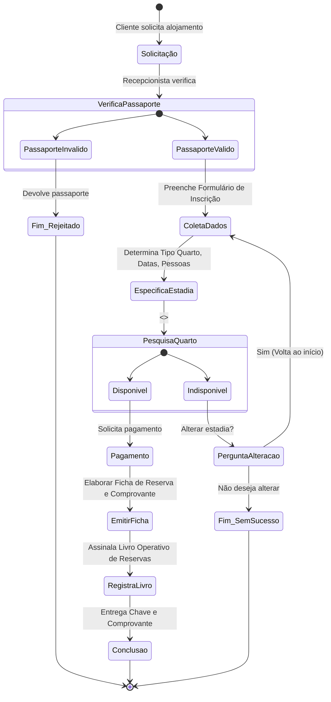

# Caderno de Exercícios e Práticas: Engenharia de Software II

## Introdução
Este documento materializa a transição da teoria (abordada no *Guia de Estudo Teórico*) para a prática de Engenharia de Software II. Ele contém as resoluções massivas e exaustivas dos casos de estudo extraídos da instituição, oferecendo a explicação completa do raciocínio e a modelagem correspondente (através de diagramas da UML gerados por notação Mermaid).

O objetivo é exercitar profundamente as técnicas de **Modelagem de Negócios** e **Captura de Requisitos**, demonstrando as competências analíticas de um Engenheiro de Software perante os usuários e a complexidade do domínio.

---

## Caso de Estudo 1: O "Hotel X"

### Contextualização e Racional
O *Hotel X* apresenta um processo estritamente manual para a reserva de quartos. Como Engenheiro de Software e Designer de Negócios, a nossa primeira tarefa é transcrever o mundo real (como o hotel opera) para um conjunto de abstrações e modelos (artefatos de Modelagem de Negócios do RUP).

A transcrição correta do negócio para o modelo determina o sucesso do software. Foram identificados processos-chave baseados nas entrevistas com a gestão do hotel.

### 1. Atores e Trabalhadores do Negócio
- **Ator de Negócio (Business Actor):** `Cliente` (Hóspede) - Entidade externa que requer alojamento ou efetua relatórios e cancelamentos.
- **Trabalhador de Negócio (Business Worker):** `Recepcionista do Hotel` - Papel interno encarregue da operacionalização do atendimento. A equipe de `Manutenção` também actua no cenário de falhas de quarto.

### 2. Identificação de Casos de Uso do Negócio (Business Use Cases)
Através da abstração e consolidação, os seguintes Casos de Uso do Negócio (CUN) foram identificados:
1. **Reservar Quarto**: CUN principal de alta complexidade englobando entrada de dados do hóspede, verificação e cobrança.
2. **Cancelar Reserva**: CUN de anulação onde estornos financeiros e liberação no livro ocorrem.
3. **Reportar Avaria (Quebra de Relatório)**: Trata avarias relatadas pelos clientes após ocupação.
4. **Terminar Reserva**: Encerramento normal, entrega de chaves e check-out.
5. **Pesquisar Quarto Disponível**: Após análise criteriosa, nota-se que "Reservar Quarto" e "Reportar Avaria" necessitam frequentemente consultar disponibilidade. Portanto, criamos este CUN genérico e independente que é consumido por inclusão (`<<include>>`).

#### Diagrama de Casos de Uso de Negócio (Mermaid)

```mermaid
usecaseDiagram
    actor "Cliente" as C
    
    package "Hotel X - Processos de Negócio" {
        usecase "Reservar Quarto" as UC1
        usecase "Cancelar Reserva" as UC2
        usecase "Reportar Avaria" as UC3
        usecase "Terminar Reserva" as UC4
        usecase "Pesquisar Quarto Disponível" as UC5
    }
    
    C --> UC1
    C --> UC2
    C --> UC3
    C --> UC4
    
    UC1 ..> UC5 : <<include>>
    UC3 ..> UC5 : <<include>>
```

*Nota Explicativa do Diagrama:* O ator *Cliente* interage diretamente com as funções operacionais principais (UC1, 2, 3, 4). A função de `Pesquisar Quarto Disponível` é uma sub-rotina lógica usada internamente e isolada para maximizar a reutilização do design do processo, utilizando um relacionamento de inclusão obrigatória.

### 3. Diagramas de Atividades (Dinâmica do Negócio)
Para compreender minuciosamente a `Reserva de Quarto`, o RUP exige a decomposição processual. A modelagem abaixo descreve as tomadas de decisões fundamentais, fluxos de controle e estados.

#### Diagrama de Atividades: Reservar Quarto (Simplificado)


### 4. Modelo de Objetos de Negócio
As entidades extraídas (que originarão as tabelas de um banco de dados relacional e objetos de domínio) são:
- `Passaporte`
- `Formulário de Inscrição para Hospedagem`
- `Formulário de Reserva`
- `Arquivo de Hospedagem` (Agregação dos formulários acima)
- `Livro Operativo de Reservas`
- `Comprovante de Reserva`
- `Lista de Distribuição de Conforto e Capacidade`
- `Quarto`

---

## Caso de Estudo 2: Universidade Internacional do Cuanza (UNIC)

### Contextualização e Racional
O problema exposto é o clássico contexto acadêmico de matrícula e controle do histórico de resultados docentes. A Secretaria Docente atua como cérebro administrativo. Professores enviam os dados de avaliação, que a Secretaria processa e converte em "Certificados de Notas". Estudantes interagem para solicitar ingresso ou ver seus resultados.

### 1. Atores de Negócio
- `Estudante`
- `Professor`
- Trabalhador de Negócio: `Secretaria Docente` (Responsável pelas rotinas diárias e preenchimento de documentos físicos).

### 2. Casos de Uso de Negócio (UNIC)
1. **Realizar Matrícula:** Disparado pelo Estudante. A Secretaria cria a *Ficha Escolar*.
2. **Elaborar Certificados de Notas:** Disparado pelo Professor mediante entrega de actas.
3. **Consultar Resultados Docentes:** Disparado pelo Estudante ou Professor para consumo de informação.

#### Diagrama UML: Casos de Uso do Negócio (UNIC)
```mermaid
usecaseDiagram
    actor "Estudante (Negócio)" as E
    actor "Professor (Negócio)" as P
    
    package "UNIC - Gestão de Processos" {
        usecase "Realizar Matrícula" as RM
        usecase "Elaborar Certificado de Notas" as ECN
        usecase "Consultar Resultados Docentes" as CRD
    }
    
    E --> RM
    P --> ECN
    E --> CRD
    P --> CRD
```

### 3. A Visão do Sistema de Software (Automatização)
O foco transita da modelagem do negócio para a modelagem do sistema a desenvolver. A Secretaria Docente agora deixa de ser um "trabalhador do negócio" para se tornar o **Ator principal do Sistema de Software**, visto que são eles que operarão as telas e teclados da aplicação (sistema de informação). O Estudante pode ter o papel de *Cliente* (Client Actor) para consultas na web sem autenticação total (como requisitos determinam, a consulta não precisa de login).

#### Atores do Sistema
- `Secretaria Docente`: Ator autenticado com privilégios de escrita.
- `Estudante/Cliente`: Ator não autenticado ou básico, privilégios de leitura (Consultas).

#### Casos de Uso do Sistema (UNIC - App)
1. **Gestão de Matrícula (CRUD Estudante)**
2. **Gestão dos Resultados Docentes (CRUD Notas)**
3. **Validar Usuário (Autenticação/Login)**
4. **Consultar Resultados Docentes (Leitura)**

```mermaid
usecaseDiagram
    actor "Secretaria Docente (Sys)" as SecDoc
    actor "Estudante/Cliente (Sys)" as CLI
    
    package "UNIC Software System" {
        usecase "Validar Usuário (Login)" as SYS_LOGIN
        usecase "Gestão de Matrículas" as SYS_MAT
        usecase "Gestão de Resultados" as SYS_RES
        usecase "Consultar Resultados Docentes" as SYS_CON
    }
    
    SecDoc --> SYS_LOGIN
    SecDoc --> SYS_MAT
    SecDoc --> SYS_RES
    
    SYS_MAT ..> SYS_LOGIN : <<include>>
    SYS_RES ..> SYS_LOGIN : <<include>>
    
    CLI --> SYS_CON
```
*Análise:* As rotinas de "Gestão de Matrículas" e "Gestão de Resultados" obrigatoriamente forçam a execução prévia da verificação de permissões do usuário, logo utilizamos o relacionamento `<<include>>` apontando para o CUS de "Validar Usuário". O acesso à "Consultar Resultados Docentes" não possui essa obrigatoriedade explícita (como ditam os requisitos).

### 4. Análise de Requisitos Não-Funcionais da UNIC
- **Tecnologias (Desenho/Implementação):** PHP, MySQL, Apache, Delphi7. Isso impõe uma arquitetura cliente-servidor, possível padronização MVC no back-end PHP ou multi-camadas no Delphi.
- **Portabilidade:** Deve funcionar em Windows, Mac e Linux via navegadores Web padronizados pela W3C.
- **Segurança:** O acesso à manipulação dos dados é restrito, implicando tabelas de sessões/usuários, hashing de passwords no banco de dados e controle de acesso baseado em papéis (RBAC).

---
## Exercícios Propostos de Autoavaliação

1. **Modelagem Orientada a Objetos:** Utilizando as regras de negócio do Hotel X, modele a classe `Quarto` contendo os atributos `numero`, `capacidade`, `tipo` e `status`. Como essa classe se associa com a classe `Reserva` em um Diagrama de Classes UML? Qual a multiplicidade?
   - *Racional Sugerido:* A multiplicidade será 1 Quarto associado a `0..*` Reservas (ao longo do tempo), porém uma Reserva se destina estritamente a `1` Quarto específico.

2. **Padrões de Projeto (Design Patterns):** Como você aplicaria o Padrão *Observer* no sistema da UNIC quando as "Actas de Notas" são publicadas, garantindo que o módulo financeiro (hipotético) ou de auditoria seja avisado?
   - *Racional Sugerido:* O sistema de Lançamento de Notas (Subject) publicaria o evento `NotasLancadasEvent`. O módulo de Bolsas/Financeiro, previamente registado como *Listener/Observer*, receberia a notificação automaticamente e reavaliaria descontos por mérito acadêmico, sem que a classe de Lançamento de Notas conheça os detalhes internos da classe financeira, provendo baixo acoplamento.
