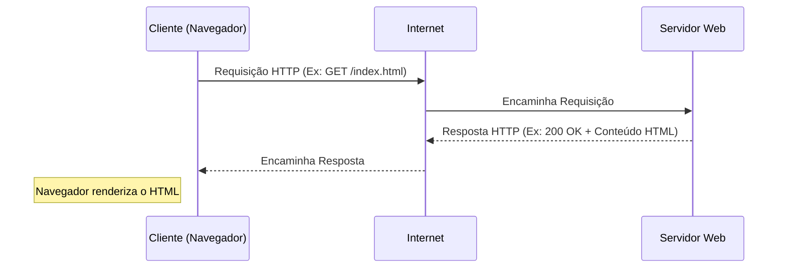

# Guia de Estudo Teórico: Programação Web I - V2

Este guia foi elaborado para oferecer uma visão universitária abrangente sobre a disciplina de Programação Web I, servindo como material principal de estudo teórico. Ele expande os tópicos apresentados em aula e fornece o aprofundamento necessário para o desenvolvimento de aplicações web modernas.

---

## Índice
1. [Introdução à Arquitetura Web](#1-introdução-à-arquitetura-web)
2. [Metodologias de Desenvolvimento de Aplicativos da Web](#2-metodologias-de-desenvolvimento-de-aplicativos-da-web)
3. [Fundamentos de HTML5](#3-fundamentos-de-html5)
4. [Fundamentos de CSS3](#4-fundamentos-de-css3)
5. [Introdução ao JavaScript](#5-introdução-ao-javascript)

---

## 1. Introdução à Arquitetura Web

O desenvolvimento web contemporâneo não é apenas escrever código; é compreender como a internet funciona e como as informações são trafegadas através dela. O conceito da Internet originou-se de projetos do Departamento de Defesa dos EUA nos anos 60 (como a ARPANET) e o protocolo TCP/IP nos anos 70, antes de expandir globalmente.

### 1.1 O que é a Web? (Website vs. Web Page)
Embora frequentemente usados como sinônimos, há distinções técnicas importantes:

| Termo | Definição | Exemplo de Analogia |
|---|---|---|
| **Web Page (Página Web)** | É um documento único, geralmente escrito em HTML, que é acessível através da internet ou de outras redes usando um navegador. | Uma "folha" individual de um livro. |
| **Website (Sítio Web)** | É um conjunto de páginas web relacionadas, interligadas por links (hipertexto) e abrigadas sob um mesmo domínio. | Um "livro" completo. |
| **Web Application (Aplicativo Web)** | É um website dinâmico projetado para realizar funções específicas, altamente interativo, similar a um software de desktop. | Um "caderno de exercícios interativo". |

### 1.2 O Modelo Cliente-Servidor
A World Wide Web (WWW) opera no modelo **Cliente-Servidor**:
*   **Cliente:** É o dispositivo e o software (normalmente um navegador como Chrome, Firefox ou Edge) que solicita recursos.
*   **Servidor:** É o computador remoto ou a rede de computadores que armazena os recursos (arquivos HTML, CSS, imagens, banco de dados) e responde às solicitações do cliente.

> [!NOTE]
> **Características Arquitetura Cliente/Servidor:** Escalabilidade horizontal e vertical, transparência de localização (o cliente não sabe onde está o recurso), processos independentes onde clientes iniciam as conversas e servidores respondem.



### 1.3 As Três Camadas do Desenvolvimento Front-End
O desenvolvimento da interface do usuário baseia-se na "Tríade da Web":
1.  **HTML (HyperText Markup Language):** Responsável pela **Estrutura** e **Conteúdo** (textos, imagens, tabelas).
2.  **CSS (Cascading Style Sheets):** Responsável pela **Apresentação** e **Design** (cores, fontes, layout).
3.  **JavaScript:** Responsável pelo **Comportamento** e **Interatividade** (animações complexas, requisições assíncronas, manipulação do DOM).

---

## 2. Metodologias de Desenvolvimento de Aplicativos da Web

Desenvolver para a web requer planejamento. O ciclo de vida do desenvolvimento de sistemas (SDLC) aplica-se aqui com adaptações.

### 2.1 Ciclo de Vida do Desenvolvimento Web
1.  **Levantamento de Requisitos e Planejamento:** Compreender o objetivo do site, o público-alvo, e elaborar um mapa do site (sitemap).
2.  **Design (UI/UX):** Criação de wireframes e protótipos visuais (ex: Figma). Foco na Experiência do Usuário (UX) e Interface do Usuário (UI).
3.  **Desenvolvimento (Front-End & Back-End):** Tradução dos protótipos em código (HTML/CSS/JS) e implementação da lógica de negócios e banco de dados no servidor.
4.  **Testes (Quality Assurance):** Testes de usabilidade, responsividade (em diferentes dispositivos e navegadores), segurança e performance.
5.  **Implantação (Deployment):** Publicação do site em um servidor de hospedagem.
6.  **Manutenção:** Atualizações contínuas de segurança, conteúdo e melhorias de performance.

---

## 3. Fundamentos de HTML5

O HTML (Linguagem de Marcação de Hipertexto) é a espinha dorsal de qualquer página web. Não é uma linguagem de programação (não possui lógica computacional como loops ou variáveis), mas sim uma **linguagem de marcação**.

> [!IMPORTANT]
> A sigla **HTML** significa **HyperText Markup Language**. "Hipertexto" refere-se ao fato de o conteúdo estar interligado através de links, enquanto "Markup" diz respeito ao uso de tags para encapsular o conteúdo e definir a sua estrutura.

### 3.1 Estrutura Básica de um Documento HTML
O HTML funciona através de "tags" (etiquetas) que encapsulam o conteúdo. A estrutura fundamental exige:

```html
<!doctype html>
<html lang="pt-BR">
    <head>
        <meta charset="utf-8">
        <title>Título da Minha Página</title>
        <!-- O cabeçalho (head) contém metadados, links para CSS e scripts. Não é visível no navegador. -->
    </head>
    <body>
        <!-- O corpo (body) contém todo o conteúdo visível da página. -->
        <h1>Bem-vindo à Programação Web I</h1>
    </body>
</html>
```

### 3.2 Tags de Estruturação e Semântica de Texto
*   **Cabeçalhos (Headings):** Variam de `<h1>` (mais importante) a `<h6>` (menos importante). 
*   **Parágrafos e Quebras de Linha:**
    *   `<p>`: Define um bloco de texto (parágrafo).
    *   `<br>`: Quebra de linha forçada.
    *   `<hr>`: Linha horizontal para separar conteúdo.
*   **Formatação de Texto Básica (Physical vs. Semantic Tags):**
    *   `<b>`: Negrito visual.
    *   `<strong>`: Negrito semântico.
    *   `<i>` / `<em>`: Itálico / Ênfase.
    *   `<u>`: Sublinhado.
    *   `<s>` / `<del>`: Tachado.

### 3.3 Listas
*   **Não Ordenadas (`<ul>`):** Utiliza marcadores (bullet points). Itens definidos com `<li>`.
*   **Ordenadas (`<ol>`):** Lista numerada. Itens também definidos com `<li>`.

### 3.4 Inserção de Mídias e Símbolos
*   **Imagens (``):** Tag auto-fechada.
    ```html
    
    ```
*   **Símbolos (HTML Entities):** Usados para exibir caracteres reservados (como `<` ou `>`) ou especiais (como fórmulas e moedas), garantindo compatibilidade. Iniciam com `&` e terminam com `;`.
    *   Exemplos: `&hearts;` (♥), `&copy;` (©), `&euro;` (€), `&starf;` (★), `&lt;` (<).
*   **Emojis:** Inseridos diretamente ou através de códigos Unicode Hexadecimais (ex: `&#x1F600;` para 😀, `&#x1F4BB;` para 💻).

### 3.5 Tabelas (Tables)
As tabelas permitem apresentar grandes quantidades de dados de forma estruturada.
*   `<table>`: Define a tabela.
*   `<tr>`: Define uma linha da tabela (Table Row).
*   `<th>`: Define uma célula de cabeçalho (Table Header).
*   `<td>`: Define uma célula de dados (Table Data).
*   **Atributos de expansão de células:**
    *   `colspan`: Define quantas colunas uma célula ocupará horizontalmente (ex: `<td colspan="2">`).
    *   `rowspan`: Define quantas linhas uma célula ocupará verticalmente (ex: `<td rowspan="3">`).

> [!TIP]
> Use os atributos `colspan` e `rowspan` em exames de Programação Web, pois eles são frequentemente testados em cenários de formulários estruturados em tabelas!

### 3.6 Formulários (Forms)
Os formulários agrupam elementos para coletar e enviar dados do usuário ao servidor. 
*   `<form>`: A tag raiz. Atributos comuns incluem `action` (URL para onde enviar os dados) e `method` (ex: `GET` ou `POST`).
*   `<input>`: Elemento genérico de entrada de dados. Seu atributo `type` altera a funcionalidade:
    *   `type="text"`, `password`, `email`, `tel`, `number`, `url`.
    *   `type="radio"`, `type="checkbox"`.
    *   `type="color"`, `type="date"`.
    *   Botões: `type="submit"`, `type="reset"`, `type="button"`.
*   `<textarea>`: Caixa de texto de múltiplas linhas.
*   `<select>` e `<option>`: Cria uma lista suspensa (dropdown).
*   `<label>`: Rótulo para campos, utiliza o atributo `for` correspondente ao `id` do input para melhorar a usabilidade e acessibilidade.

---

## 4. Fundamentos de CSS3

O CSS cuida da estética. Ele permite que você pegue a estrutura crua do HTML e aplique cores, posicione elementos, altere fontes e crie layouts.

### 4.1 Anatomia de uma Regra CSS
```css
seletor {
    propriedade: valor;
}
```

### 4.2 Seletores Básicos
*   **Seletor de Elemento:** Aplica estilo a todas as tags do mesmo tipo (ex: `p { color: red; }`).
*   **Seletor de Classe:** Inicia com `.` e estiliza elementos com uma classe específica (ex: `.destaque { font-weight: bold; }`).
*   **Seletor de ID:** Inicia com `#` e estiliza um elemento único e específico (ex: `#rodape { background: black; }`).

### 4.3 Formas de Inserir CSS
1.  **Inline (Em Linha):** Diretamente na tag HTML usando o atributo `style`. (Difícil manutenção).
2.  **Internal (Interno):** Na tag `<style>` dentro do `<head>`. (Ideal para estilos de página única).
3.  **External (Externo):** Em arquivo `.css` separado, linkado via `<link rel="stylesheet" href="style.css">`. (Mais recomendado).

### 4.4 Animações CSS
Animações CSS adicionam movimento e interatividade sem necessidade de JavaScript.
*   `@keyframes`: Define a sequência de estilos da animação ao longo do tempo (de `0%` a `100%`, ou de `from` a `to`).
*   **Principais propriedades de `animation`:**
    *   `animation-name`: Nome do `@keyframes`.
    *   `animation-duration`: Duração do ciclo (ex: `4s`).
    *   `animation-iteration-count`: Quantas vezes repete (ex: `infinite`).
    *   `animation-direction`: Direção (ex: `alternate`).

---

## 5. Introdução ao JavaScript

*Nota de Estudo: Tópico avançado para o prosseguimento da disciplina.*

O JavaScript é a linguagem que traz a web à vida. Enquanto o HTML cria os botões e o CSS os embeleza, o JavaScript define o que acontece quando o usuário clica nesses botões. Ele permite manipulação dinâmica do DOM, processamento de dados local e comunicação assíncrona.
