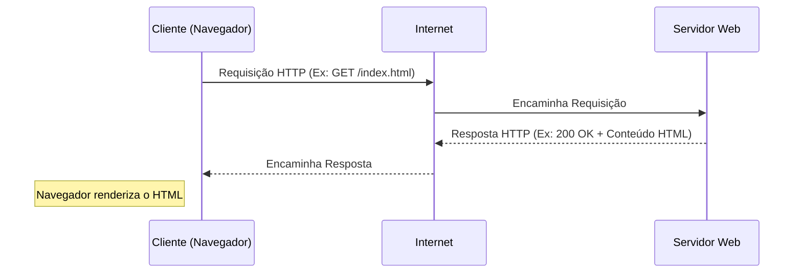

# Guia de Estudo Teórico: Programação Web I

Este guia foi elaborado para oferecer uma visão universitária abrangente sobre a disciplina de Programação Web I, servindo como material principal de estudo teórico. Ele expande os tópicos apresentados em aula e fornece o aprofundamento necessário para o desenvolvimento de aplicações web modernas.

---

## Índice
1. [Introdução à Arquitetura Web](#1-introdução-à-arquitetura-web)
2. [Metodologias de Desenvolvimento de Aplicativos da Web](#2-metodologias-de-desenvolvimento-de-aplicativos-da-web)
3. [Fundamentos de HTML5](#3-fundamentos-de-html5)
4. [Fundamentos de CSS3](#4-fundamentos-de-css3)
5. [Introdução ao JavaScript](#5-introdução-ao-javascript)

---

## 1. Introdução à Arquitetura Web

O desenvolvimento web contemporâneo não é apenas escrever código; é compreender como a internet funciona e como as informações são trafegadas através dela.

### 1.1 O que é a Web? (Website vs. Web Page)
Embora frequentemente usados como sinônimos, há distinções técnicas importantes:
*   **Web Page (Página Web):** É um documento único, geralmente escrito em HTML, que é acessível através da internet ou de outras redes usando um navegador. Funciona como uma "folha" individual de um livro.
*   **Website (Sítio Web):** É um conjunto de páginas web relacionadas, interligadas por links (hipertexto) e abrigadas sob um mesmo domínio (ex: `www.unic.co.ao`). Seria o equivalente a um "livro" completo.
*   **Web Application (Aplicativo Web):** É um website dinâmico projetado para realizar funções específicas, altamente interativo, similar a um software de desktop (ex: Gmail, Google Docs).

### 1.2 O Modelo Cliente-Servidor
A World Wide Web (WWW) opera no modelo **Cliente-Servidor**:
*   **Cliente:** É o dispositivo e o software (normalmente um navegador como Chrome, Firefox ou Edge) que solicita recursos.
*   **Servidor:** É o computador remoto ou a rede de computadores que armazena os recursos (arquivos HTML, CSS, imagens, banco de dados) e responde às solicitações do cliente.



### 1.3 As Três Camadas do Desenvolvimento Front-End
O desenvolvimento da interface do usuário baseia-se na "Tríade da Web":
1.  **HTML (HyperText Markup Language):** Responsável pela **Estrutura** e **Conteúdo** (textos, imagens, tabelas).
2.  **CSS (Cascading Style Sheets):** Responsável pela **Apresentação** e **Design** (cores, fontes, layout).
3.  **JavaScript:** Responsável pelo **Comportamento** e **Interatividade** (animações complexas, requisições assíncronas, manipulação do DOM).

---

## 2. Metodologias de Desenvolvimento de Aplicativos da Web

Desenvolver para a web requer planejamento. O ciclo de vida do desenvolvimento de sistemas (SDLC) aplica-se aqui com adaptações.

### 2.1 Ciclo de Vida do Desenvolvimento Web
1.  **Levantamento de Requisitos e Planejamento:** Compreender o objetivo do site, o público-alvo, e elaborar um mapa do site (sitemap).
2.  **Design (UI/UX):** Criação de wireframes e protótipos visuais (ex: Figma). Foco na Experiência do Usuário (UX) e Interface do Usuário (UI).
3.  **Desenvolvimento (Front-End & Back-End):** Tradução dos protótipos em código (HTML/CSS/JS) e implementação da lógica de negócios e banco de dados no servidor.
4.  **Testes (Quality Assurance):** Testes de usabilidade, responsividade (em diferentes dispositivos e navegadores), segurança e performance.
5.  **Implantação (Deployment):** Publicação do site em um servidor de hospedagem.
6.  **Manutenção:** Atualizações contínuas de segurança, conteúdo e melhorias de performance.

---

## 3. Fundamentos de HTML5

O HTML (Linguagem de Marcação de Hipertexto) é a espinha dorsal de qualquer página web. Não é uma linguagem de programação (não possui lógica computacional como loops ou variáveis), mas sim uma **linguagem de marcação**.

### 3.1 Estrutura Básica de um Documento HTML
O HTML funciona através de "tags" (etiquetas) que encapsulam o conteúdo. A estrutura fundamental exige:

```html
<!doctype html>
<html lang="pt-BR">
    <head>
        <meta charset="utf-8">
        <title>Título da Minha Página</title>
        <!-- O cabeçalho (head) contém metadados, links para CSS e scripts. Não é visível no navegador. -->
    </head>
    <body>
        <!-- O corpo (body) contém todo o conteúdo visível da página. -->
        <h1>Bem-vindo à Programação Web I</h1>
    </body>
</html>
```

*   `<!doctype html>`: Informa ao navegador que estamos utilizando o padrão HTML5.
*   `<html lang="pt-BR">`: O elemento raiz do documento, especificando o idioma para acessibilidade e motores de busca (SEO).
*   `<head>`: Contém os metadados. O título da página (`<title>`) e a codificação de caracteres (`<meta charset="utf-8">`) são cruciais.
*   `<body>`: Contém todos os elementos renderizados visualmente na página.

### 3.2 Tags de Estruturação e Semântica de Texto
*   **Cabeçalhos (Headings):** Variam de `<h1>` (mais importante, principal) a `<h6>` (menos importante). O uso correto é vital para acessibilidade e SEO.
*   **Parágrafos e Quebras de Linha:**
    *   `<p>`: Define um bloco de texto (parágrafo).
    *   `<br>`: Realiza uma quebra de linha forçada (line break).
    *   `<hr>`: Cria uma linha horizontal para separação temática de seções (thematic break).
*   **Formatação de Texto Básica (Physical vs. Semantic Tags):**
    *   `<b>`: Negrito visual (bold).
    *   `<strong>`: Negrito semântico (indica forte importância).
    *   `<i>`: Itálico visual.
    *   `<em>`: Ênfase (geralmente renderizado como itálico, mas focado no significado).
    *   `<u>`: Sublinhado.
    *   `<s>` / `<del>`: Tachado (indicando conteúdo incorreto ou deletado).

### 3.3 Listas
As listas são estruturas essenciais para organizar informações:
*   **Não Ordenadas (`<ul>`):** Lista de itens onde a ordem não importa. Renderizada com marcadores (bullet points).
    ```html
    <ul>
        <li>HTML</li>
        <li>CSS</li>
    </ul>
    ```
*   **Ordenadas (`<ol>`):** Lista numerada, útil para passos ou rankings.
    ```html
    <ol>
        <li>Planejamento</li>
        <li>Desenvolvimento</li>
    </ol>
    ```

### 3.4 Inserção de Mídias e Recursos
*   **Imagens (``):** Tag auto-fechada.
    ```html
    
    ```
    *   O atributo `alt` é obrigatório para boas práticas de acessibilidade (leitores de tela) e caso a imagem não carregue.
*   **Símbolos e Entidades HTML:** Usados para exibir caracteres reservados ou especiais. Iniciam com `&` e terminam com `;`.
    *   Exemplos: `&copy;` (©), `&hearts;` (♥), `&lt;` (<), `&gt;` (>).
*   **Emojis:** Podem ser inseridos diretamente copiando e colando, ou através de códigos Unicode Hexadecimais (ex: `&#x1F600;` para 😀).

### 3.5 Comentários no Código
Comentários são ignorados pelo navegador e servem para documentar o código:
`<!-- Este é um comentário em HTML -->`

---

## 4. Fundamentos de CSS3

*Nota de Estudo: Embora introduzido superficialmente nas aulas iniciais, o CSS é indissociável do HTML moderno.*

O CSS cuida da estética. Ele permite que você pegue a estrutura crua do HTML e aplique cores, posicione elementos, altere fontes e crie layouts responsivos (que se adaptam a celulares e computadores).

### 4.1 Anatomia de uma Regra CSS
```css
seletor {
    propriedade: valor;
}
```
Exemplo:
```css
h1 {
    color: blue;
    font-size: 24px;
}
```

### 4.2 Formas de Inserir CSS
1.  **Inline:** Diretamente na tag HTML (não recomendado para projetos grandes).
    `<p style="color: red;">Texto vermelho.</p>`
2.  **Interno (Embutido):** Na tag `<style>` dentro do `<head>`.
3.  **Externo:** Em um arquivo `.css` separado, linkado no `<head>` usando a tag `<link>`.
    `<link rel="stylesheet" href="estilo.css">`

---

## 5. Introdução ao JavaScript

*Nota de Estudo: Tópico avançado para o prosseguimento da disciplina.*

O JavaScript é a linguagem que traz a web à vida. Enquanto o HTML cria os botões e o CSS os embeleza, o JavaScript define o que acontece quando o usuário clica nesses botões.
Ele permite manipulação dinâmica do DOM (Document Object Model), processamento de dados local no navegador do cliente, comunicação assíncrona (AJAX/Fetch API) sem recarregar a página, e muito mais.

---
*Fim do Guia Teórico. Certifique-se de praticar exaustivamente o conteúdo escrevendo código e validando seus resultados no navegador.*
