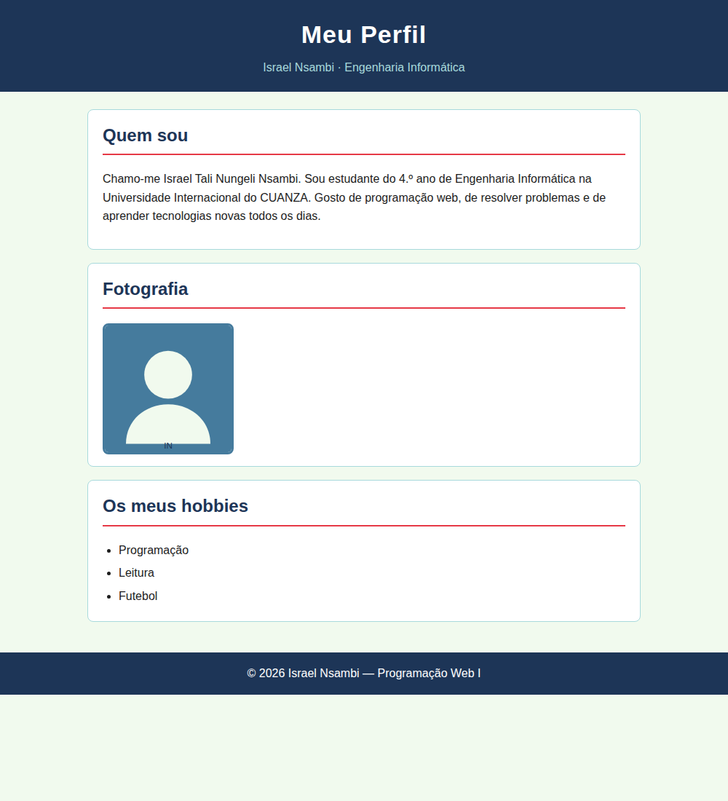
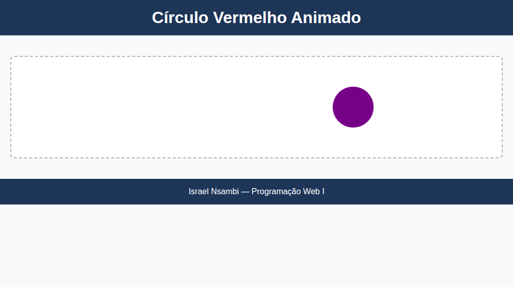
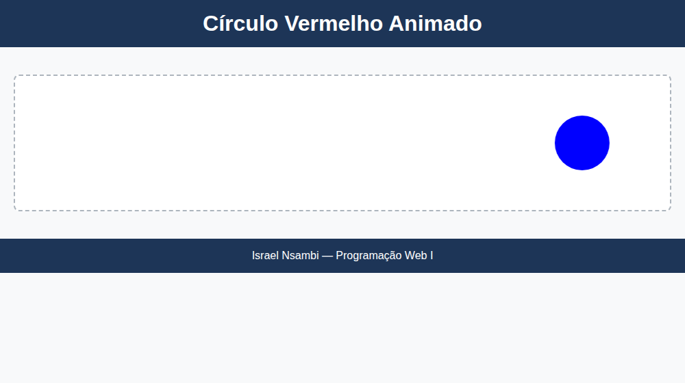
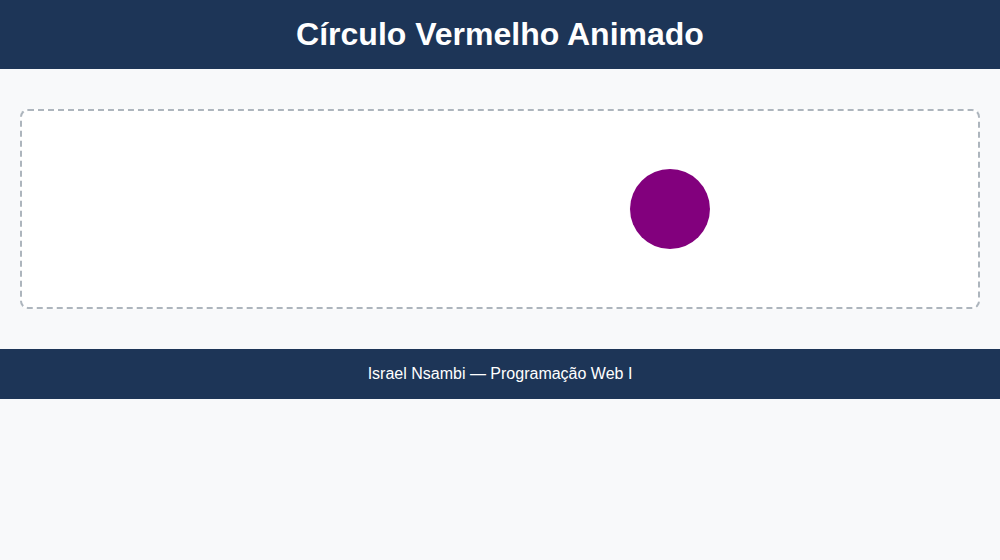
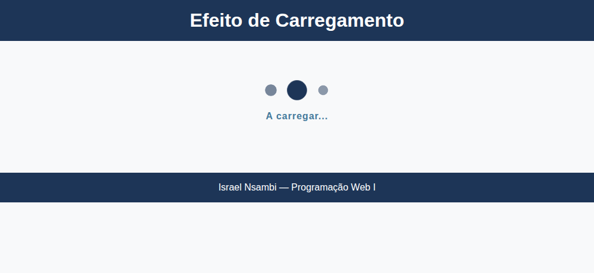

# Resolução da Prova — Programação Web I

**Aluno:** Israel Tali Nungeli Nzambi
**Disciplina:** Programação Web I · **Docente:** Núria de Sousa · **4.º ano · 2025/26**

Esta pasta (`Israel Nzambi`) contém **todos** os ficheiros pedidos na prova.

```
Israel Nzambi/
├── perfil.html      → Pergunta 2
├── estilo.css       → Pergunta 2 (CSS externo)
├── imagens/
│   └── perfil.svg   → Pergunta 2 (imagem)
├── circulo.html     → Pergunta 3
├── circulo.css      → Pergunta 3 (CSS externo)
├── loading.html     → Pergunta 4
├── loading.css      → Pergunta 4 (CSS externo)
├── capturas/        → screenshots das páginas a funcionar
└── LEIA-ME.md       → este guia
```

Para ver cada exercício: **duplo clique no ficheiro `.html`** — abre no navegador.

---

## Pergunta 1 — Criar a pasta de trabalho

> *No ambiente de trabalho (Escritório), crie uma pasta com o seu primeiro e último nome. Todos os ficheiros da prova devem constar nesta pasta.*

**Passo a passo (no computador da prova):**

1. Ir ao **Ambiente de Trabalho**.
2. Botão direito → **Novo → Pasta**.
3. Escrever o nome: **`Israel Nzambi`** (primeiro e último nome).
4. Guardar dentro dela **todos** os ficheiros que criar (`perfil.html`, `estilo.css`, etc.).

✔️ Feito: esta pasta já tem esse nome e contém tudo.

---

## Pergunta 2 — Página "Meu Perfil"  *(5 valores)*

> Página HTML com título "Meu Perfil": (a) título principal, (b) texto de apresentação,
> (c) imagem, (d) lista com três hobbies. Usar os **três tipos de CSS**.
> Organizar em blocos: (e) cabeçalho, (f) conteúdo principal, (g) rodapé.

### Passo a passo do raciocínio

1. **Esqueleto HTML** — `<!DOCTYPE html>`, `<html>`, `<head>`, `<body>`.
2. **Título da aba** — `<title>Meu Perfil</title>` dentro do `<head>`.
3. **Layout em blocos** — três elementos semânticos:
   - `<header class="cabecalho">` → (e) cabeçalho
   - `<main class="conteudo">` → (f) conteúdo principal
   - `<footer class="rodape">` → (g) rodapé
4. **Conteúdo pedido**, dentro do `<main>`:
   - (a) título principal → `<h1>` (está no `<header>`, é o título da página)
   - (b) texto de apresentação → `<p>` na secção "Quem sou"
   - (c) imagem → ``
   - (d) lista de 3 hobbies → `<ul>` com três `<li>` (Programação, Leitura, Futebol)
5. **Os três tipos de CSS** (o ponto que dá a cotação):

   | Tipo | Onde | Neste trabalho |
   |------|------|----------------|
   | **Em linha** (*inline*) | atributo `style="..."` no elemento | no `<h1>`: `style="margin:0; font-size:34px; ..."` |
   | **Interno** | bloco `<style>` no `<head>` | estiliza `.cabecalho` (fundo azul, texto centrado) |
   | **Externo** | ficheiro `.css` + `<link>` | `estilo.css` → caixas do conteúdo, lista, imagem, rodapé |

### Como confirmar que está certo

- A aba do navegador mostra **"Meu Perfil"**.
- O cabeçalho é azul-escuro com texto centrado → **CSS interno** a funcionar.
- O `<h1>` é grande e colado ao topo do cabeçalho → **CSS em linha** a funcionar.
- As caixas brancas, a lista e o rodapé → **CSS externo** a funcionar.
- Existem claramente 3 zonas: topo, meio, fundo → **organização em blocos**.

### Captura de ecrã (`perfil.html` no Chrome)



> A imagem é um `.svg` de exemplo. Se tiver uma foto real, copie-a para
> `imagens/perfil.jpg` e troque no HTML: `src="imagens/perfil.jpg"`.

---

## Pergunta 3 — Círculo vermelho animado  *(5 valores)*

> Página com um círculo vermelho. Com `@keyframes`, o círculo deve:
> mover-se do centro para a direita; demorar 6 s no percurso; mudar de cor
> durante o movimento; voltar à posição inicial; repetir infinitamente.

### Passo a passo do raciocínio

1. **HTML mínimo em blocos** (`circulo.html`): `<header>`, `<main>` com um
   `<div class="palco">` que contém `<div class="circulo">`, e `<footer>`.
   Liga **só** a `circulo.css` (a prova exige **CSS externo**).
2. **Fazer o círculo** (`circulo.css`):
   - `width` e `height` iguais (80px) + `border-radius: 50%` → círculo.
   - `background-color: red` → vermelho.
3. **Colocá-lo no centro**: o `.palco` usa `display:flex; justify-content:center;
   align-items:center;` → o círculo nasce no centro (posição inicial).
4. **Animar com `@keyframes`** (regra chamada `mover`):
   ```css
   @keyframes mover {
     0%   { transform: translateX(0);     background-color: red;  } /* centro */
     50%  { transform: translateX(35vw);  background-color: blue; } /* direita + nova cor */
     100% { transform: translateX(0);     background-color: red;  } /* voltou ao início */
   }
   ```
5. **Ligar a animação ao círculo**:
   ```css
   animation: mover 12s ease-in-out infinite;
   ```
   - `12s` = **6 s** para ir ao ponto mais à direita (0%→50%) + 6 s para regressar (50%→100%).
   - `infinite` = repete para sempre.
   - `translateX` = deslocamento **horizontal** (para a direita).

### Como confirmar que está certo

- Vê-se **um** círculo vermelho a partir do centro.
- Ele desliza para a direita, fica azul a meio do caminho, e volta vermelho ao centro.
- Nunca para (fica em ciclo).

### Capturas de ecrã (`circulo.html` em três momentos do ciclo)

| ~3 s — a ir para a direita, cor a mudar | ~6 s — no extremo direito, azul | ~9 s — a regressar ao centro |
|---|---|---|
|  |  |  |

> Se a professora quiser que o **percurso todo** (ida + volta) dure 6 s,
> troque `12s` por `6s` na linha `animation:`.

---

## Pergunta 4 — Efeito de *loading*  *(10 valores)*

> Página que simula um carregamento com **três círculos alinhados horizontalmente**.
> Os círculos devem aumentar e diminuir de tamanho **alternadamente**, criando o
> efeito de carregamento, repetindo continuamente.

### Passo a passo do raciocínio

1. **HTML em blocos** (`loading.html`): `<header>`, `<main>` e `<footer>`.
   Dentro do `<main>`: `<div class="loading">` com **três** `<span class="bola">`.
   Liga **só** a `loading.css` (**CSS externo**).
2. **Alinhar na horizontal** (`loading.css`):
   ```css
   .loading { display: flex; justify-content: center; gap: 18px; }
   ```
3. **Fazer cada bola**: `width`/`height` iguais + `border-radius: 50%`.
4. **Animação `pulsar`** (encolher ↔ crescer) com `@keyframes`:
   ```css
   @keyframes pulsar {
     0%, 100% { transform: scale(0.5); opacity: 0.4; }  /* pequeno */
     50%      { transform: scale(1.3); opacity: 1;   }  /* grande  */
   }
   ```
5. **Aplicar a todas as bolas e criar o efeito alternado** com atrasos diferentes:
   ```css
   .bola               { animation: pulsar 1.2s ease-in-out infinite; }
   .bola:nth-child(1)  { animation-delay: 0s;   }
   .bola:nth-child(2)  { animation-delay: 0.2s; }
   .bola:nth-child(3)  { animation-delay: 0.4s; }
   ```
   Como cada bola começa a animação num instante diferente, num dado momento
   estão em tamanhos diferentes → é isso que dá o efeito de **onda / loading**.
   `infinite` mantém tudo a repetir.

### Como confirmar que está certo

- Vêem-se **três** círculos lado a lado.
- Crescem e encolhem em sequência (um, depois o outro, depois o outro).
- O movimento nunca para.

### Captura de ecrã (`loading.html`)



Repara que, no mesmo instante, a bola do meio está grande e as das pontas
pequenas — é o `animation-delay` diferente que cria este efeito de onda.

---

## Checklist final antes de entregar

- [ ] A pasta chama-se **`Israel Nzambi`** e está no Ambiente de Trabalho.
- [ ] Todos os ficheiros estão **dentro** da pasta.
- [ ] `perfil.html`: aba diz "Meu Perfil"; tem `<header>`/`<main>`/`<footer>`;
      tem título, texto, imagem e lista de 3 hobbies; usa os 3 tipos de CSS.
- [ ] `circulo.html` + `circulo.css`: círculo vermelho, centro → direita,
      muda de cor, volta, repete sempre; só CSS externo.
- [ ] `loading.html` + `loading.css`: 3 círculos na horizontal, crescem/encolhem
      alternadamente, em ciclo; só CSS externo.
- [ ] Cada `<link rel="stylesheet" href="...">` tem o nome de ficheiro certo.
- [ ] Código indentado, com comentários e nomes de classe claros.
