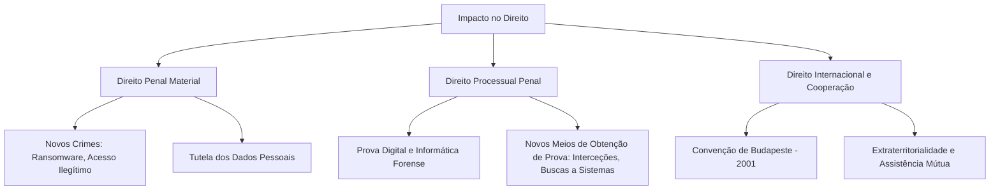

# Guia de Exercícios e Práticas: Ética e Direito da Informática

Este guia contém estudos de caso detalhados, dilemas éticos complexos e exercícios jurídicos concebidos para testar a compreensão e a capacidade analítica dos estudantes nos cinco eixos principais da disciplina: Ética Profissional, Ética em Sistemas de Informação, Ética na Administração de Recursos, Cibercrimes e Direito da Informática.

---

## 1. Exercícios Práticos: Ética Profissional e Deontologia

### Estudo de Caso 1: O Dilema da Automação e do Desemprego
**Cenário**: Você é o Engenheiro de Software Chefe numa empresa que desenvolve soluções para logística. A direção pede-lhe que desenvolva um sistema robótico autônomo e baseado em IA que substituirá 500 trabalhadores de armazém. A empresa não planeia qualquer programa de reconversão (reskilling) para os trabalhadores despedidos. Além disso, você sabe que o sistema de IA tem uma taxa de erro de 3% que pode causar acidentes materiais no armazém (embora o risco humano seja agora zero, já que não haverá humanos lá).

**Questões para Discussão**:
1. À luz do Código de Ética da ACM, quais são os princípios que estão em tensão neste cenário?
2. Como engenheiro chefe, você tem o dever moral de se opor à demissão em massa, ou isso é uma decisão exclusivamente corporativa/de negócios?
3. Elabore um plano de ação (passo-a-passo) sobre como abordaria a administração em relação à taxa de erro de 3% e aos impactos sociais.

---

## 2. Exercícios Práticos: Ética nos Sistemas de Informação

### Estudo de Caso 2: Viés Algorítmico no Sistema de Saúde
**Cenário**: Um hospital público adota um algoritmo de Machine Learning, desenvolvido pela sua equipa, para fazer a triagem de pacientes em lista de espera. O modelo foi treinado com 10 anos de dados históricos do hospital. Três meses após a implementação, descobre-se que pacientes pertencentes a minorias étnicas estão a ser consistentemente colocados no final da lista, independentemente da gravidade aparente dos sintomas. O algoritmo aprendeu (implicitamente) que esses pacientes no passado faltavam mais às consultas (muitas vezes por questões socioeconômicas) e, por isso, desprioriza-os para "maximizar a eficiência" médica.

**Questões para Discussão**:
1. Onde falhou o processo de engenharia de software do ponto de vista ético? (Foque no conceito de *Fairness* e *Algorithmic Bias*).
2. O sistema deve ser desligado imediatamente? E se o seu encerramento significar o colapso logístico do hospital nas próximas 48 horas? Qual é a atitude utilitarista vs. deontológica?
3. Proponha uma auditoria técnica e social para reverter este viés antes da próxima re-implementação.

---

## 3. Exercícios Práticos: Ética na Administração de Recursos Informáticos

### Estudo de Caso 3: Whistleblowing e o Administrador de Sistemas
**Cenário**: A Ana é Administradora de Sistemas numa grande empresa de e-commerce. Durante uma manutenção de rotina no servidor de bases de dados, ela descobre que a empresa sofreu uma grave quebra de segurança há 6 meses. Os dados de cartão de crédito de 100.000 clientes foram exfiltrados. Ao reportar isto ao CEO, este diz-lhe para apagar os logs e manter segredo absoluto, argumentando que a revelação causaria a falência da empresa e o despedimento de 300 pessoas. "Ninguém se magoou, o banco cobre fraudes, por favor não faças nada, Ana," diz ele.

**Questões para Discussão**:
1. Quais são as infrações legais cometidas pelo CEO (relacionadas ao RGPD e ocultação)?
2. A Ana tem o dever ético de denunciar (Whistleblowing)? Que impacto teria esta denúncia e quais as proteções legais para denunciantes no seu país?
3. Se a Ana apagar os logs conforme instruído, que crimes informáticos ou faltas deontológicas estará a cometer?

---

## 4. Exercícios Práticos: Cibercrimes

### Estudo de Caso 4: O "White Hat" e o Acesso Ilegítimo
**Cenário**: Carlos é um estudante brilhante de cibersegurança. Numa noite, sem qualquer contrato ou autorização, decide fazer um scan de vulnerabilidades (penetration test não autorizado) à rede de uma universidade rival apenas "para ver como está a segurança deles". Ele encontra uma falha gritante de Injeção de SQL que expõe as notas de todos os alunos. Não altera nem rouba nada. Ele envia um e-mail anónimo ao Reitor com o relatório da falha para que corrijam.

**Questões para Discussão**:
1. À luz da Convenção de Budapeste e da legislação de Cibercrime do seu país (ex: Lei nº 109/2009 em Portugal ou Lei Carolina Dieckmann no Brasil), o Carlos cometeu algum crime? Especifique.
2. A intenção "benigna" do Carlos invalida a criminalidade do ato?
3. Redija um relatório jurídico simulado sobre a diferença entre *Hacktivismo*, *White Hat Hacking* autorizado, e cibercrime doloso, usando o caso do Carlos como base.

---

## 5. Exercícios Práticos: Direito da Informática e Proteção de Dados (RGPD/GDPR)

### Estudo de Caso 5: A App de Fitness Intrusiva
**Cenário**: Uma nova startup tecnológica criou uma app gratuita de corrida e fitness ("RunPro"). Nos Termos e Condições (de 50 páginas e em letra pequena), a empresa diz que pode partilhar a localização GPS em tempo real e o ritmo cardíaco com empresas de seguros e marcas de desporto. Quando o utilizador instala a app, a localização e a partilha vêm ativadas por defeito. A empresa argumenta que tem o "consentimento" do utilizador porque este clicou em "Aceito".

**Questões para Discussão**:
1. Analise o caso à luz do **Artigo 5º do RGPD** (Princípios Fundamentais). Que princípios foram claramente violados?
2. Explique os conceitos de **Privacy by Design** e **Privacy by Default** demonstrando como a "RunPro" falhou de forma deliberada nestas exigências.
3. Como deve ser obtido o **Consentimento** legítimo à luz do RGPD? A tática da "RunPro" de esconder a cláusula em 50 páginas é lícita?

### Exercício de Redação Legal
Escreva um e-mail formal na posição de **Encarregado da Proteção de Dados (DPO)** da startup, avisando o Conselho de Administração das coimas aplicáveis (multas do RGPD) e exigindo uma restruturação técnica da aplicação. Estruture o e-mail justificando a urgência legal.

## 6. Questões de Exames e Testes (Resolução Detalhada)

Esta secção contém a resolução aprofundada de questões reais de exames e testes da disciplina de Ética e Direito da Informática, enriquecida com a devida fundamentação jurídica, doutrinária e ética, complementando os exercícios práticos.

### Questão 1: Natureza da Internet, Rede e Criminalidade Informática

**Enunciado Teórico (com base em apontamentos de aula):**
Discuta a natureza da Internet e o conceito de Rede, abordando o debate sobre se a Internet é um sistema ou um mero dado informativo. Defina também a criminalidade informática em sentido amplo e estrito.

**Resolução Detalhada:**
- **A Internet como Sistema:** Segundo o jurista José de Oliveira Ascensão, a Internet não é um mero conjunto de dados, mas sim uma "infraestrutura básica já constituída, que assegura a vinculação permanente da comunicação". Isto implica que a Internet é juridicamente reconhecida como um **sistema** (amplo e multifuncional).
- **Tutela Jurídica e Registo de Utilizadores:** Por ser um sistema, exige-se uma proteção legal que mitigue os impactos negativos do seu uso. Para tal, impõe-se aos operadores e prestadores de serviços de telecomunicações e de sociedade de informação (ISP - *Internet Service Providers*) o dever de promover o **registo dos utilizadores**. Esta é uma medida preventiva que permite auditar atividades, prevenir incidentes de segurança e auxiliar na recuperação de dados ou na investigação criminal.
- **Rede Informática:** Conceitualmente, uma rede é um grupo de sistemas de informação interligados entre si que permite o envio e receção de dados, sendo a base para a aplicação de regulamentos sobre serviços da sociedade de informação, documentos eletrónicos, publicidade eletrónica, bases de dados e nomes de domínio.

> [!TIP]
> **A relevância da distinção conceptual:**
> **Em sentido amplo:** A criminalidade informática abrange qualquer crime que utilize computadores ou redes como *instrumento* (ex: uma burla online, difamação no Facebook ou burla de MBWay).
> **Em sentido estrito:** Refere-se a crimes onde o elemento digital/informático é o próprio *bem jurídico protegido* (ex: Dano Relativo a Programas ou Dados, Sabotagem Informática, Acesso Ilegítimo). Apenas na aceção estrita estamos diante de "Cibercrimes puros".

### Questão 2: Sujeitos e Tipificação do Crime Informático

**Enunciado (Prova):**
"O sujeito ativo deve possuir certas características que não têm o denominador comum dos criminosos, ou seja, eles têm habilidades no manuseio de sistemas de computador e geralmente estão localizados em locais estratégicos onde são manipuladas informações confidenciais, ou são hábeis no uso de sistemas de computador, embora, em muitos casos, não realizem atividades de trabalho que facilitem a prática desse tipo de crime."
**a)** Identifique o tipo de crime contido na afirmação supracitada.

**Resolução Detalhada:**
A afirmação remete para os **Crimes Cibernéticos ou Crimes Informáticos** (em especial, aqueles perpetrados por *insiders* e sujeitos com elevada literacia digital, assemelhando-se aos chamados crimes de "colarinho branco").

**Fundamentação Jurídica e Ética:**
O sujeito ativo nos crimes informáticos frequentemente afasta-se do perfil clássico da criminologia. A doutrina penal sublinha que estes crimes são caracterizados por um elevado nível intelectual técnico e, muitas vezes, por um abuso de confiança. Quando ocorrem por *insiders* (administradores de base de dados, engenheiros de redes, administradores de sistemas), existe não apenas a violação da lei penal (como o crime de **Acesso Ilegítimo** ou **Sabotagem Informática**), mas uma **infração deontológica e ética grave**, pois quebra-se o princípio da lealdade para com a organização e o sigilo profissional.

### Questão 3: Ética em Sistemas de Informação

**Enunciado:**
Sobre a ética em sistemas de informação diga:
a) Explique a quem afeta os valores éticos em sistemas de informação.
b) Argumente sobre os objetivos da ética de informação.
c) Dentre os princípios éticos cite quatro e desenvolva acerca de três deles.

**Resolução Detalhada:**

**a) A quem afeta os valores éticos?**
Os impactos éticos na área de TI possuem um efeito de rede abrangente:
1. **Profissionais de TI (Criadores e Administradores):** Constantemente confrontados com dilemas no desenvolvimento e gestão (ex: colocar *backdoors* a pedido de terceiros, ignorar falhas de segurança por pressões de prazo ou recursos).
2. **Utilizadores Finais e Clientes (Consumidores):** Cuja privacidade, segurança e autonomia são afetadas pelas decisões de design (ex: partilha não consentida de dados pessoais).
3. **Organizações (Empresas/Instituições):** Sofrem impactos reputacionais e financeiros perante falhas éticas, além da responsabilização penal e coimas pesadas perante quadros regulamentares rigorosos como o RGPD.
4. **Sociedade Global:** A erosão ética na tecnologia afeta a sociedade como um todo, promovendo desinformação algorítmica, exclusão digital (infoexclusão), aumento das desigualdades sociais e ameaça à democracia.

**b) Objetivos da Ética da Informação:**
- **Preservar a Dignidade Humana e Direitos Digitais:** Garantir que o ser humano, a sua privacidade e não-discriminação, não sejam meros instrumentos (oposição ao utilitarismo extremo cego).
- **Assegurar a Integridade, Confiança e Transparência:** Garantir a exatidão da informação e a transparência no uso de algoritmos. Sem integridade e transparência, a economia digital perde credibilidade.
- **Proteger a Propriedade e Esforço Intelectual:** Equilibrar o reconhecimento dos direitos de autor (software, bases de dados) com o direito de acesso justo à informação e educação, evitando monopólios asfixiantes da inovação.
- **Governança de Danos Sociais (Risk Mitigation):** Antecipar e prevenir ativamente as consequências negativas da adoção de tecnologias emergentes para evitar degradação de instituições ou crises.

**c) Os Quatro Princípios Éticos (Modelo PAPA):**
Os quatro grandes eixos éticos, popularizados por Richard O. Mason, são: **Privacidade (Privacy), Precisão ou Exatidão (Accuracy), Propriedade (Property) e Acessibilidade (Accessibility).**

*Desenvolvimento de três deles:*
1. **Privacidade (Privacy):** É o direito à autodeterminação informativa. Ética e juridicamente, significa que o titular dos dados deve ter o poder sobre que dados são recolhidos, para que fins, e com quem são partilhados. Constitui um pilar fundamental dos direitos humanos na era digital.
2. **Precisão (Accuracy):** O imperativo ético de que a informação mantida e processada seja correta e íntegra. Decisões automatizadas baseadas em dados imprecisos (ex: historial de crédito incorreto, perfis médicos errados) podem causar danos irreparáveis à vida de uma pessoa.
3. **Propriedade (Property):** Diz respeito aos direitos sobre a criação e retenção da informação. Levanta debates críticos sobre "quem é o verdadeiro dono dos dados gerados pelo utilizador?" e gere os conflitos entre patentes corporativas, partilha justa de conhecimento (open source) e pirataria.

> [!WARNING]
> **Cuidado com o Viés Algorítmico (Accuracy & Algorithmic Bias)**
> Sistemas baseados em Inteligência Artificial treinados com dados imprecisos ou enviesados violam diretamente o princípio da **Precisão** e podem incorrer em severas violações de direitos fundamentais por discriminação em massa.

### Questão 4: O Impacto dos Crimes Cibernéticos na Esfera Jurídica

**Enunciado:**
Aborde o impacto dos crimes cibernéticos na esfera jurídica.

**Resolução Detalhada:**
A proliferação da criminalidade informática causou disrupções profundas e irreversíveis no Direito Clássico:
- **Criação de Novos Bens Jurídicos:** O Direito Penal clássico protegia essencialmente bens corpóreos ou morais. O ciberespaço exigiu o reconhecimento de bens intangíveis, culminando na proteção penal da **"integridade, confidencialidade e disponibilidade dos sistemas e dados informáticos"**.
- **Desafios da Territorialidade e Jurisdição:** A internet é uma rede sem fronteiras geográficas definidas (*aspatial*). Isto cria impasses jurídicos complexos onde um infrator opera de um país atacando servidores num segundo país para atingir vítimas num terceiro. A resposta jurídica foi a implementação de tratados internacionais urgentes, como a **Convenção de Budapeste**, para uniformizar a tipificação e permitir a extradição.
- **Complexidade da Computação Forense (Prova Digital):** O processo penal teve de se adaptar. A prova digital é extremamente volátil e de fácil manipulação. Preservar a integridade (*chain of custody* ou cadeia de custódia) e a validade jurídica de logs, metadados e discos rígidos tornou-se um subcampo altamente técnico e fundamental para os tribunais.
- **Redefinição da Responsabilidade Contratual e Civil:** Operadores de redes, provedores de cloud e empresas que não adotam boas práticas de segurança informática passaram a ser responsabilizados (inclusive por negligência) pelos danos que as invasões causam aos titulares dos dados.

### Questão 5: Sujeitos da Criminalidade Informática e Motivação

**Enunciado:**
Discorra sobre os sujeitos da criminalidade informática e a motivação de tal criminalidade.

**Resolução Detalhada:**
- **Sujeitos Ativos:** A criminologia cibernética identifica diversos perfis de infratores:
  - **Insiders (Ameaças Internas):** Funcionários, parceiros ou contratantes com acesso autorizado à rede da empresa que o utilizam de forma maliciosa. Têm um enorme potencial destrutivo.
  - **Hackers (Black Hats) / Crackers:** Invasores externos que quebram esquemas de segurança. Distinguem-se do hacking ético pelo dolo (intenção maliciosa).
  - **Cibercriminosos Organizados:** Máfias digitais altamente estruturadas (oferecendo *Crime-as-a-Service*), muito distantes do estereótipo do adolescente isolado.
  - **Atores Estatais (State-Sponsored):** Agências governamentais ou mercenários que executam ciberespionagem, sabotagem a infraestruturas críticas e guerra cibernética (*Cyberwarfare*).

- **Motivações Subjacentes:**
  - **Económica/Financeira (Lucro):** O principal motor atual. Envolve extorsão (*Ransomware*), fraude bancária e venda de dados no mercado negro.
  - **Espionagem e Roubo de Propriedade Intelectual:** Subtração de segredos industriais e comerciais para obter vantagens competitivas ilegítimas.
  - **Hacktivismo (Ideologia/Política):** Atos motivados por protesto social, religioso ou ativismo político, geralmente através de táticas como os ataques DDoS ou de desfiguração de páginas institucionais (*Defacement*).
  - **Vingança ou Sabotagem:** Muitas vezes o motor por trás dos ataques de *insiders* descontentes.
  - **Notoriedade ou Desafio Intelectual:** Especialmente comum em invasores que buscam fama ou reputação (ego) nos fóruns clandestinos, desafiando a segurança de grandes alvos.
