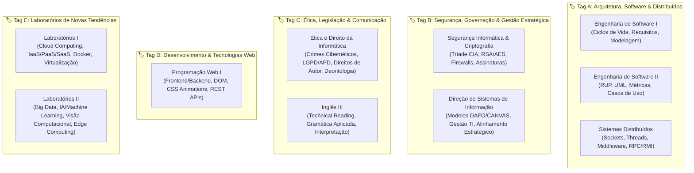

# 🚀 Sistema Marcianus: Plano de Ataque Estratégico & Cronograma de Alto Desempenho
### Exames Especiais UNIC 2025/2026 — 4.º Ano de Engenharia Informática

> [!important] 🎯 Missão Principal: Domínio Total e Aprovação com Excelência
> Este é o teu **Centro de Comando Tático**. Foi desenhado com base nas **datas reais e oficiais da UNIC**, na tua **escala real de trabalho por turnos (2D → 2F → 2N → 2F)**, e otimizado com princípios de alta performance, gamificação, recuperação ativa (Active Recall) e o Princípio de Pareto (80/20).

---

## 🏛️ 1. O Calendário de Guerra Oficial (01/09 a 07/09/2026)

| Data Oficial | Dia da Semana | Turno Manhã (09:00 – 11:00) | Sala | Turno Tarde (14:00 – 16:00) | Sala | Tag |
| :--- | :--- | :--- | :--- | :--- | :--- | :---: |
| **01/09/2026** | Terça-feira | **Segurança Informática e Criptografia** | Cutato 0.4 | **Direção de Sistemas de Informação** | Mumbué 0.4 | `Tag B` |
| **02/09/2026** | Quarta-feira | **Sistemas Distribuídos e Prog. em Paralelo** | Cutato 0.4 | **Ética e Direito da Informática** | Cutato 0.4 | `Tag A` / `Tag C` |
| **03/09/2026** | Quinta-feira | **Engenharia de Software I** | Mumbué 0.4 | **Engenharia de Software II** | Cutato 0.4 | `Tag A` |
| **04/09/2026** | Sexta-feira | **Inglês III** | Cutato 0.4 | **Programação Web I** | Cutato 0.4 | `Tag C` / `Tag D` |
| **05/09/2026** | Sábado | *Sprint de Revisão Consolidada dos Labs* | — | *Resolução de Casos Práticos de Tendências* | — | `Tag E` |
| **06/09/2026** | Domingo | *Revisão Final de Flashcards e Descanso Ativo* | — | *Preparação Logística, Mental e Foco no Dia Final*| — | `Tag E` |
| **07/09/2026** | Segunda-feira | **Laboratórios de Novas Tendências e Tecnologias I** | Cutato 0.4 | **Laboratórios de Novas Tendências e Tecnologias II** | Cutato 0.4 | `Tag E` |

---

## 🏷️ 2. Matriz de Tags de Sinergia (Estudo Simultâneo)

As disciplinas com a mesma tag compartilham alicerces cognitivos, frameworks ou complementariedade prática. Devem ser estudadas em conjunto nos blocos do cronograma:

---

## 🎮 3. Sistema de Gamificação & Mecânicas Lúdicas de Estudo

Transforma a preparação num jogo de progressão contínua:

### 🏆 Níveis de Maestria (Sistema de XP)
- **Nível 1 — Trainee / Estagiário (0 – 1.000 XP):** Leitura dos Guias Teóricos (`01`).
- **Nível 2 — Engenheiro Júnior (1.001 – 3.000 XP):** Resolução dos Estudos de Caso (`02`).
- **Nível 3 — Arquiteto Pleno (3.001 – 6.000 XP):** Domínio dos Flashcards sem hesitação.
- **Nível 4 — Lead System Architect (6.001 – 9.000 XP):** Simulações em Espelho com tempo cronometrado.
- **Nível 5 — Marcianus Legend / 20 Valores (10.000 XP):** Maestria absoluta em todas as 10 disciplinas.

### 🎲 Mini-Jogos & Dinâmicas Ativas
1. **Boss Fight Feynman (Active Recall):** Escolhe 1 conceito complexo (ex: *Como funciona o handshake TLS ou a sincronização de relógios em sistemas distribuídos?*). Tens 3 minutos para explicá-lo em voz alta a um leigo com clareza cristalina (+150 XP).
2. **Speed Run de Diagramas:** Desenhar em papel, em menos de 5 minutos, um diagrama de Casos de Uso RUP completo com atores e extensões (+200 XP).
3. **Deck de Flashcards Relâmpago:** Bater 10 perguntas rápidas das seções de flashcard no início de cada sessão (+100 XP).

---

## 📅 4. Cronograma Tático Diário: 14 Dias de Sprint (18/08 a 31/08/2026)

Legenda de Energia e Disponibilidade:
- 🟢 **Disponibilidade Máxima:** Dias de Folga (F) sem turno de trabalho (Foco em blocos longos de 3h a 4h).
- 🟡 **Disponibilidade Parcial:** Dias de Turno Noturno (N) — Bloco de ouro entre **15h30 e 19h30** (pré-turno).
- 🟠 **Disponibilidade Reduzida:** Dias de Turno Diurno (D) — Bloco de foco rápido entre **19h30 e 22h30** (pós-trabalho).

---

### 🟢 DIA 1 — Terça-feira, 18/08/2026 (Folga F2 • Energia Máxima)
- **Disponibilidade Útil:** 08h00 – 24h00 | **Meta de XP:** 1.000 XP
- **Foco do Dia:** 🏷️ **Tag B (Segurança Informática & Criptografia + Direção de Sistemas de Informação)**
- [ ] **09:00 – 12:00 (Bloco 1):** *Segurança Informática* → Leitura ativa do `01 - Guia Teórico` (Tríade CIA, Criptografia Simétrica vs Assimétrica, Hash SHA-256, RSA).
- [ ] **14:00 – 17:00 (Bloco 2):** *Direção de Sistemas de Informação* → Leitura ativa do `01 - Guia Teórico` (Modelos DAFO/SWOT, Matriz BCG, Modelo CANVAS, Alinhamento TI com Negócio).
- [ ] **18:00 – 20:30 (Bloco 3 - O Ginásio):** Resolução dos Estudos de Caso no `02 - Exercícios e Práticas` de ambas as disciplinas.
- [ ] **21:30 – 22:30 (Boss Fight):** Simulação de ataque Man-in-the-Middle e elaboração de um plano de contingência DSI em papel.

---

### 🟡 DIA 2 — Quarta-feira, 19/08/2026 (Noturno N1 • Entrada às 19h30)
- **Sono de Recuperação:** 08h30 – 15h30 | **Disponibilidade Útil:** 15h30 – 19h30 | **Meta de XP:** 600 XP
- **Foco do Dia:** 🏷️ **Tag A (Sistemas Distribuídos e Programação em Paralelo)**
- [ ] **15:30 – 17:30 (Bloco 1):** *Sistemas Distribuídos* → `01 - Guia Teórico` (Sockets TCP/UDP, Threads, RMI, RPC, Middleware, Comunicação Indireta).
- [ ] **17:45 – 19:15 (Bloco 2):** *Sistemas Distribuídos* → `02 - Exercícios e Práticas` (Arquitetura Cliente-Servidor e resolução de código de Sockets em Java/Python).
- [ ] **19:30 – 07h30:** *Turno Noturno no Trabalho*.

---

### 🟡 DIA 3 — Quinta-feira, 20/08/2026 (Noturno N2 • Entrada às 19h30)
- **Sono de Recuperação:** 08h30 – 15h30 | **Disponibilidade Útil:** 15h30 – 19h30 | **Meta de XP:** 600 XP
- **Foco do Dia:** 🏷️ **Tag C (Ética e Direito da Informática)**
- [ ] **15:30 – 17:30 (Bloco 1):** *Ética e Direito* → `01 - Guia Teórico` (Legislação de Cibercrime, Proteção de Dados, Propriedade Intelectual, Código Deontológico).
- [ ] **17:45 – 19:15 (Bloco 2):** *Ética e Direito* → `02 - Exercícios e Práticas` (Análise de casos práticos de invasão de sistemas e responsabilidade civil/penal).
- [ ] **19:30 – 07h30:** *Turno Noturno no Trabalho*.

---

### 🟡/🟢 DIA 4 — Sexta-feira, 21/08/2026 (Folga F1 pós-N2)
- **Sono de Recuperação:** 08h30 – 15h30 | **Disponibilidade Útil:** 15h30 – 24h00 | **Meta de XP:** 800 XP
- **Foco do Dia:** 🏷️ **Tag A (Engenharia de Software I & II)**
- [ ] **16:00 – 18:30 (Bloco 1):** *Engenharia de Software I* → Modelos de Ciclo de Vida (Cascata, Ágil, Scrum, Espiral) e Engenharia de Requisitos (Funcionais vs Não-Funcionais).
- [ ] **19:30 – 22:00 (Bloco 2):** *Engenharia de Software II* → Metodologia RUP (Fases: Concepção, Elaboração, Construção, Transição), Casos de Uso e Diagramas de Classes.
- [ ] **22:15 – 23:30 (Desafio Prático):** Resolver o Caso de Estudo Sistema NHS (`02 - Exercícios e Práticas`).

---

### 🟢 DIA 5 — Sábado, 22/08/2026 (Folga F2 • Energia Máxima)
- **Disponibilidade Útil:** 08h00 – 24h00 | **Meta de XP:** 1.200 XP
- **Foco do Dia:** 🏷️ **Tag D (Programação Web I) + Tag C (Inglês III)**
- [ ] **09:00 – 12:00 (Bloco 1):** *Programação Web I* → Arquitetura Web, HTTP/HTTPS, HTML5 Semântico, CSS Grid/Flexbox, JavaScript DOM e Fetch API / REST.
- [ ] **14:00 – 16:30 (Bloco 2):** *Programação Web I* → Prática de código (`02 - Exercícios`), manipulação de APIs e formulários assíncronos.
- [ ] **17:30 – 19:30 (Bloco 3):** *Inglês III* → Leitura dos textos técnicos (`Culture`, `Culture Shock`, `Fascículo de Estudo`) e resolução dos exercícios de tempos verbais e vocabulário técnico.
- [ ] **21:00 – 22:30 (Revisão Tag C):** Flashcards rápidos de Ética e Direito + Inglês III.

---

### 🟠 DIA 6 — Domingo, 23/08/2026 (Diurno D1 • 07h30 às 19h30)
- **Trabalho Diurno:** 07h30 – 19h30 | **Disponibilidade Útil:** 19h30 – 22h30 | **Meta de XP:** 400 XP
- **Foco do Dia:** 🏷️ **Tag E (Laboratórios de Novas Tendências I — Cloud & Virtualização)**
- [ ] **19:45 – 21:15 (Bloco 1):** *Laboratórios I* → `01 - Guia Teórico` (Modelos de Nuvem: IaaS, PaaS, SaaS, Hipervisores Tipo 1 e 2, Docker vs VMs).
- [ ] **21:15 – 22:15 (Bloco 2):** *Laboratórios I* → Resolução dos exercícios do guia prático (`02`).

---

### 🟠 DIA 7 — Segunda-feira, 24/08/2026 (Diurno D2 • 07h30 às 19h30)
- **Trabalho Diurno:** 07h30 – 19h30 | **Disponibilidade Útil:** 19h30 – 22h30 | **Meta de XP:** 400 XP
- **Foco do Dia:** 🏷️ **Tag E (Laboratórios de Novas Tendências II — Big Data & IA)**
- [ ] **19:45 – 21:15 (Bloco 1):** *Laboratórios II* → `01 - Guia Teórico` (Big Data 5Vs, Hadoop/Spark, Machine Learning Supervisionado vs Não-Supervisionado, Visão Computacional).
- [ ] **21:15 – 22:15 (Bloco 2):** *Laboratórios II* → Resolução dos exercícios do guia prático (`02`).

---

### 🟢 DIA 8 — Terça-feira, 25/08/2026 (Folga F1 • SIMULAÇÃO EM ESPELHO 1)
- **Disponibilidade Útil:** 08h00 – 24h00 | **Meta de XP:** 1.500 XP
- **Foco do Dia:** **Simulação do Dia 01/09 (Tag B: Segurança Informática + DSI)**
- [ ] **09:00 – 11:00 (Simulação Real Manhã):** Prova simulada de *Segurança Informática e Criptografia* (sem consulta, 2h cronometradas).
- [ ] **11:00 – 14:00:** Descanso, almoço estratégico e revisão de transição para DSI.
- [ ] **14:00 – 16:00 (Simulação Real Tarde):** Prova simulada de *Direção de Sistemas de Informação* (sem consulta, 2h cronometradas).
- [ ] **17:00 – 19:30 (Auditoria de Erros):** Corrigir ambas as provas, identificar lacunas e reler pontos fracos nos guias teóricos.
- [ ] **21:00 – 22:30:** Flashcards de reforço das duas disciplinas.

---

### 🟢 DIA 9 — Quarta-feira, 26/08/2026 (Folga F2 • SIMULAÇÃO EM ESPELHO 2)
- **Disponibilidade Útil:** 08h00 – 24h00 | **Meta de XP:** 1.500 XP
- **Foco do Dia:** **Simulação do Dia 02/09 (Sistemas Distribuídos + Ética e Direito)**
- [ ] **09:00 – 11:00 (Simulação Real Manhã):** Prova simulada de *Sistemas Distribuídos e Programação em Paralelo* (2h cronometradas).
- [ ] **11:00 – 14:00:** Intervalo tático e nutrição.
- [ ] **14:00 – 16:00 (Simulação Real Tarde):** Prova simulada de *Ética e Direito da Informática* (2h cronometradas).
- [ ] **17:00 – 19:30 (Auditoria de Erros):** Revisão e consolidação das respostas modelo.
- [ ] **21:00 – 22:30:** Sessão de Active Recall com Sockets, RPC e Legislação de Proteção de Dados.

---

### 🟡 DIA 10 — Quinta-feira, 27/08/2026 (Noturno N1 • Entrada às 19h30)
- **Sono de Recuperação:** 08h30 – 15h30 | **Disponibilidade Útil:** 15h30 – 19h30 | **Meta de XP:** 700 XP
- **Foco do Dia:** **Simulação do Dia 03/09 (Engenharia de Software I & II)**
- [ ] **15:30 – 17:15 (Sprint ES I):** Resolução rápida dos tópicos mais frequentes de ES I (Qualidade, Métricas de Pressman, Requisitos).
- [ ] **17:30 – 19:15 (Sprint ES II):** Resolução dos estudos de caso RUP e modelagem de Casos de Uso.
- [ ] **19:30 – 07h30:** *Turno Noturno no Trabalho*.

---

### 🟡 DIA 11 — Sexta-feira, 28/08/2026 (Noturno N2 • Entrada às 19h30)
- **Sono de Recuperação:** 08h30 – 15h30 | **Disponibilidade Útil:** 15h30 – 19h30 | **Meta de XP:** 700 XP
- **Foco do Dia:** **Simulação do Dia 04/09 (Inglês III + Programação Web I)**
- [ ] **15:30 – 17:15 (Sprint Inglês III):** Teste de compreensão de texto rápido e exercícios gramaticais.
- [ ] **17:30 – 19:15 (Sprint Web I):** Resolução de questões de arquitetura cliente/servidor Web, REST, CSS e JS.
- [ ] **19:30 – 07h30:** *Turno Noturno no Trabalho*.

---

### 🟡/🟢 DIA 12 — Sábado, 29/08/2026 (Folga F1 pós-N2)
- **Sono de Recuperação:** 08h30 – 15h30 | **Disponibilidade Útil:** 15h30 – 24h00 | **Meta de XP:** 1.000 XP
- **Foco do Dia:** **Simulação do Dia 07/09 (Laboratórios I & II)**
- [ ] **16:00 – 18:00 (Simulação Labs I):** Casos práticos de Cloud, arquitetura SaaS/PaaS e orquestração Docker.
- [ ] **19:00 – 21:00 (Simulação Labs II):** Casos práticos de Big Data, IA e Processamento de Imagem.
- [ ] **21:30 – 23:00 (Consolidação):** Flashcards mestres de todos os Laboratórios.

---

### 🟢 DIA 13 — Domingo, 30/08/2026 (Folga F2 • MEGA REVISÃO MASTER)
- **Disponibilidade Útil:** 08h00 – 24h00 | **Meta de XP:** 1.500 XP
- **Foco do Dia:** **Revisão Geral e Polimento de Todas as Tags (A, B, C, D, E)**
- [ ] **09:00 – 12:00 (Bloco Tag B + Tag A):** Segurança, DSI, Sistemas Distribuídos e Engenharia de Software.
- [ ] **14:00 – 17:00 (Bloco Tag C + Tag D + Tag E):** Ética/Direito, Inglês, Programação Web e Laboratórios.
- [ ] **18:00 – 20:00 (Super Flashcard Challenge):** Passar por todos os baralhos de flashcards das 10 disciplinas.
- [ ] **20:30 – 22:00 (Preparação Final):** Organização física de canetas, documentos e descanso.

---

### 🟠 DIA 14 — Segunda-feira, 31/08/2026 (Diurno D1 • VÉSPERA DO DIA D)
- **Trabalho Diurno:** 07h30 – 19h30 | **Disponibilidade Útil:** 19h30 – 22h30 | **Meta de XP:** 300 XP
- **Foco do Dia:** **Ajuste Fino Exclusivo para o Dia 1 de Exames (Segurança Informática + DSI)**
- [ ] **19:45 – 21:00:** Revisão cirúrgica de 1h15 dos conceitos-chave de *Segurança Informática e Criptografia* (`00 - Dashboard` e `01 - Guia Teórico`).
- [ ] **21:00 – 22:15:** Revisão cirúrgica de 1h15 dos modelos estratégicos de *Direção de Sistemas de Informação*.
- [ ] **22:30:** **Cessação total de estudos. Dormir cedo para acordar com 100% de energia cerebral.**

---

## ⚔️ 5. Protocolo de Guerra na Semana de Provas (01/09 a 07/09)

Durante a semana de provas, a estratégia muda de absorção para **execução cirúrgica**:

1. **Rotina Matinal (07:00 – 08:30):**
   - Pequeno-almoço rico em proteínas e hidratação.
   - 15 minutos de leitura dos Flashcards de aquecimento da prova da manhã.
   - Chegada à sala com 30 minutos de antecedência (08:30).
2. **Execução em Sala (09:00 – 11:00):**
   - Ler a prova inteira nos primeiros 5 minutos.
   - Começar pelas questões com maior pontuação e onde tens certeza absoluta.
   - Reservar 15 minutos finais para revisão de respostas e clareza de escrita.
3. **Transição Tática de Turnos (11:00 – 14:00):**
   - **Não debater a prova da manhã com colegas** (evita fadiga mental e ansiedade).
   - Almoço leve às 11:30.
   - 12:30 – 13:15: Revisão rápida dos Flashcards da disciplina da tarde.
   - 13:30: Entrada na sala da tarde.
4. **Noite de Véspera:**
   - 18:00 – 21:00: Revisão focada exclusivamente nas duas disciplinas do dia seguinte.
   - 22:00: Descanso obrigatório.

---

*“A disciplina supera a inteligência quando a inteligência não é disciplinada. O teu sucesso no 4.º ano já está estruturado; agora é só executar o plano passo a passo.”*
