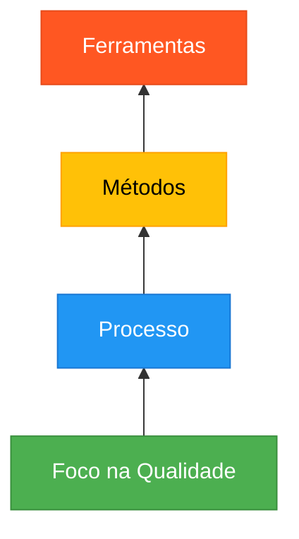
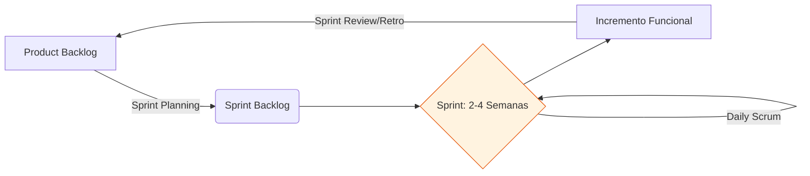
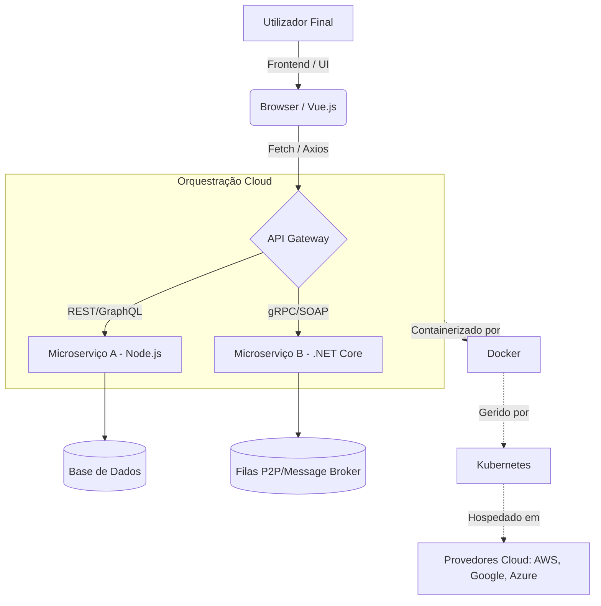

# Guia de Estudo Teórico: Engenharia de Software I

Este guia exaustivo aborda os fundamentos, princípios, modelos e práticas da Engenharia de Software, servindo como material definitivo para o estudo universitário da disciplina. A Engenharia de Software transcende a simples programação, integrando processos sistemáticos para garantir qualidade, resiliência e adaptação das soluções.

---

## 1. O Software: Natureza, Características e Importância

O software é o motor lógico que impulsiona a sociedade moderna. Não se trata apenas de linhas de código, mas sim do conjunto completo que compreende o código executável, as estruturas de dados necessárias para que o programa manipule a informação de forma adequada, e a documentação que descreve a operação, instalação e manutenção do sistema.

### 1.1 Características Únicas do Software

Segundo Roger S. Pressman, o software possui uma natureza lógica, não física. Esta característica fundamental demarca a engenharia de software da engenharia de hardware.

1. **O software é desenvolvido e construído intelectualmente (não manufaturado):** 
   Na engenharia de hardware, a fase de produção e fabrico é suscetível a erros físicos e desgaste. No software, cada cópia é exata. Se houver falhas, elas derivam de um "defeito de projeto" e não de um processo de montagem. Os custos concentram-se na fase de desenvolvimento e não na reprodução em larga escala.
2. **O software não se desgasta, mas deteriora-se (Entropia do Software):**
   O hardware sofre com a fadiga do material, falhando com o uso físico e o tempo. O software, contudo, sofre de "deterioração" funcional e estrutural. À medida que o ambiente muda (novos requisitos, atualizações de sistema operativo, dependências de terceiros), o software exige manutenção contínua. Cada alteração introduz novos riscos e falhas, aumentando a entropia do sistema.
3. **Personalização e Intangibilidade:**
   Ao contrário de peças de hardware universais, sistemas complexos de software são geralmente construídos sob medida para um contexto organizacional específico. Ademais, o software é intangível; só podemos avaliar o progresso através de artefactos (diagramas UML, documentação, resultados de testes).
4. **Complexidade Crescente:**
   Mesmo sistemas pequenos possuem milhares de interações. Como estipula a Lei de Lehman, um sistema deve evoluir ou entrará em obsolescência, mas à medida que evolui, a sua complexidade intrínseca aumenta, requerendo esforço contínuo para manter a estrutura do código.

---

## 2. A Engenharia de Software

A Engenharia de Software é a aplicação de uma abordagem quantificável, sistemática e disciplinada ao desenvolvimento, operação e manutenção de software.

### 2.1 As Camadas da Engenharia de Software

1. **Foco na Qualidade:** A base. Exige um compromisso organizacional com padrões e melhoria contínua.
2. **Processo:** Define o fluxo de trabalho, os papéis, os marcos (*milestones*) e a gestão de entregáveis.
3. **Métodos:** Práticas técnicas detalhadas (Modelagem orientada a objetos, arquitetura de software, design de testes).
4. **Ferramentas (CASE):** Suporte automatizado (Ex: Git, Jira, IDEs, SonarQube) que integra processos e métodos.

### 2.2 Princípios Fundamentais

1. **Compreender o Problema antes de Codificar:** A fase de elicitação de requisitos é crítica. Um erro de requisito custa exponencialmente mais se for detetado apenas em produção.
2. **Modularidade e Abstração:** "Dividir para conquistar". Um software deve ser estruturado em módulos com **alta coesão** (cada módulo tem uma responsabilidade única) e **baixo acoplamento** (módulos não dependem excessivamente uns dos outros).
3. **Validação e Verificação Contínuas:** 
   * *Validação:* Atender às necessidades de negócio.
   * *Verificação:* Garantir a corretude técnica.
4. **Foco nas Pessoas:** Projetos são construídos por equipas. A comunicação eficaz supera a tecnologia mais avançada.

---

## 3. Qualidade do Software

A qualidade não é acidental; é projetada. O modelo de McCall classifica a qualidade em três dimensões:

### 3.1 Operação do Produto (Perspetiva do Utilizador)
* **Correção:** Execução lógica correta.
* **Confiabilidade:** Probabilidade de operar sem falhas num ambiente sob condições normais.
* **Eficiência:** Uso otimizado de recursos (CPU, memória).
* **Segurança:** Integridade dos dados, proteção contra acessos indevidos e injeções de código.
* **Usabilidade:** Qualidade da experiência do utilizador (UX).

### 3.2 Revisão do Produto (Perspetiva do Desenvolvedor)
* **Manutenibilidade:** Facilidade de localizar e corrigir defeitos.
* **Flexibilidade:** Facilidade de adaptar o software a novas mudanças.
* **Testabilidade:** Capacidade da arquitetura de suportar testes automatizados rigorosos.

### 3.3 Transição do Produto
* **Portabilidade:** Capacidade de migrar a aplicação para diferentes ambientes.
* **Interoperabilidade:** Integração sistémica através de APIs e serviços.
* **Reusabilidade:** Módulos que podem ser reaproveitados para outros projetos.

---

## 4. Modelos de Processo (Ciclo de Vida)

### 4.1 Modelo Cascata (Waterfall)
Abordagem linear. Extremamente rígido. Requer requisitos congelados, o que é irrealista no mercado atual. Se o cliente solicitar mudanças na fase de testes, os custos disparam. Útil apenas para projetos altamente previsíveis e curtos.

### 4.2 Modelo em Espiral (Boehm)
Aborda o desenvolvimento em iterações baseadas numa **análise de risco rigorosa**. Combina a prototipagem com os aspetos sistemáticos do cascata. Ideal para projetos críticos onde os riscos técnicos ou de negócio são muito altos.

### 4.3 Desenvolvimento Ágil (Scrum)
Focado em entrega contínua, adaptação e colaboração profunda com o cliente.
Trabalha com ciclos curtos chamados *Sprints*.

---

## 5. Engenharia de Requisitos e Modelagem de Negócios

A engenharia de requisitos lida com a tradução da necessidade do negócio num modelo técnico. O fluxo inicial em RUP (Rational Unified Process) e metodologias iterativas começa pela **Modelagem de Negócio**.

### 5.1 Requisitos Funcionais e Não Funcionais
* **RF:** Ações que o sistema executa (Ex: "Fazer uma reserva").
* **RNF:** Restrições de desempenho, segurança ou escalabilidade (Ex: "A reserva deve ser confirmada em menos de 2s").
* **Regras de Negócio:** Políticas inquebráveis da empresa (Ex: "Não permitir reservas para quartos que já excedam a sua capacidade").

### 5.2 Modelagem de Processos de Negócio
Para compreender o ecossistema antes da automação, os engenheiros utilizam diagramas de casos de uso de negócio e diagramas de atividades para mapear processos reais (como rececionistas e arquivos manuais de um hotel). Isso garante a identificação de gargalos (melhorias) a serem resolvidos via software.

---

## 6. A UML e Abstração do Software

A Unified Modeling Language (UML) é a planta arquitetónica do software. Permite comunicação sem ambiguidades.

### Principais Diagramas
1. **Casos de Uso:** Mapeia a interação entre atores (utilizadores, outros sistemas) e funcionalidades do sistema.
2. **Atividades:** Modela fluxos de controle e lógicas procedimentais de negócio.
3. **Classes:** A espinha dorsal do *design* orientado a objetos. Modela as entidades estáticas e os seus relacionamentos estruturais.
4. **Sequência:** Revela a troca de mensagens dinâmicas entre os objetos para satisfazer um fluxo específico.

---

## 7. Anexo Profundo: Eixos Tecnológicos e Curriculares Complementares (GII) %%Por pesquisar: Estudar tudo abaixo de ponta a ponta.%%

Com base na extração exaustiva de conhecimentos das Guias Docentes dos ficheiros (ES_GII-IYA038, ES_GII-IYA040, ES_GII-IYA041, ES_GII-IYA042, ES_GII-IYA043, ES_GII-IYA049, ES_GII-IYA061, ES_GII-IYA062), detalhamos as disciplinas tangenciais que expandem e sustentam a Engenharia de Software no contexto do Grado em Ingeniería Informática. Estes módulos interligam-se diretamente com o ciclo de vida do software, abordando desde infraestruturas e tendências emergentes até gestão, segurança e imperativos éticos.

> [!TIP]
> **A Natureza Holística do Software**
> O engenheiro de software moderno não apenas concebe o código, mas compreende o <u>ecossistema de negócio, as plataformas distribuídas, a conformidade legal e as infraestruturas de orquestração cloud</u>.

### 7.1 Arquitetura e Integração Web (Programação Web I)

A construção de aplicações de software modernas exige o domínio profundo de arquiteturas baseadas na Web. A evolução das interfaces de utilização e dos serviços backend introduz camadas de complexidade que o engenheiro deve orquestrar.

*   **Fundamentos Frontend (A Semântica e a Estética):** Utilização intensiva de **HTML5** para estruturação semântica e acessível (garantindo o cumprimento das diretrizes WCAG) e **CSS3** para desenhar interfaces responsivas e visualmente imersivas.
*   **Comportamento e Dinamismo (O Motor do Cliente):** Adoção das especificações modernas do JavaScript (**ECMAScript 6+**). Isto inclui a manipulação precisa do **DOM** (Document Object Model) e a delegação de eventos para garantir que a *User Experience* (UX) é otimizada.
*   **Comunicação Assíncrona e APIs:** Desacoplamento do frontend e backend através de chamadas de rede assíncronas utilizando **AJAX, Fetch e Axios**.
*   **Paradigmas de Serviços Backend:**
    *   **RESTful APIs:** Serviços orientados a recursos utilizando métodos HTTP padrão. Representam o padrão de facto na indústria.
    *   **SOAP:** Protocolo rigoroso baseado em XML, crucial para sistemas corporativos legados ou onde contratos rígidos são essenciais (setor bancário).
*   **Ecossistema Node.js:** Desenvolvimento de servidores escaláveis não-bloqueantes com JavaScript através de **Node.js** e gestão de dependências via **NPM** (Node Package Manager).

### 7.2 Sistemas Distribuídos e Paralelos

À medida que os requisitos de desempenho e escalabilidade aumentam, os monolitos cedem lugar a sistemas distribuídos.

*   **Paradigmas de Distribuição:** Arquiteturas Cliente-Servidor (incluindo as variantes de *Thin* e *Fat clients*), sistemas *Peer-to-Peer* (P2P) e Arquitetura Orientada a Serviços (**SOA** - Service Oriented Architecture).
*   **Middleware e Protocolos de Comunicação:** O tecido conetivo das aplicações distribuídas. O software interage através da rede recorrendo a tecnologias como **WCF** (Windows Communication Foundation) e **.NET Remoting** no ecossistema Microsoft.
*   **Programação Assíncrona e Paralelismo:** A engenharia de desempenho aborda a concorrência através da **Programação Assíncrona** (`async`/`await`) para operações baseadas em I/O (rede, ficheiros) e da **Programação Paralela** para processamento intensivo de CPU.

### 7.3 Infraestruturas Cloud, Virtualização e Tendências

A implantação do software evoluiu de servidores *bare-metal* para abstrações orquestradas na nuvem.

*   **Modelos de Nuvem (Cloud Computing):**
    *   **IaaS (Infrastructure as a Service):** Abstração do hardware (ex: servidores e redes virtuais).
    *   **PaaS (Platform as a Service):** Ambientes geridos para alojamento direto de aplicações.
    *   **SaaS (Software as a Service):** Software como produto consumível pelo utilizador final.
*   **Virtualização vs. Contenerização:** 
    *   *Virtualização Clássica:* Hypervisors como **VMware** e **ESX**.
    *   *Contenerização Moderna:* Utilização de **Docker** e **Docker Compose** para isolamento leve e reprodutível de ambientes, escalonado de forma massiva através de orquestradores como o **Kubernetes**.
*   **Arquitetura de Microserviços e *Clean Architecture*:** 
    *   Para sustentar microserviços, utiliza-se a disciplina do **DDD (Domain-Driven Design)**, tanto a nível **Estratégico** (definindo os *Bounded Contexts*) quanto **Tático** (Entities, Value Objects, Aggregates).
    *   Uso da *Clean Architecture* para isolar o núcleo do negócio dos *frameworks* e infraestruturas (ex: Express.js, Laravel, Vue.js).
*   **Tecnologias Emergentes:** Introdução às revolões da **Visão Artificial**, modelagem e sistemas de dados massivos (**Big Data**) e **Informática Quântica**, redefinindo os limites algorítmicos.

> [!IMPORTANT]
> **Diagrama de Orquestração Tecnológica**
> O diagrama seguinte ilustra a convergência destas tecnologias num pipeline moderno.

### 7.4 Segurança Informática e Criptografia

Um projeto de software não existe num vácuo perfeito, e as suas defesas devem ser desenhadas (*Security by Design*).

*   **Fundamentos e Necessidades:** A segurança é avaliada com base nos elementos a proteger e nas estruturas básicas de segurança de sistemas de informação.
*   **Segurança Passiva vs. Ativa:**
    *   *Segurança Passiva:* Estratégias para mitigar danos pós-incidente (backups redundantes, planos de recuperação de desastres).
    *   *Segurança Ativa:* Defesas diretas contra invasões (firewalls, criptografia de dados em trânsito e em repouso, mecanismos robustos de autenticação).

### 7.5 Direção e Estratégia de Sistemas de Informação

A engenharia de software no meio corporativo depende de justificações orçamentais, visão estratégica e alinhamento com a economia digital.

*   **Inovação e Modelos de Negócio:** Aplicação de ferramentas estratégicas como o **CANVAS**, Análise **DAFO** (SWOT), **Design Thinking** e a estratégia de **Océano Azul**.
*   **Gestão de Recursos e Transformação Digital:**
    *   Implementação de tecnologias como **RPA** (Robotic Process Automation) para automatização, e integração de **IoT** (Internet of Things).
    *   Preocupação com a sustentabilidade através do **Green IT**.
*   **Gestão de Fornecedores e *Sourcing*:** Planeamento de *Outsourcing*, *Offshoring* e definição estrita de **Acordos de Nível de Serviço (SLA)** para mitigar riscos na delegação de serviços TI.
*   **Comércio Eletrónico (e-Commerce e m-Commerce):** Adaptação de plataformas para dispositivos móveis, personalização profunda utilizando análise de dados e redes sociais.

### 7.6 Ética, Deontologia e Legislação Informática

Por fim, a automação e o processamento de informação requerem responsabilidade profissional estrita, pois decisões de design técnico têm ramificações legais e sociais.

*   **Ética e Caráter Profissional:** A deontologia informática reflete o compromisso com a sociedade. O engenheiro lida com poder considerável, necessitando de valores éticos para não incidir em situações de corrupção ou negligência no desenvolvimento (e.g. algoritmos enviesados).
*   **Direito Informático e Proteção de Dados:** 
    *   Estrito cumprimento do Regulamento Geral de Proteção de Dados (**RGPD** / GDPR), garantindo a privacidade e a rastreabilidade dos dados recolhidos.
    *   Conformidade com a Lei dos Serviços da Sociedade da Informação e Comércio Eletrónico (**LSSI**).
*   **Delitos e Peritagem Informática:** Compreensão da tipificação dos crimes informáticos, e o papel fulcral da peritagem informática forense na recolha de provas audítáveis após intrusões ou ações maliciosas.

---
*Atualizado com os eixos temáticos complementares oriundos da matriz curricular.*
