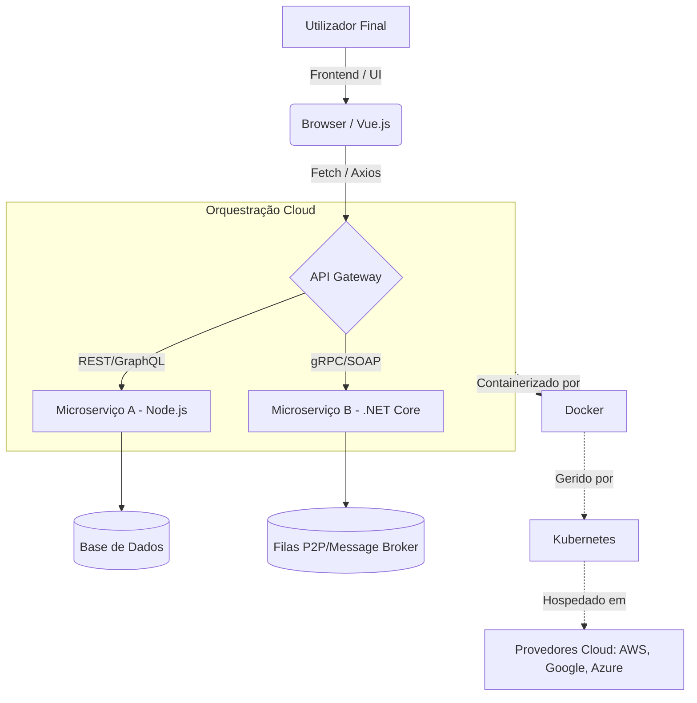

# Guia de Estudo Teórico: Engenharia de Software I

Este guia exaustivo aborda os fundamentos, princípios, modelos e práticas da Engenharia de Software, servindo como material definitivo para o estudo universitário da disciplina (baseado nas referências canónicas de Roger S. Pressman e Ian Sommerville).

---

## 1. O Software: Natureza, Características e Importância

O software é o motor que impulsiona a era da informação. Mais do que simples programas de computador, o software compreende o código executável, as estruturas de dados associadas e a documentação abrangente que descreve a sua operação e uso.

### 1.1 Características Únicas do Software
De acordo com Roger S. Pressman, o software possui uma natureza lógica e não física, o que lhe confere características muito distintas em relação aos produtos de engenharia tradicionais (hardware, pontes, edifícios):

1. **O software é desenvolvido ou construído intelectualmente, não manufaturado:** 
   Na engenharia de hardware, a fase de fabrico é onde os defeitos de qualidade são frequentemente introduzidos. No software, não há "fábrica" no sentido tradicional. Cada cópia é perfeita e idêntica; portanto, as falhas resultam de erros no *design* e na engenharia, e não de um processo de estampagem ou montagem falho.
2. **O software não "desgasta", mas deteriora-se:**
   O hardware sofre com a fadiga do material, fricção, calor, e os seus componentes falham ao longo do tempo (a clássica "curva da banheira" de taxas de falha). O software, em teoria, não sofre desgaste físico. A sua curva de falhas deveria estabilizar e permanecer plana. No entanto, na prática, o software sofre *deterioração*. À medida que o ambiente muda (novos sistemas operativos, novas exigências do utilizador), o software precisa de manutenção. Cada modificação introduz novos erros potenciais, aumentando a sua entropia e reduzindo a sua qualidade estrutural.
3. **O software é (maioritariamente) feito à medida:**
   Apesar do crescimento das bibliotecas reutilizáveis e dos pacotes de software de prateleira (COTS - *Commercial Off-The-Shelf*), a maioria dos grandes sistemas de software críticos é construída por encomenda para satisfazer os requisitos específicos de um cliente corporativo.
4. **Intangibilidade:**
   O software é invisível. Não podemos tocar-lhe ou medir o seu progresso através de uma estrutura física. Isto torna a gestão de projetos de software extremamente difícil, obrigando os engenheiros a usar "artefactos" (documentos, diagramas UML, relatórios de testes) para visualizar o avanço do trabalho.
5. **Fácil de modificar, mas difícil de controlar (Complexidade Crescente):**
   Mudar uma linha de código é trivial; compreender o impacto dessa mudança num sistema com milhões de linhas é um desafio monumental. A complexidade do software aumenta exponencialmente à medida que adicionamos novas funcionalidades (Lei de Lehman).

### 1.2 Os Problemas Crónicos (A "Crise" do Software)
O desenvolvimento de software tem sido historicamente atormentado por problemas sistémicos:
*   **Estimativas imprecisas:** Projetos estouram orçamentos e prazos consistentemente.
*   **Insatisfação do Cliente:** O produto entregue não corresponde àquilo de que o cliente realmente necessitava.
*   **Qualidade Pobre:** Software entregue com inúmeros *bugs*, vulnerabilidades de segurança e problemas de desempenho.
*   **Manutenção Intratável:** Código "esparguete", sem documentação, impossível de atualizar ou corrigir sem quebrar outras partes do sistema.

As causas destes problemas radicam na **falta de comunicação**, **requisitos voláteis**, **ausência de processos definidos** e **complexidade não gerida**.

---

## 2. A Engenharia de Software

### 2.1 Definição
Segundo a norma IEEE, a Engenharia de Software é a aplicação de uma abordagem sistemática, disciplinada e quantificável ao desenvolvimento, operação e manutenção de software; ou seja, a aplicação da engenharia ao software.

O seu objetivo fundamental é **produzir software de alta qualidade, dentro do prazo e do orçamento previstos, que satisfaça as necessidades dos utilizadores e seja fácil de manter.**

### 2.2 Camadas da Engenharia de Software
O processo de engenharia assenta numa estrutura em camadas:
1. **Foco na Qualidade (A base):** Qualquer esforço de engenharia deve repousar sobre um compromisso organizacional com a melhoria contínua e a gestão da qualidade total (TQM, Six Sigma, etc.).
2. **Processo (O cimento):** O processo é o elo que mantém a tecnologia em conjunto. Define um "framework" (estrutura) de atividades essenciais e permite o desenvolvimento racional e oportuno.
3. **Métodos (A técnica):** Fornecem o "como fazer" técnico. Incluem análise de requisitos, design, codificação, testes e suporte.
4. **Ferramentas (O suporte automatizado):** As ferramentas CASE (*Computer-Aided Software Engineering*) suportam os métodos e o processo (ex: IDEs, Git, Jira, SonarQube).

### 2.3 Princípios Fundamentais
Estes princípios balizam qualquer projeto bem-sucedido:
1.  **Compreender o Problema:** A fase de levantamento de requisitos é a mais crítica. O custo de corrigir um erro de requisito na fase de produção é 100 vezes maior do que na fase de planeamento.
2.  **Planeamento Adequado:** Gerir riscos, definir o âmbito e o cronograma. Projetos de sucesso têm gestores que sabem dizer "não" a mudanças de âmbito não controladas (*scope creep*).
3.  **Modularidade (Dividir para Conquistar):** Sistemas complexos devem ser divididos em módulos (ou serviços) menores, que sejam **altamente coesos** (cada módulo faz uma única coisa bem feita) e **fracamente acoplados** (módulos independentes uns dos outros).
4.  **Qualidade Contínua (V&V):** 
    *   *Validação:* "Estamos a construir o produto certo?" (Satisfaz o utilizador?)
    *   *Verificação:* "Estamos a construir o produto corretamente?" (O código está isento de erros técnicos?)
5.  **Rigor, Método e Foco nas Pessoas:** Não basta ter ferramentas de ponta; a competência da equipa e a eficácia da comunicação ditam o sucesso do projeto.

---

## 3. Qualidade do Software

A qualidade do software não é um atributo acidental; deve ser arquitetada desde o primeiro dia. McCall estabeleceu um modelo clássico de fatores de qualidade que todo o engenheiro deve conhecer.

### 3.1 Fatores de Qualidade (Modelo ISO / McCall)
Podemos classificar a qualidade em três perspetivas:

**A. Operação do Produto (O que o utilizador experimenta no dia a dia):**
*   **Correção:** O software faz aquilo que os requisitos exigem? (Sem falhas de lógica).
*   **Confiabilidade:** A probabilidade de operação livre de falhas num determinado ambiente e período. 
*   **Eficiência:** O uso ótimo dos recursos do sistema (CPU, memória RAM, largura de banda).
*   **Integridade e Segurança:** Controlo de acessos, proteção contra ataques (ex: SQL Injection, DDoS) e garantia da confidencialidade, integridade e disponibilidade dos dados (Tríade CIA).
*   **Usabilidade:** O quão fácil e natural é aprender e utilizar o sistema. Uma boa interface (UI) e experiência (UX) são essenciais.

**B. Revisão do Produto (Capacidade de adaptação interna):**
*   **Manutenibilidade:** O esforço necessário para localizar e corrigir um erro num programa em funcionamento.
*   **Flexibilidade:** O esforço para modificar o programa operativo (adicionar novas funcionalidades).
*   **Testabilidade:** O esforço necessário para testar um programa e garantir que realiza a sua função pretendida (ex: arquitetura facilitadora de *Unit Tests* e *Mocking*).

**C. Transição do Produto (Adaptação a novos ambientes):**
*   **Portabilidade:** Esforço necessário para migrar o sistema para outro ambiente (ex: migrar de Windows para Linux, ou de *on-premise* para a Nuvem).
*   **Reusabilidade:** A extensão em que um programa ou módulo pode ser aproveitado noutras aplicações.
*   **Interoperabilidade:** A capacidade do sistema de se integrar fluidamente com outros sistemas (através de APIs, *Webhooks*, *microservices*).

---

## 4. Modelos de Processo (Ciclo de Vida do Software)

O modelo de processo estabelece o fluxo de trabalho e a sequência das atividades de desenvolvimento.

### 4.1 Modelo Cascata (Waterfall)
*   **Como funciona:** Abordagem linear e sequencial (Comunicação $\rightarrow$ Planeamento $\rightarrow$ Modelação/Design $\rightarrow$ Construção/Código $\rightarrow$ Implementação/Testes).
*   **Vantagens:** Fácil de compreender, as fases são rígidas, com *milestones* claros. Obriga a extensa documentação.
*   **Desvantagens:** É irrealista. Os requisitos de um cliente raramente estão "congelados" desde o início. Quando o cliente vê o produto (no final do ciclo), pode aperceber-se que não é o que queria. O custo das alterações tardias é catastrófico. O projeto pode sofrer bloqueios prolongados.

### 4.2 Modelo em Espiral (Boehm)
*   **Como funciona:** Abordagem cíclica que engloba as características iterativas com aspetos controlados do modelo cascata. A espiral é dividida em secções de tarefas (Comunicação, Planeamento, Análise de Risco, Engenharia, Construção e Lançamento, Avaliação pelo Cliente). 
*   **Vantagens:** Excelente foco na **gestão de riscos** contínua. Projetos de grande porte e críticos usam este modelo para criar protótipos incrementais.
*   **Desvantagens:** Exige altíssima especialização na identificação e gestão de riscos. Se o risco for mal avaliado, o projeto fracassa.

### 4.3 Desenvolvimento Ágil (Scrum / XP)
*   **A Filosofia (Manifesto Ágil):** Indivíduos e interações acima de processos; Software em funcionamento acima de documentação exaustiva; Colaboração com o cliente acima de negociação de contratos; Resposta à mudança acima do seguimento de um plano.
*   **Scrum:** Um framework iterativo. O trabalho é dividido em **Sprints** (ciclos curtos de 2 a 4 semanas).
    *   *Papéis:* Product Owner (voz do cliente, gere o *Product Backlog*), Scrum Master (facilitador, remove impedimentos), Development Team.
    *   *Artefactos:* Product Backlog (lista de requisitos/histórias), Sprint Backlog (tarefas para o Sprint), Incremento (software entregável no final da Sprint).
    *   *Cerimónias:* Sprint Planning, Daily Stand-up, Sprint Review, Sprint Retrospective.
*   **Vantagens:** Feedback rápido. Adapta-se fluidamente a mudanças (mesmo tardias). Reduz os riscos de falha catastrófica ao entregar valor constante.
*   **Desvantagens:** Requer mudança cultural severa. Má documentação se mal aplicado. Falta de foco na arquitetura a longo prazo.

---

## 5. Engenharia de Requisitos

Os requisitos definem **o que** o sistema deve fazer, antes da equipa decidir **como** o fazer (Design). Sem engenharia de requisitos adequada, construímos maravilhas técnicas que ninguém quer usar.

### 5.1 Tipos de Requisitos
*   **Requisitos Funcionais (RF):** Descrevem funções que o sistema deve executar. (Ex: "O sistema deve permitir ao cliente adicionar itens a um carrinho de compras").
*   **Requisitos Não Funcionais (RNF):** Descrevem restrições, aspetos de qualidade, arquitetura ou performance. (Ex: "O sistema deve processar o pagamento em menos de 2 segundos", "O sistema deve suportar 50.000 acessos simultâneos", "Os dados de pagamento devem usar criptografia AES-256").
*   **Regras de Negócio:** Restrições da organização. (Ex: "Um cliente só pode solicitar reembolso até 15 dias após a compra").

### 5.2 O Processo de Elicitação e Modelação
*   **Técnicas de Elicitação:** Entrevistas, Questionários, Observação (*Shadowing*), JAD (*Joint Application Design*), Prototipagem rápida.
*   **Atores e Casos de Uso (UML):**
    *   *Atores:* Qualquer entidade externa que interage com o sistema (Utilizador, Base de Dados Externa, API de Pagamento).
    *   *Casos de Uso:* Uma descrição das sequências de ações que o sistema executa e que produzem um resultado observável de valor para o ator.
    *   *Documentação de Caso de Uso:* Fluxo Principal, Fluxos Alternativos e Fluxos de Exceção. A priorização é feita consoante o valor de negócio e o risco arquitetónico.

### 5.3 O Modelo de Domínio
Representa os conceitos abstratos (entidades) do mundo real relevantes para o problema de negócio. Numa loja virtual, os conceitos do domínio incluiriam `Cliente`, `Encomenda`, `Fatura`, `Produto`. Ele serve para garantir que desenvolvedores e stakeholders falam a mesma linguagem (a *Ubiquitous Language*, como defendido no *Domain-Driven Design*).

---

## 6. A Modelação (A Arte da Abstração) e a UML

Os engenheiros não constroem edifícios sem plantas. Os engenheiros de software não devem construir sistemas sem modelos. A **UML** (Unified Modeling Language) é a linguagem padronizada para este fim.

### 6.1 Por que modelar?
*   Reduzir a complexidade através da abstração.
*   Visualizar a arquitetura e o comportamento antes do esforço intensivo de codificação.
*   Comunicar intenções técnicas com a equipa de desenvolvimento.

### 6.2 Principais Diagramas da UML
*   **Diagrama de Casos de Uso:** Captura requisitos funcionais, evidenciando as funcionalidades na perspetiva do utilizador e as interações (`include`, `extend`).
*   **Diagrama de Classes:** O coração da modelação orientada a objetos (OO). Mostra as classes do sistema, os seus atributos, métodos e as relações entre elas (Associação, Agregação, Composição, Herança/Generalização).
*   **Diagrama de Sequência:** Modela o comportamento dinâmico. Mostra como os objetos interagem (trocam mensagens) ao longo do tempo para concretizar um Caso de Uso. Revela as chamadas síncronas e assíncronas.
*   **Diagrama de Atividades:** Semelhante a um fluxograma, modela a lógica procedimental de negócio, incluindo concorrência e pontos de decisão.
*   **Diagrama de Estados:** Descreve a vida de um objeto; os diferentes estados em que se pode encontrar mediante certos gatilhos e transições.

---

## 7. Anexo Profundo: Eixos Tecnológicos e Curriculares Complementares (GII)

Com base na extração exaustiva de conhecimentos das Guias Docentes dos ficheiros (ES_GII-IYA038, ES_GII-IYA040, ES_GII-IYA041, ES_GII-IYA042, ES_GII-IYA043, ES_GII-IYA049, ES_GII-IYA061, ES_GII-IYA062), detalhamos as disciplinas tangenciais que expandem e sustentam a Engenharia de Software no contexto do Grado em Ingeniería Informática. Estes módulos interligam-se diretamente com o ciclo de vida do software, abordando desde infraestruturas e tendências emergentes até gestão, segurança e imperativos éticos.

> [!TIP]
> **A Natureza Holística do Software**
> O engenheiro de software moderno não apenas concebe o código, mas compreende o ecossistema de negócio, as plataformas distribuídas, a conformidade legal e as infraestruturas de orquestração cloud.

### 7.1 Arquitetura e Integração Web (Programação Web I)

A construção de aplicações de software modernas exige o domínio profundo de arquiteturas baseadas na Web. A evolução das interfaces de utilização e dos serviços backend introduz camadas de complexidade que o engenheiro deve orquestrar.

*   **Fundamentos Frontend (A Semântica e a Estética):** Utilização intensiva de **HTML5** para estruturação semântica e acessível (garantindo o cumprimento das diretrizes WCAG) e **CSS3** para desenhar interfaces responsivas e visualmente imersivas.
*   **Comportamento e Dinamismo (O Motor do Cliente):** Adoção das especificações modernas do JavaScript (**ECMAScript 6+**). Isto inclui a manipulação precisa do **DOM** (Document Object Model) e a delegação de eventos para garantir que a *User Experience* (UX) é otimizada.
*   **Comunicação Assíncrona e APIs:** Desacoplamento do frontend e backend através de chamadas de rede assíncronas utilizando **AJAX, Fetch e Axios**.
*   **Paradigmas de Serviços Backend:**
    *   **RESTful APIs:** Serviços orientados a recursos utilizando métodos HTTP padrão. Representam o padrão de facto na indústria.
    *   **SOAP:** Protocolo rigoroso baseado em XML, crucial para sistemas corporativos legados ou onde contratos rígidos são essenciais (setor bancário).
*   **Ecossistema Node.js:** Desenvolvimento de servidores escaláveis não-bloqueantes com JavaScript através de **Node.js** e gestão de dependências via **NPM** (Node Package Manager).

### 7.2 Sistemas Distribuídos e Paralelos

À medida que os requisitos de desempenho e escalabilidade aumentam, os monolitos cedem lugar a sistemas distribuídos.

*   **Paradigmas de Distribuição:** Arquiteturas Cliente-Servidor (incluindo as variantes de *Thin* e *Fat clients*), sistemas *Peer-to-Peer* (P2P) e Arquitetura Orientada a Serviços (**SOA** - Service Oriented Architecture).
*   **Middleware e Protocolos de Comunicação:** O tecido conetivo das aplicações distribuídas. O software interage através da rede recorrendo a tecnologias como **WCF** (Windows Communication Foundation) e **.NET Remoting** no ecossistema Microsoft.
*   **Programação Assíncrona e Paralelismo:** A engenharia de desempenho aborda a concorrência através da **Programação Assíncrona** (`async`/`await`) para operações baseadas em I/O (rede, ficheiros) e da **Programação Paralela** para processamento intensivo de CPU.

### 7.3 Infraestruturas Cloud, Virtualização e Tendências

A implantação do software evoluiu de servidores *bare-metal* para abstrações orquestradas na nuvem.

*   **Modelos de Nuvem (Cloud Computing):**
    *   **IaaS (Infrastructure as a Service):** Abstração do hardware (ex: servidores e redes virtuais).
    *   **PaaS (Platform as a Service):** Ambientes geridos para alojamento direto de aplicações.
    *   **SaaS (Software as a Service):** Software como produto consumível pelo utilizador final.
*   **Virtualização vs. Contenerização:** 
    *   *Virtualização Clássica:* Hypervisors como **VMware** e **ESX**.
    *   *Contenerização Moderna:* Utilização de **Docker** e **Docker Compose** para isolamento leve e reprodutível de ambientes, escalonado de forma massiva através de orquestradores como o **Kubernetes**.
*   **Arquitetura de Microserviços e *Clean Architecture*:** 
    *   Para sustentar microserviços, utiliza-se a disciplina do **DDD (Domain-Driven Design)**, tanto a nível **Estratégico** (definindo os *Bounded Contexts*) quanto **Tático** (Entities, Value Objects, Aggregates).
    *   Uso da *Clean Architecture* para isolar o núcleo do negócio dos *frameworks* e infraestruturas (ex: Express.js, Laravel, Vue.js).
*   **Tecnologias Emergentes:** Introdução às revoluções da **Visão Artificial**, modelagem e sistemas de dados massivos (**Big Data**) e **Informática Quântica**, redefinindo os limites algorítmicos.

> [!IMPORTANT]
> **Diagrama de Orquestração Tecnológica**
> O diagrama seguinte ilustra a convergência destas tecnologias num pipeline moderno.

### 7.4 Segurança Informática e Criptografia

Um projeto de software não existe num vácuo perfeito, e as suas defesas devem ser desenhadas (*Security by Design*).

*   **Fundamentos e Necessidades:** A segurança é avaliada com base nos elementos a proteger e nas estruturas básicas de segurança de sistemas de informação.
*   **Segurança Passiva vs. Ativa:**
    *   *Segurança Passiva:* Estratégias para mitigar danos pós-incidente (backups redundantes, planos de recuperação de desastres).
    *   *Segurança Ativa:* Defesas diretas contra invasões (firewalls, criptografia de dados em trânsito e em repouso, mecanismos robustos de autenticação).

### 7.5 Direção e Estratégia de Sistemas de Informação

A engenharia de software no meio corporativo depende de justificações orçamentais, visão estratégica e alinhamento com a economia digital.

*   **Inovação e Modelos de Negócio:** Aplicação de ferramentas estratégicas como o **CANVAS**, Análise **DAFO** (SWOT), **Design Thinking** e a estratégia de **Océano Azul**.
*   **Gestão de Recursos e Transformação Digital:**
    *   Implementação de tecnologias como **RPA** (Robotic Process Automation) para automatização, e integração de **IoT** (Internet of Things).
    *   Preocupação com a sustentabilidade através do **Green IT**.
*   **Gestão de Fornecedores e *Sourcing*:** Planeamento de *Outsourcing*, *Offshoring* e definição estrita de **Acordos de Nível de Serviço (SLA)** para mitigar riscos na delegação de serviços TI.
*   **Comércio Eletrónico (e-Commerce e m-Commerce):** Adaptação de plataformas para dispositivos móveis, personalização profunda utilizando análise de dados e redes sociais.

### 7.6 Ética, Deontologia e Legislação Informática

Por fim, a automação e o processamento de informação requerem responsabilidade profissional estrita, pois decisões de design técnico têm ramificações legais e sociais.

*   **Ética e Caráter Profissional:** A deontologia informática reflete o compromisso com a sociedade. O engenheiro lida com poder considerável, necessitando de valores éticos para não incidir em situações de corrupção ou negligência no desenvolvimento (e.g. algoritmos enviesados).
*   **Direito Informático e Proteção de Dados:** 
    *   Estrito cumprimento do Regulamento Geral de Proteção de Dados (**RGPD** / GDPR), garantindo a privacidade e a rastreabilidade dos dados recolhidos.
    *   Conformidade com a Lei dos Serviços da Sociedade da Informação e Comércio Eletrónico (**LSSI**).
*   **Delitos e Peritagem Informática:** Compreensão da tipificação dos crimes informáticos, e o papel fulcral da peritagem informática forense na recolha de provas audítáveis após intrusões ou ações maliciosas.

---
*Atualizado com os eixos temáticos complementares oriundos da matriz curricular.*
