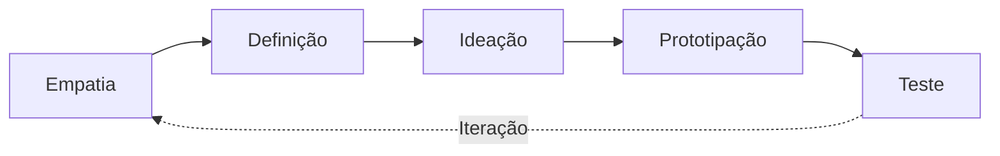
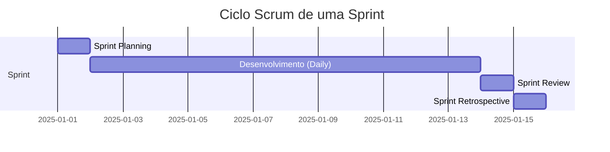
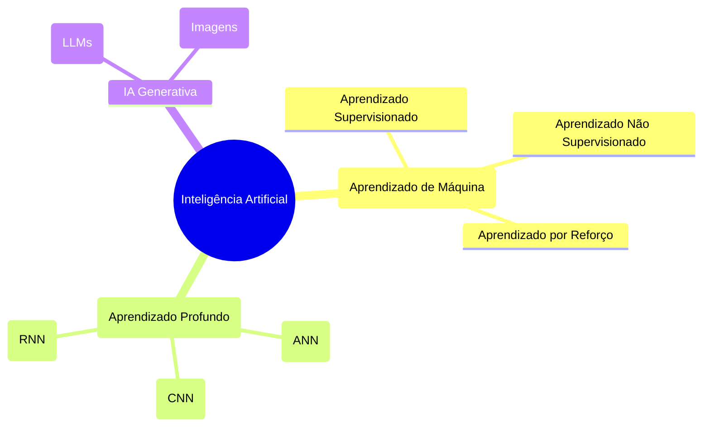
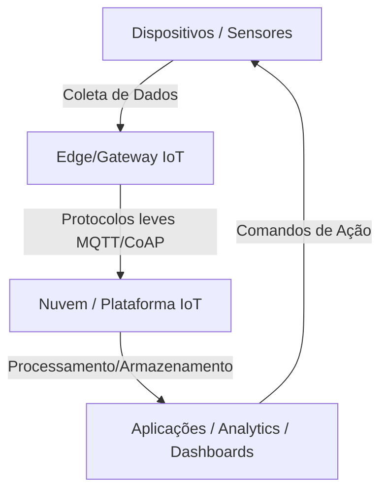

# Guia de Estudo Teórico: Laboratório de Novas Tendências em Tecnologias I

Este guia exaustivo aborda as tendências tecnológicas fundamentais que estão moldando o panorama atual da computação e da inovação. O objetivo da disciplina de nível I é fornecer a base teórica e prática em tecnologias emergentes consolidadas: Inteligência Artificial (IA), Internet das Coisas (IoT), Cloud Computing e Metodologias Ágeis de Inovação.

---

## 1. Fundamentos da Inovação e Metodologias Ágeis

A tecnologia por si só não resolve problemas; ela precisa estar ancorada em processos de inovação estruturados. 

### 1.1. Design Thinking
O *Design Thinking* é uma abordagem centrada no ser humano para a resolução de problemas complexos. Baseia-se na empatia, ideação e experimentação.

- **Empatia**: Compreender profundamente o usuário final, seus desafios e necessidades.
- **Definição**: Sintetizar as descobertas para definir o problema central.
- **Ideação**: Tempestade de ideias (Brainstorming) para gerar o máximo de soluções possíveis.
- **Prototipação**: Criar representações tangíveis e baratas das melhores ideias.
- **Teste**: Validar o protótipo com os usuários.

### 1.2. Metodologias Ágeis (Scrum)
No desenvolvimento de produtos tecnológicos, abordagens iterativas e incrementais substituíram o modelo tradicional em cascata (Waterfall).

- **Backlog do Produto**: Lista priorizada de funcionalidades.
- **Sprint**: Ciclo de trabalho (1 a 4 semanas) onde um incremento utilizável do produto é criado.
- **Papéis**: Product Owner (Dono do Produto), Scrum Master (Facilitador), Development Team (Equipe de Desenvolvimento).

---

## 2. Inteligência Artificial e Machine Learning

A IA é o campo da ciência da computação dedicado a criar sistemas capazes de realizar tarefas que normalmente exigiriam inteligência humana.

### 2.1. Taxonomia da Inteligência Artificial

### 2.2. Machine Learning vs. Programação Tradicional
Na programação tradicional, humanos inserem **Dados** e **Regras** (código) em um computador para obter **Respostas**. No Machine Learning, inserimos **Dados** e **Respostas** (rótulos) para que a máquina descubra as **Regras**.

- **Aprendizado Supervisionado**: O modelo é treinado com dados rotulados. Ex: Prever o preço de uma casa com base em seu tamanho e localização.
- **Aprendizado Não Supervisionado**: O modelo lida com dados não rotulados, buscando padrões ou agrupamentos (Clustering). Ex: Segmentação de clientes.
- **Aprendizado por Reforço**: Um agente aprende a tomar decisões executando ações em um ambiente para maximizar uma recompensa. Ex: Algoritmos de jogos (AlphaGo).

### 2.3. IA Generativa e LLMs
A IA Generativa cria novos conteúdos (texto, imagens, áudio). Os Grandes Modelos de Linguagem (LLMs), como GPT-4, são baseados na arquitetura **Transformer**.

**Arquitetura Transformer Simplificada:**
O Transformer utiliza um mecanismo de *Atenção (Self-Attention)* que permite ao modelo ponderar a importância de cada palavra em uma frase em relação a todas as outras, permitindo compreensão de contexto de longo alcance.

---

## 3. Cloud Computing (Computação em Nuvem)

A computação em nuvem é a entrega sob demanda de recursos de TI (poder computacional, armazenamento, bancos de dados) pela Internet, com preços pagos conforme o uso.

### 3.1. Modelos de Serviço em Nuvem

| Modelo | Descrição | O que o provedor gerencia | O que o usuário gerencia | Exemplos |
|--------|-----------|---------------------------|--------------------------|----------|
| **IaaS** | Infraestrutura como Serviço | Servidores, Armazenamento, Rede, Virtualização | SO, Middleware, Dados, Aplicações | AWS EC2, Google Compute Engine |
| **PaaS** | Plataforma como Serviço | Tudo do IaaS + SO, Middleware, Runtime | Aplicações e Dados | Heroku, Google App Engine |
| **SaaS** | Software como Serviço | Toda a pilha (da infraestrutura à aplicação) | Apenas configurações e uso da interface | Gmail, Office 365, Salesforce |

### 3.2. Arquiteturas Cloud Native
- **Microsserviços**: Aplicações monolíticas divididas em pequenos serviços independentes que se comunicam via APIs.
- **Containers (Docker)**: Empacotam código e dependências em unidades padronizadas para execução consistente em qualquer ambiente.
- **Orquestração (Kubernetes)**: Gerencia automaticamente a implantação, escalonamento e operação de containers.

---

## 4. Internet das Coisas (IoT)

IoT refere-se à rede de objetos físicos incorporados a sensores, software e outras tecnologias para conectar e trocar dados com outros dispositivos e sistemas pela internet.

### 4.1. Arquitetura IoT

### 4.2. Protocolos de Comunicação em IoT
Os dispositivos IoT geralmente têm recursos limitados de bateria e processamento, exigindo protocolos específicos:
- **MQTT (Message Queuing Telemetry Transport)**: Baseado no modelo Publish/Subscribe. Extremamente leve e ideal para redes com alta latência ou conexões instáveis.
- **HTTP/REST**: Mais pesado (devido aos cabeçalhos complexos), mas útil quando o dispositivo possui mais recursos.
- **CoAP (Constrained Application Protocol)**: Semelhante ao HTTP, mas otimizado para dispositivos com restrições severas.

---

## Resumo e Reflexão

O domínio dessas quatro áreas (Metodologias Ágeis, IA, Cloud e IoT) não deve ser visto de forma isolada. A verdadeira inovação tecnológica atual reside na convergência: Dispositivos **IoT** coletam dados no mundo físico, esses dados são transmitidos e armazenados em infraestrutura **Cloud**, onde algoritmos de **Inteligência Artificial** os processam para gerar insights acionáveis, e todo o ciclo de desenvolvimento desse produto é orquestrado via **Metodologias Ágeis**.
