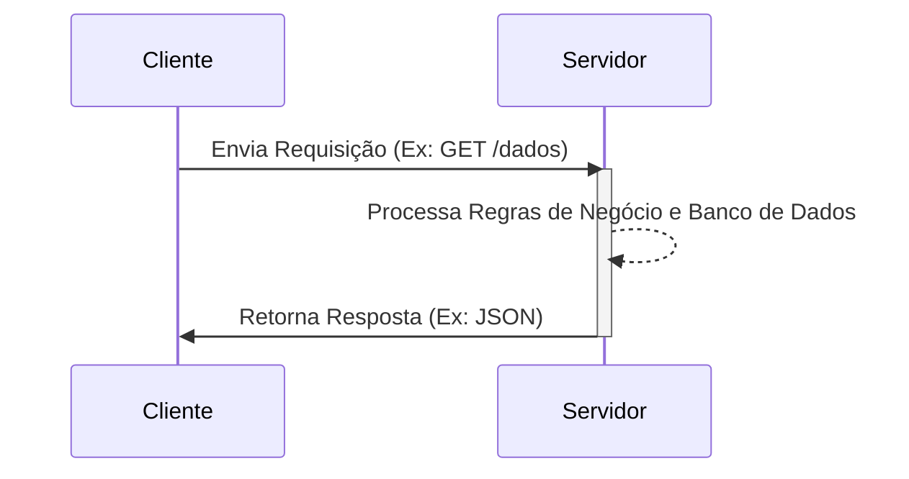
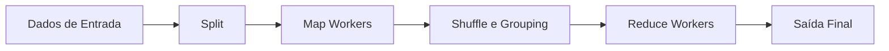

# Guia de Estudo Teórico: Sistemas Distribuídos e Programação em Paralelo

Este guia compreensivo foi desenvolvido para cobrir exaustivamente todos os tópicos fundamentais e avançados da disciplina de Sistemas Distribuídos e Programação em Paralelo. 

## Índice
1. [Introdução aos Sistemas Distribuídos](#1-introdução-aos-sistemas-distribuídos)
2. [Modelos Arquiteturais](#2-modelos-arquiteturais)
3. [Comunicação e Protocolos](#3-comunicação-e-protocolos)
4. [Sincronização e Tempo em Sistemas Distribuídos](#4-sincronização-e-tempo-em-sistemas-distribuídos)
5. [Arquitetura Orientada a Serviços (SOA) e Web Services](#5-arquitetura-orientada-a-serviços-soa-e-web-services)
6. [Segurança em Sistemas Distribuídos](#6-segurança-em-sistemas-distribuídos)
7. [Computação em Nuvem e MapReduce](#7-computação-em-nuvem-e-mapreduce)

---

## 1. Introdução aos Sistemas Distribuídos

### 1.1 Definição
Segundo Andrew Tanenbaum, um **Sistema Distribuído** é definido como "um conjunto de computadores independentes que se apresentam aos seus usuários como um sistema único e coerente". Em essência, as máquinas (nós) são interconectadas por uma rede, comunicam-se primariamente através de troca de mensagens e colaboram para alcançar um objetivo comum, compartilhando um estado e recursos.

### 1.2 Principais Características (Vantagens e Desvantagens)

**Vantagens:**
- **Compartilhamento de Recursos:** Elementos de hardware (armazenamento, processamento) e software podem ser utilizados de maneira conjunta.
- **Concorrência:** Múltiplos processos são executados simultaneamente em diferentes nós, maximizando o desempenho.
- **Escalabilidade:** É a capacidade do sistema lidar com um aumento de carga (horizontal - adicionando mais nós, ou vertical - melhorando o hardware de um nó). Sistemas distribuídos escalam horizontalmente com facilidade.
- **Tolerância a Falhas:** A redundância permite que o sistema continue operando mesmo se um ou mais nós falharem. Não há um ponto único de falha (*Single Point of Failure - SPOF*).
- **Independência Tecnológica:** Componentes podem ser construídos usando diferentes linguagens de programação e rodar em diferentes sistemas operacionais.

**Desvantagens:**
- **Complexidade:** Gerenciar concorrência, latência de rede, e sincronização de estado é substancialmente mais complexo que em sistemas centralizados.
- **Segurança:** Com múltiplos nós se comunicando por uma rede (muitas vezes pública), a superfície de ataque é significativamente expandida.
- **Gerenciamento e Troubleshooting:** Identificar erros (debugging) torna-se difícil. Falhas de rede ou atrasos podem causar comportamentos imprevisíveis.

### 1.3 Transações e Propriedades ACID em Sistemas Distribuídos (STP)
Sistemas de Processamento de Transações exigem garantias rigorosas:
- **Atômicas:** Uma transação ocorre inteiramente ou não ocorre (indivisível).
- **Consistentes:** Transições de estado devem preservar as invariantes lógicas do sistema.
- **Isoladas:** Transações concorrentes não interferem umas nas outras.
- **Duráveis:** Uma vez validada (commit), a alteração é permanente.

---

## 2. Modelos Arquiteturais

A arquitetura define como os componentes do sistema são distribuídos e como interagem.

### 2.1 Arquitetura Cliente-Servidor
A mais tradicional arquitetura. 
- **Cliente:** Inicia as requisições. O cliente precisa conhecer a localização (IP/Porta) do servidor.
- **Servidor:** Fica em estado de escuta passiva, processa requisições e retorna respostas. Não precisa conhecer previamente o cliente.
- Pode ser dividida em **Thin Client** (cliente magro - apenas apresentação) ou **Fat Client** (cliente gordo - processa lógica localmente).

### 2.2 Arquitetura Peer-to-Peer (P2P)
Nesta arquitetura, a distinção entre cliente e servidor desaparece. Todo nó (Peer) atua simultaneamente como cliente e servidor (fornece e consome recursos).
- **P2P Puro:** Não há servidores centrais (ex: Gnutella, Bitcoin).
- **P2P Híbrido:** Um servidor central indexa onde os arquivos estão, mas a transferência de dados ocorre diretamente entre os pares (ex: BitTorrent, Napster).
- Usa mecanismos como **PNRP (Peer Name Resolution Protocol)** ou DHT (Distributed Hash Tables) para localizar pares na malha (mesh).

### 2.3 Middleware
O middleware atua como o "encanamento" do sistema distribuído. É uma camada de software (ou API) que esconde a heterogeneidade da rede, sistema operacional e linguagens de programação.
- **Exemplos:** Message Brokers (RabbitMQ), Object Request Brokers (CORBA), Drivers de Banco de Dados (JDBC).

---

## 3. Comunicação e Protocolos

A comunicação é a espinha dorsal. Sem memória compartilhada física, os processos usam a rede.

### 3.1 Camadas de Rede e TCP vs UDP
Baseado no modelo TCP/IP:
- **TCP (Transmission Control Protocol):** Orientado a conexão. Garante a entrega dos dados, controle de fluxo e controle de congestionamento. É confiável, mas possui maior latência.
- **UDP (User Datagram Protocol):** Não orientado a conexão. Envia datagramas velozmente mas sem garantias de ordem ou entrega. Usado para streaming, VoIP, e sistemas onde a velocidade suplanta a precisão absoluta.

### 3.2 Sockets de Rede
Um socket é a porta de entrada para a rede. É constituído por **Endereço IP + Porta**.
Os 3 estados de um socket servidor TCP:
1. **Listen:** Escutando conexões.
2. **Accept:** Aceita uma conexão e cria um *novo socket* dedicado para aquele cliente.
3. **Send/Recv:** Troca de dados bidirecional.

### 3.3 RPC (Remote Procedure Call)
O RPC permite que um programa execute um procedimento/função em outro computador como se fosse uma chamada de função local.
- O **Stub** (no cliente) empacota os parâmetros (Marshaling) e envia pela rede.
- O **Skeleton** (no servidor) desempacota (Unmarshaling), executa a função local, empacota o resultado e devolve.

### 3.4 Comunicação Baseada em Mensagens
Em vez de chamadas síncronas bloqueantes, usa-se mensagens enviadas e armazenadas em filas (*Message Queues*).
- **Vantagens:** Desacoplamento espacial (emissor e receptor não precisam se conhecer) e temporal (não precisam estar ativos ao mesmo tempo). Tolerância a falhas.
- **Exemplos:** RabbitMQ, Apache Kafka, Amazon SQS.

---

## 4. Sincronização e Tempo em Sistemas Distribuídos

Em sistemas distribuídos, não existe um "relógio global". Cada máquina possui seu oscilador de quartzo com taxas de desvio (drift) diferentes.

### 4.1 Relógios Lógicos de Lamport
Leslie Lamport propôs que não precisamos saber a hora exata que um evento ocorreu, mas sim a **ordem** em que os eventos aconteceram (relação "happens-before" ou $\rightarrow$).

**Algoritmo de Lamport:**
1. Cada processo $P_i$ mantém um contador local $C_i$, inicializado em 0.
2. Antes de executar um evento (instrução, envio de mensagem), $P_i$ incrementa $C_i = C_i + 1$.
3. Quando $P_i$ envia uma mensagem $m$, ele anexa o tempo lógico: $(m, C_i)$.
4. Quando um processo $P_j$ recebe $(m, C_i)$, ele atualiza seu relógio: $C_j = \max(C_j, C_i) + 1$.

Isso garante uma ordenação causal dos eventos, fundamental para sistemas de transações, chats distribuídos e resolução de conflitos.

---

## 5. Arquitetura Orientada a Serviços (SOA) e Web Services

### 5.1 Conceitos de SOA
O aplicativo é decomposto em serviços autônomos, sem estado (*stateless*) e fracamente acoplados (*loosely coupled*). Os serviços expõem interfaces padronizadas (Contratos).

### 5.2 SOAP vs REST

- **SOAP (Simple Object Access Protocol):** 
  - Baseado inteiramente em XML.
  - Possui forte rigor de tipagem e contratos formais definidos em **WSDL (Web Services Description Language)**.
  - Suporta os complexos protocolos `WS-*` (WS-Security, WS-AtomicTransaction).

- **REST (Representational State Transfer):**
  - Estilo arquitetural focado em recursos (URLs).
  - Usa os métodos padrão do HTTP (GET, POST, PUT, DELETE).
  - Mais leve, utiliza predominantemente JSON em vez de XML. É amplamente adotado no desenvolvimento web moderno e microserviços.

---

## 6. Segurança em Sistemas Distribuídos

Dado que os dados trafegam por múltiplos links de rede, a segurança baseia-se em quatro pilares:
1. **Confidencialidade:** Evitar vazamento.
2. **Integridade:** Impedir alteração não autorizada.
3. **Disponibilidade:** Garantir que o sistema opere (combate a DoS).
4. **Não-Repúdio:** Garantir autoria das ações.

### 6.1 Autenticação vs Autorização
- **Autenticação:** Quem é você? (Login, Senha, Biometria, MFA/2FA, Tokens).
- **Autorização:** O que você pode fazer? (RBAC - Controle de Acesso Baseado em Papéis, ACLs, OAuth, JWT).

### 6.2 Criptografia e TLS/SSL
A comunicação deve ser protegida contra ataques *Man-in-the-Middle (MitM)* usando HTTPS e TLS.
- O Handshake TLS estabelece a identidade via **Certificados Digitais**.
- Usa criptografia assimétrica (chaves pública/privada) para trocar de modo seguro as chaves simétricas (chaves de sessão) que farão a encriptação rápida do tráfego.

### 6.3 Ataques Comuns
- **DDoS (Distributed Denial of Service):** Sistemas botnet sobrecarregam um serviço. *Mitigação:* Firewalls de aplicação (WAF), Rate Limiting, Balanceamento de carga (CDN).
- **MitM:** Interceptação de tráfego (Ex: ARP Poisoning, Rogue Wi-Fi). *Mitigação:* Uso restrito de HTTPS/TLS e VPNs.

---

## 7. Computação em Nuvem e MapReduce

### 7.1 Computação em Nuvem
A nuvem é a entrega de recursos computacionais (servidores, armazenamento, bancos de dados, software) pela internet, com escalabilidade elástica.

### 7.2 O Paradigma MapReduce
Para processamento de enormes volumes de dados distribuídos (Big Data).
- **Map:** Filtra, processa e extrai informações locais em diversos nós paralelos emitindo pares de `chave-valor`.
- **Shuffle/Sort:** O framework agrupa todos os valores associados à mesma chave.
- **Reduce:** Nós de redução agregam os valores das chaves para produzir o resultado final.

