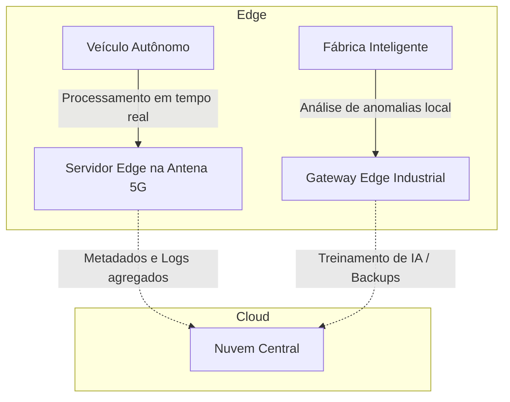
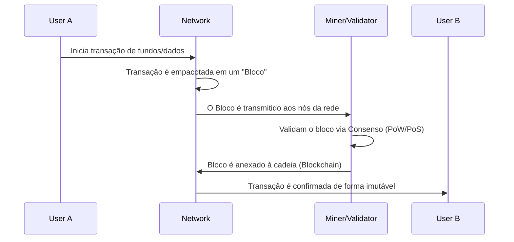

# Guia de Estudo Teórico: Laboratório de Novas Tendências em Tecnologias II

Dando continuidade ao nível I, a disciplina "Laboratório de Novas Tendências em Tecnologias II" explora as tecnologias emergentes de fronteira (Deep Techs). Estas são inovações que exigem maior densidade científica e técnica, apresentando alto impacto disruptivo: Edge Computing, Realidades Imersivas (XR), Web3/Blockchain e noções de Computação Quântica.

---

## 1. Edge Computing e Redes 5G/6G

À medida que o volume de dados gerados pela IoT explode, enviar tudo para a Cloud centralizada causa problemas de latência e consumo de banda. A solução é o **Edge Computing** (Computação de Borda).

### 1.1. O Paradigma do Edge Computing
Em vez de processar os dados em data centers remotos (Nuvem), o processamento ocorre no limite (Edge) da rede, o mais próximo possível da fonte geradora dos dados (sensores, câmeras, veículos autônomos).

### 1.2. O Papel do 5G e 6G
O Edge Computing depende de conexões ultrarrápidas e confiáveis.
- **5G:** Caracteriza-se por *eMBB* (banda larga móvel aprimorada), *URLLC* (comunicações ultra confiáveis de baixa latência) e *mMTC* (comunicação massiva tipo máquina). A latência cai para < 10ms, essencial para cirurgias remotas e carros autônomos.
- **6G (Visão):** Integração profunda com IA, comunicação baseada em Terahertz, integração espaço-ar-terra (satélites), latência sub-milissegundo e criação fluida de Gêmeos Digitais (Digital Twins).

---

## 2. Tecnologias Imersivas (XR: AR, VR, MR)

O termo Extended Reality (XR) engloba todo o espectro das realidades computacionais.

### 2.1. O Espectro da Realidade Imersiva

- **Virtual Reality (VR) - Realidade Virtual:** Oculta completamente o mundo físico, substituindo-o por um ambiente totalmente gerado por computador. Requer headsets fechados (ex: Meta Quest).
- **Augmented Reality (AR) - Realidade Aumentada:** Sobrepõe elementos digitais (texto, imagens, modelos 3D) ao mundo físico, visualizados por meio de telas (smartphones) ou óculos translúcidos. O mundo físico é a base.
- **Mixed Reality (MR) - Realidade Mista:** Similar à AR, mas os objetos virtuais são ancorados e interagem perfeitamente com o espaço físico (ex: uma bola digital colide com uma mesa física). Dispositivos avançados como Apple Vision Pro ou Microsoft HoloLens.

### 2.2. Gêmeos Digitais (Digital Twins)
Uma réplica digital em tempo real de um objeto físico, processo ou sistema. Usado extensivamente na Indústria 4.0. Operadores podem usar AR para visualizar os dados do Gêmeo Digital sobrepostos à máquina real na fábrica.

---

## 3. Blockchain, Web3 e Smart Contracts

A evolução da internet aponta para um modelo descentralizado focado na propriedade de dados pelos usuários.

### 3.1. Fundamentos da Blockchain
Uma Blockchain é um livro-razão (ledger) digital, distribuído, imutável e criptografado.

- **Hash Criptográfico:** Cada bloco contém um hash único e o hash do bloco anterior, garantindo a integridade.
- **Consenso:** Mecanismos como *Proof of Work* (Prova de Trabalho, alto consumo energético) e *Proof of Stake* (Prova de Participação, ecologicamente correto).

### 3.2. Contratos Inteligentes (Smart Contracts)
São programas armazenados na blockchain que são executados automaticamente quando condições predeterminadas são atendidas. Eliminam a necessidade de intermediários (como bancos ou cartórios) para executar acordos.
**Web3:** É a visão de uma internet construída sobre Blockchains públicas, caracterizada por *DeFi* (Finanças Descentralizadas) e *DAOs* (Organizações Autônomas Descentralizadas).

---

## 4. Computação Quântica: Uma Introdução

Diferente da computação clássica baseada em *bits* (que assumem o valor 0 ou 1), a computação quântica utiliza *qubits* (bits quânticos).

### 4.1. Princípios Fundamentais
- **Superposição:** Um qubit pode representar 0, 1, ou qualquer proporção (estado de superposição) de ambos simultaneamente. Isso permite processar vastas quantidades de possibilidades em paralelo.
- **Emaranhamento Quântico (Entanglement):** Qubits emaranhados compartilham um estado. A medição de um afeta instantaneamente o outro, independentemente da distância. Isso aumenta o poder computacional exponencialmente.

### 4.2. Impacto e Ameaças
A computação quântica promete revolucionar a descoberta de novos medicamentos (simulação de moléculas complexas) e otimização financeira. No entanto, sua capacidade de fatorar grandes números rapidamente (Algoritmo de Shor) é uma ameaça existencial para a criptografia atual (como RSA). Surge a necessidade da **Criptografia Pós-Quântica**.

---

## Conclusão e Aspectos Éticos

A adoção dessas Deep Techs levanta questões éticas profundas. A realidade virtual hiper-realista pode causar dependência e dissociação; algoritmos descentralizados (Web3) carecem de regulamentação para proteger o consumidor; e o processamento pervasivo (Edge) lida com dados íntimos capturados ininterruptamente. O desenvolvimento tecnológico moderno deve ter a ética no centro (*Ethics by Design*).
